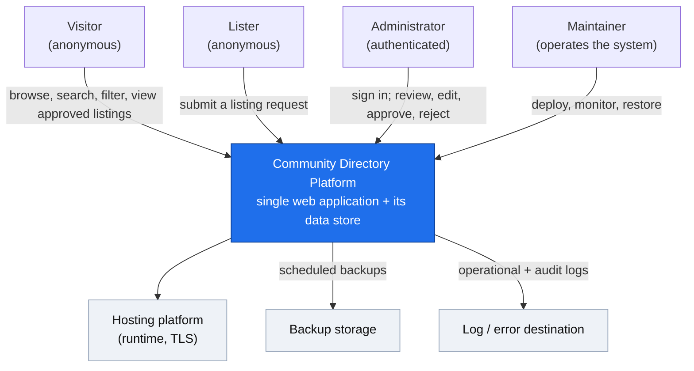
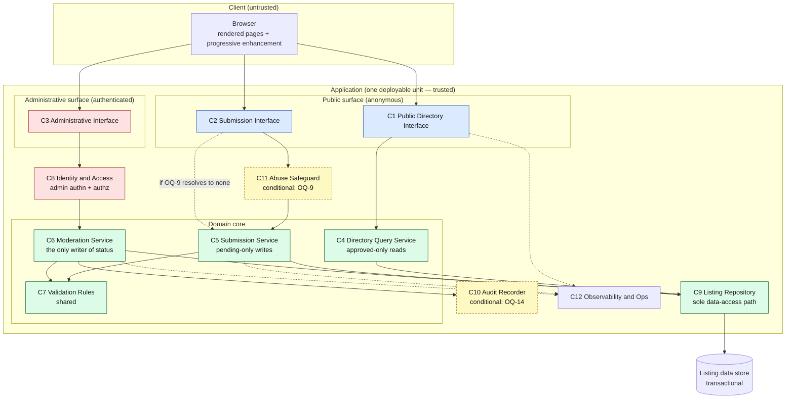
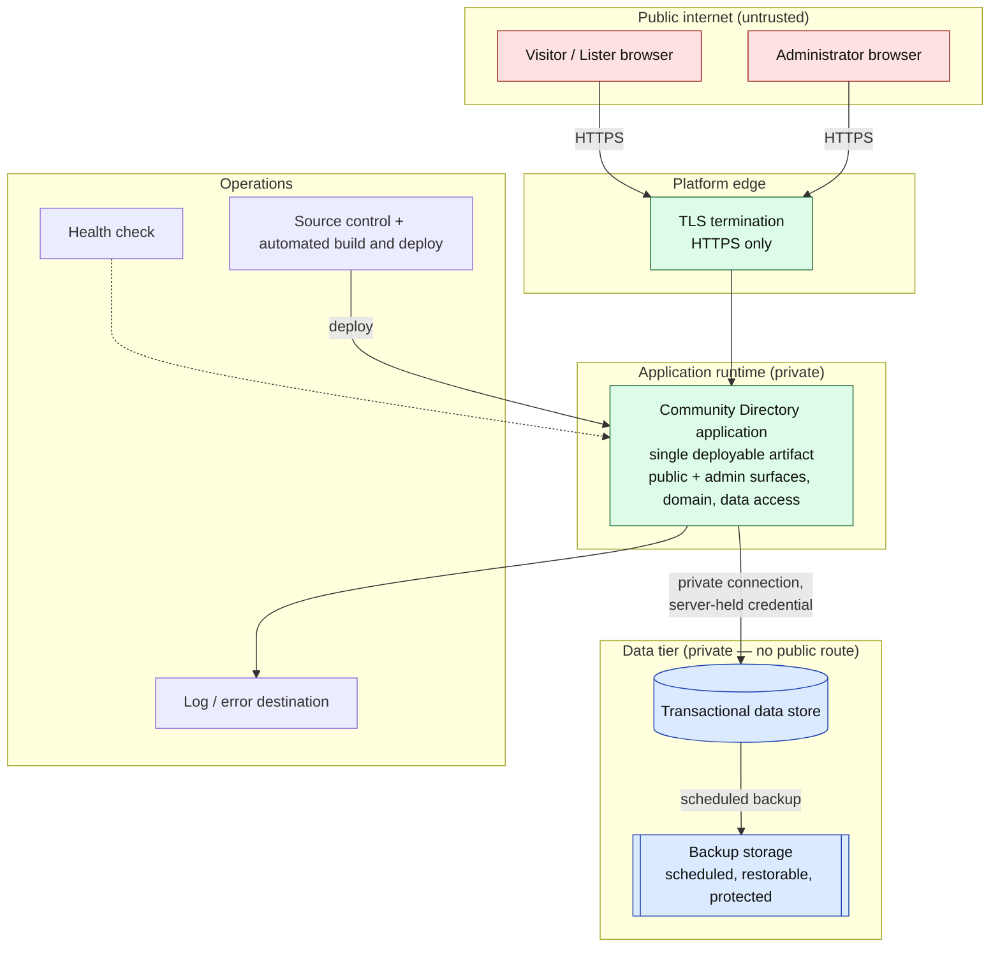
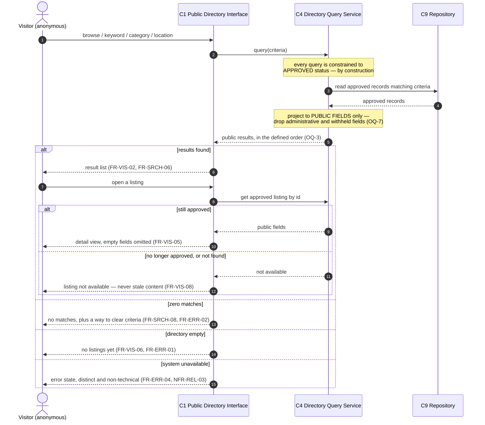
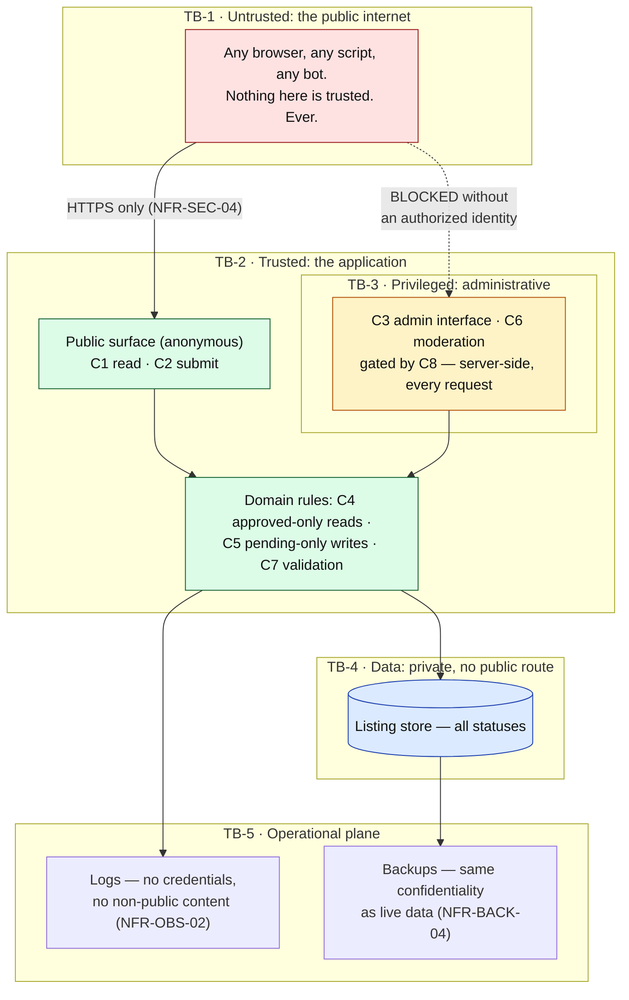

# Community Directory Platform — MVP System Architecture

## Purpose and scope

This document defines the system architecture for the **MVP** of the Community
Directory Platform: the major components, how they fit together, how data and
requests flow between them, where the trust boundaries lie, and how the system
is deployed and operated.

It builds on and is consistent with:

- [`docs/01-vision.md`](./01-vision.md) — product vision.
- [`docs/02-stakeholders.md`](./02-stakeholders.md) — stakeholders and needs.
- [`docs/03-mvp-scope.md`](./03-mvp-scope.md) — approved MVP scope.
- [`docs/04-user-journeys.md`](./04-user-journeys.md) — MVP user journeys.
- [`docs/05-functional-requirements.md`](./05-functional-requirements.md) — `FR-*`.
- [`docs/06-non-functional-requirements.md`](./06-non-functional-requirements.md) — `NFR-*`.

**What this document does.** It evaluates realistic architecture options against
documented criteria, recommends one, and describes it in enough detail to
support later technology selection, ADRs, data design, API design, backlog
refinement, and implementation planning.

**What this document does not do.**

- It does **not** select a framework, language, database product, hosting
  provider, or vendor. It defines *criteria* for those choices and records them
  as deferred decisions.
- It does **not** contain implementation code and does **not** create deployment
  resources.
- It does **not** add product capability. Every component here exists to satisfy
  an approved requirement in `docs/03`–`docs/06`.
- It does **not** resolve open business questions. Where the architecture would
  otherwise have to invent an answer (search matching, location granularity,
  public field set, required fields, anti-spam, edit-after-approval, removal,
  retention, audit logging, performance thresholds, availability, backup
  targets, expected load), it isolates the decision behind a seam and records it
  under *Deferred decisions* and *Open questions*.

**Reading it without the diagrams.** The Mermaid diagrams are aids. Every
diagram is paired with prose that states the same thing, so the architecture is
complete for a reader who cannot see them.

**Two levels, kept separate.** *Logical architecture* (what components exist,
what they are responsible for, how they talk) is described independently of
*technology selection* (what products realize those components). The logical
architecture is a commitment of this document; the technology is not.

---

## Architecture drivers

Architecture drivers are the forces that actually shape the design. Each is
traced to its source requirement. Anything not listed here is a consequence, not
a driver.

| # | Driver | Why it shapes the architecture | Source |
|---|---|---|---|
| D-1 | **Moderation-first: nothing is public until approved** | The public read path must be structurally incapable of returning a non-approved record; publication is a privileged state transition, not a UI convention. This is the single most important constraint. | FR-SUB-04, FR-MOD-01, NFR-DATA-01, `03` constraint |
| D-2 | **Two sharply different populations of actor** | Anonymous, untrusted public (read and submit only) versus a small set of authenticated, trusted administrators (everything else). This split drives the primary trust boundary. | FR-AUTH-01..03, NFR-SEC-01..03 |
| D-3 | **No public write path to published content** | The public may *request*, never publish, edit, or delete. Write authority must be centralized where it can be enforced, not distributed to clients. | FR-VIS-09, FR-MOD-03, NFR-SEC-03 |
| D-4 | **An unauthenticated public write surface (the request form)** | A form anyone can post to is the largest attack and abuse surface in the system: it demands server-side validation, input constraint, and an abuse safeguard. | FR-SUB-01, NFR-SEC-05, NFR-SEC-06 |
| D-5 | **Privacy of non-public data** | Pending and rejected submissions, administrative fields, and withheld contact details must be unreachable through any public path — including via search, detail URLs, logs, and backups. | NFR-PRIV-01..03, NFR-OBS-02, NFR-BACK-04 |
| D-6 | **Small, low-volume, single-maintainer operation** | One primary developer, a handful of trusted administrators, no dedicated operations staff, low submission volume. Operational simplicity outranks scalability. | NFR-OPS-01..04, `03` A-2, A-5 |
| D-7 | **Accessibility and responsiveness are core, not cosmetic** | Keyboard operability, semantic structure, non-color status conveyance, and readable content on a phone must survive the rendering strategy — so the rendering strategy is an architectural concern. | FR-ACC-01..05, NFR-ACC-01..05, NFR-RESP-01..04, NFR-COMP-03/04 |
| D-8 | **Data integrity across the moderation lifecycle** | Status is single-valued, transitions are constrained, and writes are all-or-nothing. This calls for transactional storage, not eventually-consistent or multi-store storage. | NFR-DATA-01..06, NFR-REL-04 |
| D-9 | **Recoverability with a documented, tested procedure** | Data loss is the one failure a small team cannot absorb. Backup and restore must be first-class and exercised. | NFR-BACK-01..05 |
| D-10 | **Modest, mostly-read load with room to grow** | Predominantly reads of a small approved-listing set; writes are rare. Nothing here justifies distributed infrastructure — but nothing may foreclose growth either. | NFR-SCALE-01..03, NFR-PERF-06 |
| D-11 | **Diagnosability without a full observability stack** | A maintainer must be able to explain an incident after the fact from logs, without heavyweight tooling and without sensitive data in those logs. | NFR-OBS-01..06 |
| D-12 | **The architecture must not resolve open product questions** | Fifteen `OQ-*` and nine `NOQ-*` decisions are still open. The design must place each behind a seam so it can be decided later without restructuring. | `05` OQ-1..15, `06` NOQ-1..9 |
| D-13 | **Evolvability toward the deferred feature set** | Owner accounts, claiming, reviews, analytics, and promotion are explicitly future possibilities. Today's design should not make them impossible — but must not pre-build for them. | `01` future direction, `03` future capabilities |

**The tension the design must resolve.** D-1 through D-5 and D-8 demand a strong,
centrally enforced write and visibility boundary. D-6 and D-10 demand the
smallest possible operational footprint. The recommended architecture is the
smallest shape that still enforces the boundary *on the server*, where it cannot
be bypassed.

---

## Constraints and assumptions

### Constraints (inherited, not decided here)

- **C-1.** Content is not public until an administrator approves it (`03`).
- **C-2.** Only administrators may approve, edit, reject, or remove (`03`).
- **C-3.** The MVP must be small enough for one primary developer to build and a
  small team to operate (`03`, NFR-OPS-01).
- **C-4.** Responsive and basically accessible on core flows (`03`).
- **C-5.** The **Community Directory Mini Lab** (Next.js, Supabase, and Vercel,
  with browser-direct data access under Row Level Security and manual approval
  performed in the vendor database console) is a **frozen learning prototype**.
  Its lessons are welcome; its stack, its data model, and above all its *shape*
  are **not** adopted by default (`01`).
- **C-6.** No out-of-scope product capability may be introduced (`03`).

### Assumptions (carried forward, and load-bearing here)

- **A-1.** Low submission volume; manual review is practical (`03` A-2).
- **A-2.** A small number of trusted administrators (`03` A-5).
- **A-3.** A small, predefined category set (`03` A-3).
- **A-4.** Geographic scope limited enough that simple location fields suffice
  (`03` A-4).
- **A-5.** Reads greatly outnumber writes, and the approved-listing corpus is
  small — hundreds to low thousands, not millions — in the first release.
- **A-6.** The expected usage level is **not yet quantified** (NOQ-4). The
  architecture is therefore sized for "small", and every performance claim in
  this document is conditional on that and must be revalidated once NOQ-4 is
  answered.

> **A-5 and A-6 are the assumptions most likely to be wrong**, and they are the
> ones to re-examine first if the architecture ever feels undersized. See *Risks
> and trade-offs* (R-5).

---

## Architecture principles

These are the tie-breakers. When two designs both satisfy the requirements,
these decide.

1. **Enforce on the server; never trust the client.** Visibility, authorization,
   and validation are decided where the caller cannot reach. A browser-side rule
   is a usability affordance, never a security control. (D-1..D-4)
2. **One place to say "this is public".** Exactly one component performs the
   approved/not-approved decision, and exactly one read path serves visitors. A
   second path is a second chance to leak. (D-1, D-5)
3. **The smallest thing that safely works.** Prefer one deployable unit, one data
   store, one language, one pipeline. Complexity must be *earned* by a
   requirement, not anticipated. (D-6, D-10)
4. **Modular inside, singular outside.** Internal boundaries are real and are
   enforced by code structure; they are not premature process boundaries. The
   seams make later extraction possible without paying for distribution now.
   (D-6, D-13)
5. **A deferred decision gets a seam, not a guess.** Every open question is
   localized behind one component or one configuration point, so that answering
   it later is a change in one place rather than a redesign. (D-12)
6. **Server-rendered, progressively enhanced.** Content that must be accessible,
   readable on a phone, and functional on a modest browser is delivered as
   content, not assembled by the client. (D-7)
7. **Portability over vendor leverage.** Nothing in the MVP is big enough to need
   a proprietary capability. Depend on commodity, replaceable substrates
   (relational storage, HTTP hosting) so that changing vendor is a deployment
   change. (D-6)
8. **Recoverability beats availability.** With a small team, a short outage is
   survivable; losing the directory is not. Invest in backup and restore before
   redundancy. (D-9)
9. **Auditable by construction.** Every state transition is an explicit, named
   action performed by an identified actor — so that recording it (if OQ-14 is
   answered yes) is wiring, not rework. (D-11, D-12)

---

## Context diagram

**In prose.** The system is a single web application on the public internet.
Three kinds of people use it. **Visitors** (anonymous) read the approved
directory. **Listers** (anonymous — the same public actor in a different role)
post a listing request into it. **Administrators** (authenticated) sign in and
moderate. The application owns one persistent store. It depends on the
surrounding platform for hosting, backups, and a destination for logs. Nothing
else calls it, and it calls nothing else: there are no third-party integrations
in the MVP (`03` out-of-scope).



**What is deliberately absent.** No email or SMS provider, no map or geocoding
service, no analytics vendor, no CDN as a required element, no external search
engine, and no payment or advertising system. Each would be a new dependency, a
new failure mode, and in several cases a new privacy surface — and none is
required by an approved MVP requirement.

One caveat worth stating rather than burying: if OQ-2 is answered "notify the
lister of the outcome", an outbound notification dependency enters this diagram.
It is recorded as such under *Deferred decisions* (DD-16) and is deliberately not
built in advance.

---

## Major system actors

| Actor | Authenticated? | May do | May never do | Source |
|---|---|---|---|---|
| **Visitor** | No | Browse, search, filter, and view an approved listing public fields | See pending or rejected data; see administrative or withheld fields; write anything | FR-VIS-01, FR-AUTH-01, NFR-PRIV-01..03 |
| **Lister** | No | Everything a Visitor may do, plus submit one listing request | Publish, edit, or delete any listing; see the status of another submission | FR-SUB-01, FR-VIS-09, FR-MOD-03 |
| **Administrator** | **Yes** | View the pending queue; open, edit, approve, and reject; edit approved listings; remove (subject to OQ-11) | Bypass validation; act without the action being attributable | FR-ADM-01..13, FR-AUTH-02, NFR-SEC-01 |
| **Maintainer** | Yes (platform, not app) | Deploy, read operational logs, run backup and restore, check health | Casually read non-public submission content — such access is privileged and logged | NFR-OPS-01, NFR-OBS-01..03, NFR-BACK-02 |
| **System** | n/a | Set administrative fields (status, dates); enforce the lifecycle | Allow any of these to be set from a public path | FR-DATA-09, FR-AUD-01..04, NFR-DATA-04 |

**Visitor and Lister are the same person.** They are not separate identities, and
no account distinguishes them (FR-AUTH-04). They are separated here because they
exercise *different trust characteristics*: one only reads, the other writes into
the system. That write role is the whole reason D-4 exists.

---

## Major system components

Nine components, plus two that are **conditional** on open questions. This is the
complete inventory; there is nothing else.



**In prose.** The browser talks to three interface components: the public
directory, the submission form, and the administrative area. The public directory
reads through a query service that can only see approved records. The submission
form writes through a submission service that can only create pending records.
The administrative area is gated by identity and access, and it is the only way
to reach the moderation service — the one component permitted to change a listing
status. All three services reach storage through a single repository, and nothing
else touches the database. Validation rules are shared by the submission service
and the moderation service, so a public submission and an administrator edit are
held to the same standard. Two components (audit recording and the abuse
safeguard) are drawn with dashed styling because whether they exist in the MVP
depends on open questions.

---

## Component responsibilities

### C1 — Public Directory Interface

Renders the browse, search, filter, listing-detail, empty, no-results, and error
views for anonymous visitors. Owns the *presentation* of the three distinct
non-content states (FR-ERR-01/02/04, NFR-USA-03) and the accessibility and
responsive properties of the public flows (FR-ACC-01..05, NFR-RESP-01..04).

- **Serves:** FR-VIS-01..08, FR-SRCH-01..09, FR-ERR-01/02/04, FR-ACC-01..05.
- **May not** request non-approved data. It has no vocabulary for it, because C4
  does not offer one. This is enforcement by construction, not by discipline.

### C2 — Submission Interface

Renders the public request form, presents field-level validation feedback while
preserving already-entered valid input (FR-VAL-02, FR-VAL-03, NFR-USA-02), and
shows the pending, not-yet-public confirmation (FR-SUB-07, FR-CONF-01,
NFR-USA-06).

- **Serves:** FR-SUB-01, FR-SUB-02, FR-SUB-05, FR-SUB-07, FR-VAL-02/03/06,
  FR-CONF-01, FR-ERR-06.
- **Client-side validation is a convenience only.** The authoritative check is
  C7, invoked server-side by C5 (NFR-SEC-05).

### C3 — Administrative Interface

Renders the pending queue, the submission and listing detail views, the edit
form, and the approve, reject, and edit controls. Renders the administrator empty
state (FR-ERR-03) and the action confirmations (FR-CONF-02..04).

- **Serves:** FR-ADM-01..13, FR-ERR-03, FR-CONF-02..04, NFR-RESP-04.
- **Reachable only through C8.** Not "linked only from behind a login" but
  *unreachable* without an authorized identity, checked server-side on every
  request, including direct-URL and non-browser access (NFR-SEC-01, NFR-SEC-02).

### C4 — Directory Query Service

The **only** read path to listing data for the public. Every query it can express
is constrained to approved status, and every record it returns is projected to
the public field set — administrative fields and any withheld contact field are
dropped before data leaves this component (FR-DATA-11, NFR-PRIV-01, NFR-PRIV-02).

- **Serves:** FR-VIS-02..05, FR-SRCH-01..09, NFR-PERF-02/03/06, NFR-PRIV-01..03.
- **Owns the deferred search seam.** Which fields are searched and how they match
  (OQ-4), the default ordering (OQ-3), the location granularity (OQ-6), and the
  public field projection (OQ-7) are all decided **inside C4 and the data
  design**, not spread across the user interface. When those questions are
  answered, C4 is where the answers land.

### C5 — Submission Service

Accepts a public submission, validates it via C7, and — only on success — creates
exactly one new listing record with status *pending*, its submission date set,
and its last-updated date set (FR-SUB-03, FR-SUB-04, FR-AUD-02). On failure it
creates nothing at all (FR-SUB-06, NFR-REL-04, NFR-DATA-03).

- **Serves:** FR-SUB-03..06, FR-SUB-09, FR-VAL-01, FR-AUD-01/02.
- **Cannot create an approved record.** Pending status is not a parameter it
  accepts; it is a fact it asserts. The public write path has no expressible way
  to publish (D-1, D-3).

### C6 — Moderation Service

The **sole writer of listing status** and the sole mutator of approved content.
It implements the lifecycle: pending to approved, pending to rejected,
edit-in-place with status unchanged (FR-ADM-05), edit of an already-approved
listing (FR-ADM-09), and rejection-reason capture (FR-ADM-08). Every entry point
requires an authorized administrator identity supplied by C8; the check is not
delegated to the caller.

- **Serves:** FR-ADM-04..13, FR-MOD-01..06, FR-AUD-01/03, NFR-DATA-01..03/05.
- **Owns the deferred lifecycle seams.** Whether an edit to an approved listing
  publishes immediately or requires secondary review (OQ-10, FR-ADM-10), whether
  unpublish or remove exists (OQ-11, FR-ADM-12), and whether rejected records are
  retained (OQ-13, FR-AUD-06) are all state-machine questions, and the state
  machine lives here. Answering them changes C6 and the data design, and nothing
  else.

### C7 — Validation Rules

One shared, server-side definition of required fields, field formats, and the
contact-method minimum. Invoked by **both** C5 (submissions) and C6
(administrator edits), which is what makes FR-VAL-04 true rather than
aspirational.

- **Serves:** FR-VAL-01..06, FR-DATA-01..10, NFR-SEC-05, NFR-USA-02.
- **Owns the deferred field seams.** Which fields are required (OQ-8) and whether
  at least one contact method is enforced (OQ-8b) are configuration and rule
  content inside C7, not conditionals scattered through the interface
  (NFR-MAINT-04).

### C8 — Identity and Access

Authenticates administrators and authorizes every administrative action, enforced
server-side, on every request, in front of C3 and C6. Denials reveal nothing —
not the content, and not whether a record exists (NFR-SEC-02).

- **Serves:** FR-AUTH-01..04, NFR-SEC-01..03, NFR-SEC-07, NFR-SEC-08.
- **Deliberately minimal.** Two roles exist: *administrator* and *everyone else*.
  There is no role hierarchy, no permission matrix, and no self-registration —
  because A-2 says there are a handful of trusted administrators and FR-AUTH-04
  forbids any other role. A role model is a thing to add when a second role
  exists.
- **The mechanism is deferred, not the boundary.** *How* an administrator
  authenticates (DD-4) is a technology decision. *That* every administrative
  entry point is gated is architecture, and it is settled here.

### C9 — Listing Repository

The single data-access path. It owns transactions, so that a create, edit, or
moderation action either completes fully or has no effect (NFR-DATA-03). No other
component — and **no client** — holds a data-store credential or issues a query.

- **Serves:** NFR-DATA-01..06, NFR-REL-04, NFR-BACK-01.

### C10 — Audit Recorder *(conditional — OQ-14 / NOQ-8)*

If audit logging is committed, this records who changed which record status or
content, and when (FR-AUD-05, NFR-OBS-05). It is drawn as a component because C6
already makes every transition an explicit, attributable action — so the recorder
is a subscriber, not a retrofit (principle 9).

- **If OQ-14 is answered "no",** C10 does not exist in the MVP and nothing else
  changes. That is precisely the point of isolating it.

### C11 — Abuse Safeguard *(conditional — OQ-9)*

If an anti-spam safeguard is committed, it sits in front of C5 on the public
submission path only (FR-SUB-09, NFR-SEC-06). Its *mechanism* — rate limiting, a
challenge, a honeypot, or throttled review capacity — is undecided, and
deliberately so: different answers carry very different privacy, accessibility,
and vendor consequences.

- **Placement is architectural; mechanism is not.** The seam is fixed now so that
  the decision later is a plug-in rather than surgery.
- **Accessibility caveat:** if the eventual answer is a visual challenge, it
  collides with NFR-ACC-01/02. Recorded as a risk, not resolved.

### C12 — Observability and Operations

Structured operational logging of errors, failed saves, and denied access
attempts (NFR-OBS-01); a health check (NFR-OBS-03); and user-facing errors that
stay non-technical while the diagnostics stay in the logs (NFR-OBS-04,
NFR-REL-03). It enforces the **sensitive-data exclusion** (NFR-OBS-02): no
credentials, and no non-public submission content, in any log line.

- **Serves:** NFR-OBS-01..06, NFR-REL-03, and the FR-ERR paths.
- Log **retention** (NOQ-7) is deferred. The exclusion rule is not.

---

## Logical architecture

**The shape: a modular monolith with a server-enforced public/administrative
split.**

One application, internally divided into three layers with an **enforced**
direction of dependency:

1. **Interface layer** (C1, C2, C3) — renders views and accepts input. It holds
   no business rules and never touches storage.
2. **Domain layer** (C4, C5, C6, C7, with C8 as a gate) — the moderation
   lifecycle, the approved-only read model, and validation. Every rule that
   matters lives here.
3. **Data-access layer** (C9) — the only component that speaks to the store.

Dependencies point strictly inward: interface to domain to data access. The
domain layer never calls back into the interface layer. This is what allows the
domain rules to be tested without a browser (NFR-MAINT-03), and what keeps an
interface change from being able to break a moderation guarantee.

**The two paths that carry the whole product:**

- **The public read path** — C1 to C4 to C9. Structurally incapable of returning
  a non-approved record or a non-public field, because C4 has no query that
  expresses either. There is no second read path. (D-1, D-5, principle 2)
- **The privileged write path** — C3 to C8 to C6 to C9. Structurally incapable of
  being reached without an authorized administrator, because C8 gates it and C6
  will not act without an identity. (D-2, D-3)

The submission path (C2, optionally C11, then C5 to C9) is a third path, and it
is the interesting one, because it is a *public write*. It is made safe not by
trusting the caller but by narrowing what the caller can express: C5 can only ever
produce a pending record. A compromised or hostile client can, at worst, create a
pending record that an administrator will see and reject. **That is the entire
security argument for the public write surface**, and it is why moderation-first
is an architectural property rather than a policy.

**Why "modular monolith" and not merely "monolith".** The module boundaries above
are real: C4 cannot see pending records, C6 is the only writer of status, and C9
is the only holder of a store credential. These constraints are enforced in code
structure and covered by tests (NFR-MAINT-03) rather than merely documented. That
yields the maintainability of separation (NFR-MAINT-01) without the operational
cost of distribution (NFR-OPS-04) — and it means that if a component ever needs to
be extracted (the administrative surface being the most plausible candidate), the
seam already exists.

**What was deliberately not built:** no service mesh, no message broker, no cache
tier, no separate search index, no API gateway, no read replica, and no
event-sourced audit store. Each was considered and rejected as unearned at MVP
load (A-5, A-6, NFR-OPS-04). Each is reconsiderable the moment a *measured*
requirement demands it — and *measured* is the operative word, because NOQ-1 and
NOQ-4 mean there are currently no numbers that could justify any of them.

---

## Deployment architecture

**In prose.** One application artifact runs as one (or a few identical)
application instance(s) behind the hosting platform TLS termination. It talks to
one managed transactional data store over a private network path. The store is
backed up on a schedule to separate storage. Logs go to a log destination. The
maintainer deploys from source control through an automated pipeline. That is the
entire production topology: there is no additional tier in the request path — no
cache, no queue, no worker fleet.



**The load-bearing deployment properties.** These are commitments; the products
that provide them are not.

- **The data store has no public network route.** It is reachable only from the
  application runtime. This is the single most important deployment control, and
  it is precisely the property the mini lab shape does not have (see *Architecture
  options*).
- **All traffic is HTTPS** (NFR-SEC-04).
- **The store credential lives only server-side**, is never shipped to a browser,
  and never appears in a log (NFR-SEC-08, NFR-OBS-02).
- **The application instance is stateless** — all durable state is in the store —
  so an instance can be replaced or scaled horizontally without coordination.
  This is what makes availability (NFR-REL-02) an operational choice rather than a
  rewrite, and it costs nothing to preserve now.
- **Backups are separate from the live store** and carry the same confidentiality
  guarantee as live data (NFR-BACK-04).
- **Deployment is automated from source control** and is repeatable (NFR-OPS-05).

**Environments.** At minimum a local development environment and production. A
staging environment is *recommended* but is a project decision rather than an
architectural requirement. It is raised here only because NFR-BACK-02 requires the
recovery procedure to be **tested**, and testing a restore against production is
not a plan.

**On availability.** The "at least 99% monthly" in NFR-REL-02 is a **draft**
target (NOQ-2). A single stateless instance on a managed platform plausibly meets
it; 99.9% would likely require redundancy across instances and a store with
failover — a materially larger and more expensive footprint. **This is exactly the
kind of number that must be committed before it can be designed for.** The design
preserves the ability to add redundancy (through statelessness) without paying for
it today. See *Deferred decisions* (DD-8).

---

## Data flow

There are exactly three request and data flows in the MVP. Every user journey in
`docs/04` is one of them.

| Flow | Actor | Path | Can it publish? | Can it read non-public data? |
|---|---|---|---|---|
| **F1 Public read** | Visitor (anonymous) | C1 to C4 to C9 to store | No | **No** — C4 cannot express it |
| **F2 Public write (request)** | Lister (anonymous) | C2, optionally C11, then C5 to C7 to C9 to store | **No** — pending only | No |
| **F3 Privileged write** | Administrator (authenticated) | C3 to C8 to C6 to C7 to C9 to store, then C10 | **Yes** — the only flow that can | Yes — that is its purpose |

**The invariant this table expresses:** publication authority exists in exactly
one flow, and that flow is the only one behind an authentication gate. Everything
else in the security design follows from that single fact.

Data at rest is one logical collection — **listing records** — each carrying its
submitted content plus system-managed administrative fields (status, submission
date, last-updated date; FR-DATA-09). Pending, approved, and rejected records are
the *same kind of record in different lifecycle states*, distinguished by status
rather than by living in different places. This is deliberate: it makes "approved"
a single, auditable, transactional state transition (D-8, NFR-DATA-02) rather than
a copy between stores, which would introduce a window in which the two disagree.

> **What this rules out.** A design in which approved listings are *copied* into a
> separate public store would create two sources of truth and a synchronization
> gap. At MVP scale it buys nothing and risks publishing stale or unapproved
> content. Rejected on principle 2 and D-8.

---

## Listing-submission and moderation flow

**In prose.** A member of the public opens the request form and submits it. The
server validates the submission against the shared rules. If validation fails,
nothing is written, and the form returns with field-level messages and the
submitter valid input preserved. If validation succeeds, a single new record is
written with status *pending*, its submission and last-updated dates set, and the
submitter sees a confirmation that says explicitly: received, pending review, not
yet public. It is not visible to any visitor at this point, and there is no path
by which it could be. Later, an administrator signs in, sees the record in the
pending queue, opens it, and optionally edits it — editing does **not** change its
status. The administrator then approves it (it becomes publicly visible) or
rejects it (it never becomes public, and a reason may be recorded). The
confirmation states the resulting status. If audit logging is committed, the
action is recorded.

```mermaid
sequenceDiagram
    autonumber
    actor L as Lister (anonymous)
    participant C2 as C2 Submission Interface
    participant C11 as C11 Abuse Safeguard (OQ-9)
    participant C5 as C5 Submission Service
    participant C7 as C7 Validation
    participant C9 as C9 Repository
    actor A as Administrator
    participant C8 as C8 Identity and Access
    participant C6 as C6 Moderation Service

    L->>C2: open request form
    L->>C2: submit fields
    C2->>C11: forward submission
    Note over C11: conditional — exists only<br/>if OQ-9 is answered
    C11->>C5: accepted submission
    C5->>C7: validate (server-side, authoritative)
    alt validation fails
        C7-->>C5: field-level errors
        C5-->>C2: no record written (FR-SUB-06)
        C2-->>L: field errors; valid input preserved (FR-VAL-03)
    else validation passes
        C5->>C9: create record, status PENDING, dates set
        C9-->>C5: committed (all-or-nothing)
        C5-->>C2: success
        C2-->>L: received, pending review, not yet public (FR-CONF-01)
    end

    Note over L,C9: The record is now invisible to every public path.<br/>C4 cannot return it. There is no other read path.

    A->>C8: sign in
    C8-->>A: authorized administrator session
    A->>C6: view pending queue (via C3, gated by C8)
    C6->>C9: read pending records
    C9-->>C6: pending records
    C6-->>A: queue, or a distinct empty state (FR-ERR-03)

    A->>C6: open and optionally edit
    C6->>C7: validate edit (same rules — FR-VAL-04)
    C6->>C9: save content, status UNCHANGED (FR-ADM-05)

    alt approve
        A->>C6: approve
        C6->>C9: status := APPROVED, last-updated := now
        C6-->>A: approved, now public (FR-CONF-02)
        Note over C6: now — and only now — C4 can see it
    else reject
        A->>C6: reject, with optional reason (FR-ADM-08)
        C6->>C9: status := REJECTED (retention: OQ-13)
        C6-->>A: rejected, not public (FR-CONF-03)
    end

    C6-->>C6: record audit entry (conditional — OQ-14)
```

**Edit after approval (OQ-10) is deliberately not drawn as resolved.** FR-ADM-10
requires a *defined publication rule* for an administrator edit of an
already-approved listing: either it publishes immediately, or it requires
secondary review. **The architecture supports both and commits to neither.**

- *Publish immediately* — C6 writes the content and the record stays approved. No
  new state is needed.
- *Secondary review* — the lifecycle needs an additional state (an approved record
  carrying a pending revision), which means a **data-design change**: a revision
  must be storable separately from the live published content.

This is the single open question with the largest architectural consequence, which
is why it is raised here and again under *Risks*. It should be answered **before
data design begins** (DD-1).

---

## Public browsing and search flow

**In prose.** A visitor opens the directory with no account and no sign-in. The
public directory interface asks the query service for approved listings, applying
whatever keyword, category, and location criteria the visitor supplied, combined
so that results satisfy *all* applied criteria. The query service asks the
repository, which reads only approved records, and projects each result down to
the public field set before returning it. The visitor sees results, or a
*no-results* state if the criteria matched nothing, or a *no listings yet* state
if the directory is empty, or an *error* state if the system is unavailable —
three different, distinctly worded states. Opening a listing shows its public
fields, with fields that hold no value omitted or clearly marked. If the listing
is no longer approved, the visitor gets "not available" rather than stale content.



**The search seam (OQ-4).** Which fields are searched, and whether matching is
exact, partial, or fuzzy, is undecided — and it is the deferred question most
likely to be quietly resolved by accident during implementation. The architecture
therefore fixes only that **search is a server-side capability of C4 over approved
records**, and states the consequence of each possible answer:

| If OQ-4 resolves to... | Architectural consequence |
|---|---|
| Exact or prefix match on a few fields | Satisfied by ordinary indexed queries in the store. **No new component.** |
| Partial or substring match across several fields | Still satisfiable in-store at the MVP corpus size (A-5), but this is where NFR-PERF-06 ("must not degrade disproportionately") starts to bite. **Measure; do not assume.** |
| Fuzzy, ranked, or typo-tolerant matching | Likely needs the store full-text capability or, in the worst case, a dedicated search index. **A dedicated index is a new component, a new failure mode, and a new synchronization problem, and it would be the first genuine violation of "the smallest thing that works".** It must be justified by a measured requirement, never chosen for polish. |

This is a concrete instance of principle 5: the seam (C4) is fixed, the answer is
not guessed, and the cost of each possible answer is written down *before* someone
has to live with it.

**Ordering (OQ-3)** and **location granularity (OQ-6)** likewise land in C4 and
the data design. Location granularity in particular is not cosmetic: city-only,
city plus state or region, and multi-country each imply a different location field
set (FR-DATA-04..06) and a different filter shape — and retrofitting a country
field onto a populated directory means backfilling every existing record. **Decide
it before data design** (DD-1).

---

## Authentication and authorization boundaries

**The rule, stated once:** *the public may read approved content and create
pending content; everything else requires an authenticated administrator, checked
on the server, on every request.*

| Boundary | What crosses it | How it is enforced | Requirements |
|---|---|---|---|
| **Anonymous to public read** | Browse, search, filter, view | No authentication required. C4 cannot return non-approved or non-public data, so there is nothing here for authentication to protect — the protection lives in the query model itself. | FR-VIS-01, FR-AUTH-01, NFR-PRIV-01 |
| **Anonymous to public write** | A listing request | No authentication required, but the write is *narrowed*: C5 can only create a pending record. Input is validated and constrained server-side. | FR-SUB-01, NFR-SEC-05 |
| **Anonymous to administrative** | Nothing. Ever. | C8 gates every administrative entry point — pages, actions, and any direct-URL or non-browser access. Denial reveals nothing: not the content, and not whether the record exists. | FR-AUTH-02, FR-AUTH-03, NFR-SEC-01, NFR-SEC-02 |
| **Administrator to moderation** | Approve, reject, edit, remove (OQ-11) | C6 refuses to act without an authorized identity. Authorization is not delegated to the interface layer; C3 being hidden is not the control. | FR-MOD-02, NFR-SEC-01 |
| **Application to data store** | All reads and writes | A server-held credential over a private path. No client ever holds one. | NFR-SEC-08 |

**Two roles, and no more.** *Administrator* and *everyone else*. FR-AUTH-04
forbids business-owner accounts, claiming, and any other public role in the MVP,
so a permission system would be modelling a distinction that does not exist.
Adding one now would be the clearest possible case of overengineering (see
*Risks*). The seam that keeps this cheap: authorization is asked as a question
("may this actor perform this action?") at C8, so a richer answer later does not
require finding every call site.

**Defense in depth.** The safety of the public read path does not rest on
authorization alone: C4 *structurally cannot* express a non-approved query. Even a
bug in the interface layer cannot leak a pending record, because there is no
method to call. This is the practical reason for choosing a server-mediated data
path over a client-direct one — see *Architecture options considered*.

### Trust boundaries



**The five boundaries, in prose:**

- **TB-1 — the internet.** Everything arriving from a browser is hostile until
  validated. No input, no client-side check, and no hidden field is trusted.
- **TB-2 — into the application.** The only entry is HTTPS to the application.
  This is where validation, authorization, and the approved-only read model are
  enforced. **Every guarantee in this document is enforced at or behind this
  line.**
- **TB-3 — into the administrative surface.** A boundary *inside* the trusted
  application, because the application is not one uniform trust level: the public
  surface is reachable by anyone, and the administrative surface must not be. This
  is the boundary a mistake is most likely to breach, and therefore the one that
  most needs explicit automated test coverage (NFR-MAINT-03).
- **TB-4 — into the data.** The store holds *all* statuses, including rejected
  submissions and withheld contact details. It has no public route, and only C9
  holds a credential.
- **TB-5 — the operational plane.** Logs and backups are a real boundary and a
  real leak risk: a backup is a complete copy of every pending and rejected
  submission, and a careless log line can reproduce non-public content inside a
  system that is often less protected than the database. This is why NFR-OBS-02
  and NFR-BACK-04 are architectural obligations rather than hygiene.

---

## Data-storage responsibilities

**One transactional store, one logical collection: listing records.**

| Responsibility | Where it lives | Why |
|---|---|---|
| Listing content (name, category, description, location, contacts) | The listing record | FR-DATA-01..08 |
| Administrative fields (status, submission date, last-updated date) | The listing record, **system-set only** | FR-DATA-09, FR-AUD-02/03, NFR-DATA-04/05 |
| Lifecycle status — exactly one value at all times | The listing record, written **only** by C6 | FR-AUD-01, NFR-DATA-01/02 |
| The predefined category set | Configuration, or a small reference collection | FR-DATA-10, NFR-MAINT-04 — must be changeable without rewriting logic |
| Administrator identities and credentials | An identity store (possibly the same store, possibly the platform — DD-4) | NFR-SEC-07/08 — never in a listing record, never in a log |
| Audit entries *(conditional — OQ-14)* | An append-only collection | NFR-OBS-05 — it must be *append-only*, or it is not an audit log |
| Rejected submissions *(retention — OQ-13)* | A listing record with rejected status, **or** purged | FR-AUD-06 versus NFR-PRIV-05 — see below |

**Why one store and not two.** Separating pending from approved records into
different stores looks like a stronger public/private split. It is not: it
replaces a single transactional status change with a cross-store move, creating a
window in which a record is in both stores or neither, and a second place where
"public" gets decided. The moderation guarantee is *stronger* when publication is
one committed transaction controlled by one component (D-8, principle 2).

**Storage properties required** of *any* eventual product. This is the
technology-neutral requirement, and it is also the shortlist against which DD-3
must be judged:

- **Transactional, all-or-nothing writes** (NFR-DATA-03, NFR-REL-04).
- **An enforceable constraint that status is one of a fixed set** (NFR-DATA-01).
- **Efficient filtered queries** on status, category, location, and keyword at the
  expected corpus size (NFR-PERF-02/03/06).
- **Point-in-time restorable backups** carrying the same confidentiality as live
  data (NFR-BACK-01..05).
- **No public network route.**

A **relational** store satisfies all five naturally, and its constraint and
transaction guarantees map directly onto the moderation lifecycle. That is a
*strong indication* — but the **product** remains deferred (DD-3).

**A privacy tension worth naming rather than burying.** FR-AUD-06 says retain
rejected submissions for audit; NFR-PRIV-05 says non-public data must not be kept
indefinitely by default. These pull in opposite directions, and **OQ-13 must
resolve both at once** — retention *with a defined period and purpose*, not
retention forever. The architecture supports either answer and does not choose. The
implication if retention is chosen: a purge capability becomes a *requirement*
rather than a nice-to-have, and someone must own running it.

---

## Security and privacy considerations

**The threats that actually matter here**, and the architectural answer to each:

| Threat | Architectural answer | Requirements |
|---|---|---|
| **An anonymous user publishes content** | C5 cannot express an approved write. Publication exists only in C6, behind C8. This is not a check that can be forgotten; it is an absence of capability. | FR-MOD-01/03, NFR-SEC-03 |
| **An anonymous user reads pending or rejected submissions** | C4 cannot express a non-approved query, and there is no second public read path. | NFR-PRIV-03 |
| **Direct-URL or scripted access to administrative functions** | C8 checks server-side on every request — not on render, and not in the client. Denial leaks nothing, including whether a record exists. | FR-AUTH-03, NFR-SEC-02 |
| **Malicious input through the public form** | Server-side validation and constraint at C7, plus safe output handling so submitted content cannot be reflected unsafely to other users. Client-side validation is never authoritative. | NFR-SEC-05 |
| **Automated bulk or spam submissions** | The C11 seam on the public write path. **Mechanism undecided (OQ-9)** — a real gap, not a solved problem. | FR-SUB-09, NFR-SEC-06 |
| **Interception or tampering in transit** | HTTPS throughout; credentials never transmitted in the clear. | NFR-SEC-04 |
| **Credential exposure** | The store credential is server-side only, never shipped to a client, and never logged. Administrator credentials are never stored or transmitted in readable form. | NFR-SEC-08 |
| **A leak through the operational plane** | No credentials and no non-public submission content in logs (NFR-OBS-02); backups carry live-data confidentiality (NFR-BACK-04). | NFR-OBS-02, NFR-BACK-04 |
| **Over-collection of personal data** | Collect only the defined listing fields; nothing extra "just in case". | NFR-PRIV-04 |
| **Publishing a field the submitter never meant to be public** | C4 projects to the **public field set** before data leaves the domain. **Which fields those are is OQ-7 — and until it is answered, this control has no content.** | FR-DATA-11, NFR-PRIV-01/02 |

**The honest summary.** The confidentiality and integrity story is strong *by
construction* on the read and publish paths: those guarantees follow from the shape
of the architecture rather than from remembering to check. It is **weakest at two
points, and both are open questions rather than design gaps.** OQ-7 means nobody
has yet said which fields are public, so the projection is currently an empty
promise. OQ-9 means nothing yet stops a script from filling the pending queue with
thousands of submissions — which, given that A-1 assumes manual review is
practical, is not merely a nuisance but an attack on the operating model itself.
Both are carried into *Risks* and *Open questions*. **Neither should be allowed to
reach implementation unanswered.**

---

## Reliability, backup, and recovery approach

**The stance: recoverability first, availability second** (principle 8). With one
maintainer and a small trusted administrator team, a brief outage is an
inconvenience; losing the directory data is the end of the product. The
architecture invests accordingly.

**Reliability**

- **Atomic writes.** Every create, edit, and moderation action is one transaction:
  it completes fully or has no effect. No partial record, and — critically — no
  partially public record (NFR-DATA-03, NFR-REL-04).
- **Safe retry.** A failed save leaves a consistent state and preserves the actor
  entered data, so the action can be retried without re-entry (NFR-ERR-05/06,
  NFR-REL-04).
- **Graceful degradation.** Reads and writes travel separate paths through separate
  components, so if the submission path is impaired the public directory remains
  browsable. The architecture makes this *possible*; the implementation must not
  couple them (NFR-REL-06).
- **A distinct failure state.** A system error is presented as an error — visibly
  different from "no listings yet" and from "no matches" — with no internal detail
  leaked (NFR-REL-03, NFR-OBS-04).
- **Stateless application instances.** Any instance can be replaced without losing
  state, which is what makes restart-as-recovery viable and makes redundancy an
  incremental step rather than a redesign.

**Backup and recovery**

- Scheduled, automated backups of the listing store to storage separate from the
  live store (NFR-BACK-01).
- A **written, tested** restore procedure that returns the directory to a
  consistent, usable state (NFR-BACK-02, NFR-OPS-05). *Tested* is the operative
  word: an unexercised restore procedure is a belief, not a capability. This is the
  strongest practical argument for having a non-production environment to rehearse
  it in.
- Backups protected to the **same** confidentiality standard as live data, because
  they contain every pending and rejected submission (NFR-BACK-04).
- Periodic verification that a backup is actually restorable (NFR-BACK-05).

**What is not committed — and cannot be, until the numbers exist.** Backup
*frequency*, the **recovery point objective** (how much data loss is tolerable),
and the **recovery time objective** (how much downtime is tolerable) are **NOQ-3,
and they are undecided**. This is not a detail: the recovery point objective is the
difference between hourly snapshots and continuous point-in-time recovery, and
those are materially different capabilities with materially different costs and
different candidate products. Likewise the availability target (NOQ-2) is the
difference between one instance and a redundant deployment. **DD-8 and DD-9 cannot
be closed, and the store product cannot be responsibly chosen, until NOQ-2 and
NOQ-3 are answered.** The architecture deliberately does not paper over this by
inventing a number.

---

## Observability and operational support

Sized for **one maintainer diagnosing an incident after the fact**, not for a
real-time operations centre (D-11, NFR-OPS-01).

- **Operational logs** of errors, failed saves, and **denied access attempts**,
  detailed enough to reconstruct what happened (NFR-OBS-01). Denied-access logging
  matters more than it looks: it is the only signal that TB-3 is being probed.
- **Sensitive-data exclusion**, enforced at C12: no credentials and no non-public
  submission content, ever (NFR-OBS-02). The retention period is **NOQ-7,
  deferred**; the exclusion rule is not deferred and applies from day one.
- **A health check** — a simple authorized means to ask whether the public
  directory is reachable and healthy (NFR-OBS-03).
- **Non-technical user-facing errors**, with the diagnostic detail kept in the logs
  (NFR-OBS-04).
- **An audit log of moderation actions** — *conditional on OQ-14/NOQ-8* (C10,
  NFR-OBS-05). Note the stakeholder pull here: `02-stakeholders.md` lists "clear
  audit trails of changes" as an **administrator need**, so answering OQ-14 "no" is
  a real product decision with a stakeholder cost, not a free simplification. The
  architecture has made it cheap to say yes (principle 9); it should not be said no
  to by default.
- **An operational runbook** covering backup, restore, health check, and routine
  maintenance, documented so that any authorized operator can execute it
  (NFR-OPS-05).

**Deliberately excluded from the MVP:** distributed tracing, metrics pipelines,
dashboards, alerting stacks, and application performance monitoring. All are
disproportionate to a single small application at an unquantified-but-small load
(NFR-OPS-04), and each is a standing operational cost paid by the one person the
architecture is trying to protect. Structured logs plus a health check is the right
size. Revisit when load is actually measured (NOQ-4).

---

## Accessibility and responsive-design implications

Accessibility is treated as an **architectural** concern rather than a styling one,
because the rendering strategy determines whether it is achievable at all (D-7).

**What follows from the requirements:**

- **Server-rendered content, progressively enhanced.** Core content — listings,
  details, forms, and error states — arrives as content rather than being assembled
  client-side. This directly serves NFR-COMP-03 (no plug-in or non-standard client
  capability required) and NFR-COMP-04 (degrade usably on a less capable browser),
  and it makes NFR-ACC-01 (full keyboard operability) and NFR-ACC-02 (semantic
  structure for assistive technology) achievable by default rather than by heroic
  effort. **This is a direct argument against a client-rendered single-page
  application for the public surface**, and it is one of the two decisive reasons
  Option B is not recommended.
- **Server-rendered validation errors and status messages.** Because C7 is
  server-side and authoritative, an error state is a real page state rather than a
  client-only artifact. It can carry proper semantics, be announced to assistive
  technology, and survive with scripting unavailable (NFR-ACC-03, NFR-USA-02,
  FR-VAL-06).
- **Non-color status conveyance.** Pending, approved, rejected, error, and success
  states must be conveyed by text and structure, not by color alone (FR-ACC-04,
  NFR-ACC-03). This is a *component contract* for C1, C2, and C3 — which is why it
  appears here and not only in a design guide.
- **Responsive layout** for all visitor and lister core flows on phone, tablet, and
  desktop, with no horizontal scrolling of primary content and comfortable touch
  targets (NFR-RESP-01..03). The administrative flow must be usable at tablet and
  desktop sizes (NFR-RESP-04); it need not be phone-optimized, which is a deliberate
  simplification justified by A-2.
- **Accessibility must be testable**, not asserted. Keyboard operability and the
  semantic structure of the core flows belong in the automated test coverage
  required by NFR-MAINT-03.

**The unresolved part.** NOQ-5 — which published accessibility standard and level
is committed, and therefore which contrast ratio follows (NFR-ACC-04/05) — is
**undecided**. The architecture makes conformance *achievable* by choosing
server-rendered, semantic delivery, but it cannot make conformance *verifiable*
until a standard is named. **This one is cheap to answer now and expensive to
retrofit later** — decide it early (DD-10).

**A caution recorded, not resolved.** If the anti-spam answer to OQ-9 turns out to
be a visual challenge, it will collide head-on with NFR-ACC-01/02 and with the
low-friction principle in `01-vision.md`. The accessible answers to OQ-9 are not
the obvious ones. Flagged under *Risks* (R-1).

---

## Architecture options considered

The seven options in the issue are **not mutually exclusive** — several are
different axes (application shape, data-access shape, deployment shape). They are
therefore evaluated as realistic *combinations*.

### Option A — Single deployable, internally modular web application with a relational store *(combines options 1, 4, and 6)*

One artifact serving the public and administrative surfaces, server-rendered,
internally layered (interface, domain, data access), talking to one managed
transactional store over a private path.

- **Fit.** Covers every functional and non-functional requirement without adding a
  component the requirements do not ask for. One deployment, one log stream, one
  test suite, one thing to restore. The server boundary makes moderation-first and
  the public/administrative split enforceable rather than conventional.
- **Costs.** All surfaces scale and deploy together, and the administrative
  interface ships with the public application. Neither is a real cost at MVP load,
  and neither is irreversible.
- **Verdict: recommended.**

### Option B — Separate frontend application and separate backend API *(option 2)*

A client-rendered frontend plus an independently deployed API service.

- **Fit.** Fully capable. This is a conventional and perfectly respectable shape.
- **Costs.** Two deployables, two pipelines, two runtimes, a network hop, CORS, an
  API contract to version, and duplicated validation on client and server — all
  carried by **one developer** (NFR-OPS-01/04, NFR-MAINT-01). Worse, a
  client-rendered public surface puts the accessibility, progressive-enhancement,
  and older-browser requirements (NFR-ACC-01/02, NFR-COMP-03/04) at the mercy of
  client-side execution, which is exactly what those requirements would rather not
  depend on.
- **Rejected for the MVP.** It buys independent frontend and backend scaling plus
  multi-client reuse — **neither of which is an MVP requirement** (there is no
  native app; `03` out-of-scope). It pays for that with roughly double the
  operational surface and a harder accessibility story. **This is the textbook
  shape to adopt when a second client exists.** Today, one does not.

### Option C — Managed backend platform with browser-direct data access *(option 3 — the mini lab shape)*

The browser talks straight to a vendor-hosted database, with declarative row-level
policies as the security boundary and moderation performed in the vendor console.

- **Fit.** The fastest route to a working screen. It is genuinely how the mini lab
  proved the concept, and that was the right call for a prototype.
- **Costs — and these are disqualifying, in order:**
  1. **The security boundary moves into vendor policy configuration.** The invariant
     "nothing is public until approved" stops being a property of code the team owns
     and tests (NFR-MAINT-03) and becomes a property of correctly authored database
     policies. One mistaken policy exposes every pending and rejected submission.
     Compare Option A, where C4 has *no method* that returns a pending record.
  2. **The client holds a data-store credential.** Even a restricted key is a key
     shipped into TB-1, the untrusted zone. It directly negates the deployment
     property this document called load-bearing: *the store has no public route*.
  3. **Server-side validation becomes awkward** exactly where it matters most — on
     the unauthenticated public write path (NFR-SEC-05, D-4).
  4. **Moderation in a database console is not an administrative interface.** It
     fails FR-ADM-01..13 (a queue, a review view, confirmations, empty states),
     FR-CONF-02..04, and NFR-OPS-02 ("routine operation shall not require
     specialized technical skill"). A non-technical administrator cannot be handed a
     SQL console. This alone means the MVP would have to build an administrative
     application anyway — at which point the shortcut has bought far less than it
     first appeared to.
  5. **The deepest vendor lock-in of any option** (portability, NFR-MAINT-04).
- **Rejected.** This is the clearest instance of C-5 in action: the mini lab shape
  is *rejected on its merits against the documented requirements*, not merely "not
  adopted by default". Its **lessons** are carried forward in full —
  moderation-first works, the core loop is small, and a pending status plus an
  approved-only read filter is the whole trick.
- **The distinction that matters most here.** *Using a managed database product* is
  perfectly compatible with Option A and remains a live candidate for DD-3. What is
  rejected is **browser-direct data access with policy-as-security**. "Managed" is a
  hosting decision; "browser-direct" is an architecture decision. **Conflating the
  two is the single most likely way for the mini lab shape to reappear by accident**
  (R-10).

### Option D — Serverless or function-oriented *(option 5)*

Each capability deployed as an independent function behind a gateway.

- **Fit.** Capable, and attractive on idle cost at genuinely low traffic.
- **Costs.** It distributes a domain that has exactly one transactional invariant
  (D-8) across many independently deployed units, replacing in-process calls with
  configuration and network. Cold starts push against NFR-PERF-04 (a perceptible
  response within about a second). Local development, end-to-end testing
  (NFR-MAINT-03), and connection management against a relational store all become
  harder. Lock-in is high.
- **Rejected as the primary shape for the MVP.** It optimizes for elastic scale and
  idle cost. The former is not a requirement (NFR-SCALE-01 sits at an *unquantified
  but small* load — A-6), and the latter does not justify fragmenting the domain.
- **However:** deploying the **Option A single artifact** onto a serverless
  *runtime* is a perfectly legitimate **deployment choice** and is explicitly **not**
  foreclosed. Statelessness is what keeps that door open. What is rejected is
  *function-per-capability decomposition*, not serverless hosting. This is DD-5.

### Option E — Microservices *(option 7)*

Separately deployed services per capability: directory, submission, moderation,
identity, and so on.

- **Rejected outright — not deferred with a wink.** Microservices solve independent
  scaling, independent deployment by **multiple teams**, and independent failure
  domains. The MVP has **one primary developer** (NFR-OPS-01), one transactional
  invariant that would have to be split across service boundaries (D-8,
  NFR-DATA-01..03), and an unquantified-but-small load (A-6). Adopting them would
  introduce distributed transactions or eventual consistency into the one guarantee
  the product cannot afford to get wrong — *nothing is public until approved* — in
  exchange for benefits nobody has asked for. It would make the system **less**
  reliable, not more.
- **The condition under which this is revisited:** multiple independent teams, or a
  measured scaling need that Option A demonstrably cannot meet. Neither is
  foreseeable within the MVP. The modular seams of Option A (principle 4) are the
  cheap, reversible bet that keeps this a *future option* rather than a *future
  rewrite* — extracting the administrative surface being the most plausible first
  move, if it ever comes.

### Comparison against the documented evaluation criteria

Scored **for this MVP, under these requirements and A-1..A-6** — not in the
abstract. `++` strong, `+` adequate, `~` neutral or mixed, `-` weak, `--`
disqualifying.

| Criterion (from Issue #13) | **A** Modular monolith | **B** Split FE/BE | **C** BaaS browser-direct | **D** Serverless functions | **E** Microservices |
|---|:--:|:--:|:--:|:--:|:--:|
| MVP scope fit | `++` | `+` | `~` | `+` | `--` |
| Functional-requirement coverage | `++` | `++` | `-` (admin UI, FR-ADM-*) | `+` | `+` |
| Non-functional coverage | `++` | `+` | `-` | `~` | `-` |
| **Security** | `++` (server-enforced, by construction) | `+` | `--` (policy-as-security; client holds a key) | `+` | `~` |
| **Privacy** | `++` (one projected read path) | `+` | `--` (one bad policy exposes pending) | `+` | `~` |
| Maintainability | `++` | `~` (two codebases, one dev) | `~` | `-` | `--` |
| **Operational simplicity** | `++` | `-` | `+` | `-` | `--` |
| Cost | `++` | `~` | `++` | `+` | `--` |
| Deployment simplicity | `++` | `-` | `++` | `~` | `--` |
| Testability | `++` (in-process domain tests) | `+` | `--` (security lives in vendor config) | `-` | `-` |
| Scalability for realistic early growth | `+` (ample at A-5) | `++` | `+` | `++` | `++` |
| Developer learning curve | `++` | `~` | `+` | `-` | `--` |
| **Suitability for one primary developer** | `++` | `-` | `+` | `-` | `--` |
| Ability to evolve later | `+` (seams preserved) | `++` | `-` | `+` | `++` |
| Vendor lock-in | `++` (low) | `+` | `--` (high) | `-` | `~` |
| Portability | `++` | `+` | `--` | `-` | `+` |
| **Administrative workflow support** | `++` | `++` | `--` (a console is not an admin UI) | `+` | `+` |

**How to read this table honestly.** Option A does not win because it is superior
in the abstract — it wins on *this* row set. Options B and E score better on
*ability to evolve* and *scalability*, and those are real advantages: they are the
right choice for a different project with multiple teams, multiple clients, or
measured scale. Under the MVP actual drivers — one developer, an unquantified but
small load, a hard server-enforced moderation boundary, and accessibility that
wants server-rendered content — A wins decisively on the criteria that are actually
binding, and its losses fall on criteria that are not yet binding and that its
modular seams keep recoverable.

---

## Recommended architecture

> **Recommendation: Option A — a single deployable, internally modular,
> server-rendered web application, backed by one managed transactional
> (relational-shaped) data store on a private network path, with a server-enforced
> public/administrative boundary.**
>
> Microservices (E) are **rejected**, not deferred. Browser-direct data access (C)
> is **rejected on the requirements**. A split frontend and backend (B) and
> function-per-capability serverless (D) are **deferred**: sensible later, unearned
> now.

**The justification, in one paragraph.** The binding constraints of this MVP are a
hard moderation boundary that must be enforced where the client cannot reach it
(D-1, D-3), a sharp split between an anonymous public and a handful of trusted
administrators (D-2), an unauthenticated public write surface that must be validated
server-side (D-4), a small team with no operations staff (D-6), and accessibility
requirements best served by delivering real content rather than assembling it in the
browser (D-7). A single server-rendered application satisfies every one of these *by
construction*: the public read path has no way to express a non-approved query, the
public write path has no way to express an approved record, and the administrative
path cannot be reached without an authorized identity — all while costing one
deployment, one pipeline, one log stream, and one thing to restore. Every
alternative either weakens that enforcement (C), doubles the operational surface for
benefits the MVP does not need (B, D), or fragments the one transactional invariant
the product cannot afford to get wrong (E).

**What makes this architecture small and what makes it safe are the same
decisions.** That is the strongest available signal that the shape is right.

**Explicitly preserved for later, at no cost today:**

- **Stateless instances** — redundancy and horizontal scaling become an operational
  change rather than a redesign, if NOQ-2 turns out to demand more than 99%.
- **Enforced internal seams** (C4, C5, C6, C7, C8, C9) — the administrative surface,
  or any other component, can be extracted later without unpicking the domain.
- **No vendor-proprietary capability in the domain** — the hosting and store products
  remain replaceable (DD-3, DD-5).
- **A commodity, portable substrate** — nothing here bets the product on a single
  vendor continued existence or pricing.

---

## Technology-selection criteria

**No technology is selected in this document.** What follows are the criteria a
later ADR must satisfy, and the disqualifiers it must respect.

### Hard requirements (a candidate that fails any one of these is out)

1. **Server-side rendering with progressive enhancement** for the public surface —
   demanded by NFR-ACC-01/02, NFR-COMP-03/04, and principle 6.
2. **Server-side enforcement of authorization and validation** on every request —
   NFR-SEC-01/02/05. *A stack that pushes these to the client is disqualified.*
3. **Transactional writes** with an enforceable status constraint — NFR-DATA-01/03.
4. **No client-held data-store credential, and no public route to the store** —
   NFR-SEC-08.
5. **A store with point-in-time restorable, confidentiality-preserving backups** —
   NFR-BACK-01..05.
6. **Automated testing of the domain in-process**, without a browser and without a
   deployed environment — NFR-MAINT-03.

### Weighted criteria (how the surviving candidates are ranked)

| Criterion | Weight | Why it carries this weight |
|---|---|---|
| Operational simplicity for one maintainer | **Highest** | NFR-OPS-01/04, D-6. The scarcest resource in this project is maintainer attention. |
| Security posture out of the box | **Highest** | D-1..D-5. Defaults become the system. A stack that makes the safe thing the easy thing is worth more than one that merely makes it possible. |
| Testability of the domain rules | High | NFR-MAINT-03. The moderation guarantee is only as good as the test that proves it. |
| Accessibility support in the rendering model | High | NFR-ACC-*, NFR-COMP-*. Retrofitting accessibility costs far more than choosing a model that grants it. |
| Developer familiarity and learning curve | High | Per `01-vision.md`, this project is also a return to development after a break. A stack the developer can be productive in *is* a delivery requirement, and pretending otherwise is how MVPs die. |
| Cost at MVP scale | Medium | NFR-OPS-04. Should be near-zero to modest; this is a community platform. |
| Portability and low lock-in | Medium | Principle 7. Nothing here is big enough to need a proprietary capability, so paying in lock-in buys nothing. |
| Maturity, documentation, community | Medium | NFR-MAINT-02/05. A single maintainer leans on the ecosystem for answers. |
| Ecosystem longevity | Medium | This is intended to be operated for years by a small team. |
| Raw performance ceiling | **Low** | At the A-5 corpus size, essentially any mainstream stack clears NFR-PERF-02/03. Optimizing for this would be optimizing for the wrong thing. |
| Elastic scalability | **Low** | Not an MVP requirement (NOQ-4 is unanswered; A-6). Explicitly *not* a tiebreaker. |

### Explicit anti-criteria — reasons that must **not** decide

- **"It was used in the mini lab."** (C-5. The lessons transfer; the choices do not.)
- **"It is what a large-scale system would use."** The MVP is not one, and designing
  for a scale nobody has quantified (A-6, NOQ-4) is the definition of
  overengineering.
- **"It is new, interesting, or good for a portfolio."** Novelty is a cost the
  maintainer pays forever.
- **"It scales to millions."** So does everything, at this corpus size. Irrelevant.

### Decisions to be made by ADR (not here)

Language and framework; the data-store product; the hosting platform; the
administrator authentication mechanism; the anti-spam mechanism (pending OQ-9); the
testing stack; and the CI/CD pipeline. **Each must be judged against the criteria
above and recorded together with the alternatives it rejected.**

---

## Deferred decisions

Decisions this document deliberately does **not** make. Each is recorded with what
depends on it, because the cost of a deferred decision is only acceptable when it
is visible.

| ID | Deferred decision | Why deferred | Blocked by / must precede |
|---|---|---|---|
| **DD-1** | **Detailed data design** — fields, types, keys, indexes, and how the category set is represented | It depends on unresolved product decisions; guessing now would silently resolve them | **Blocked by OQ-6** (location granularity), **OQ-7** (public fields), **OQ-8/8b** (required fields), **OQ-10** (approved-edit rule — may need a revision state), **OQ-11** (removal), **OQ-13** (rejected retention). **These must be answered before data design starts.** |
| **DD-2** | Language and application framework | Technology selection; needs the criteria above applied deliberately | Must satisfy hard requirements 1, 2, and 6 |
| **DD-3** | Data-store product | Same. The *storage properties* are fixed; the product is not | Must satisfy hard requirements 3, 4, and 5. **Cannot be responsibly chosen until NOQ-2 and NOQ-3** (availability, RPO/RTO) are answered |
| **DD-4** | Administrator authentication mechanism | The *boundary* is architecture and is settled (C8 gates everything, server-side). The *mechanism* is a technology choice | NFR-SEC-07, NOQ-9 (credential and session strength) |
| **DD-5** | Hosting platform and runtime model (long-running instance versus serverless runtime) | Both satisfy the architecture; statelessness keeps both open | NFR-OPS-04. **Does not reopen the rejected decomposition of Option D** |
| **DD-6** | Anti-spam mechanism | **OQ-9 is unanswered.** The seam (C11) is fixed; the mechanism is not | **OQ-9.** Must be weighed against NFR-ACC-01/02 and the low-friction principle in the vision |
| **DD-7** | Whether an audit log exists, and its shape | **OQ-14 / NOQ-8 unanswered.** The design of C6 makes it cheap either way | **OQ-14.** Note the stakeholder cost of "no" (`02`: administrators need audit trails) |
| **DD-8** | Availability target, and whether redundancy is deployed | **NOQ-2 unanswered.** 99% and 99.9% are different architectures | **NOQ-2.** Statelessness preserves both options |
| **DD-9** | Backup frequency, recovery point objective, recovery time objective | **NOQ-3 unanswered.** These determine backup *capability*, not merely schedule | **NOQ-3.** Feeds DD-3 |
| **DD-10** | Accessibility standard and level | **NOQ-5 unanswered.** Conformance cannot be verified against an unnamed standard | **NOQ-5.** Cheap now, expensive later — **decide early** |
| **DD-11** | Supported browser, device, and assistive-technology matrix | **NOQ-6 unanswered.** It defines what "works" means for testing | **NOQ-6** |
| **DD-12** | Performance thresholds, and the load at which they hold | **NOQ-1 and NOQ-4 unanswered.** Without them NFR-PERF-* is untestable and NFR-SCALE-01 has no content | **NOQ-1, NOQ-4.** Also gates any future decision to add caching or a search index |
| **DD-13** | Log retention period | **NOQ-7 unanswered.** The exclusion rule is **not** deferred | **NOQ-7** |
| **DD-14** | Search implementation (in-store query, store full-text, or a dedicated index) | **OQ-4 unanswered.** The seam is C4; the answer determines whether a new component is needed at all | **OQ-4**, plus measurement against NFR-PERF-06. **A dedicated index must be justified by measurement, never by preference** |
| **DD-15** | API design (internal contracts, and whether any surface is exposed as a public API) | No MVP requirement for a public API; internal contracts follow from the data design | After DD-1. Nothing in `03`–`06` requires a public API |
| **DD-16** | Notification path for submission outcomes | **OQ-2 unanswered.** A "yes" introduces an outbound dependency (email): a new external system, a new failure mode, and a new privacy surface | **OQ-2.** Deliberately **absent** from the context diagram today |

**The pattern.** Every deferred decision has a **seam** — one component or one
configuration point where the answer lands. None requires restructuring the
architecture, which is precisely what makes deferring them responsible rather than
negligent. **Two exceptions are worth watching: OQ-10**, which may require a new
lifecycle state and a data-design change, **and OQ-4**, which may at the extreme
require an entirely new component. Those are the deferred decisions with real
architectural teeth.

---

## Risks and trade-offs

### Accepted trade-offs (deliberate, with eyes open)

| Trade-off | What is given up | Why it is right *here* | When to revisit |
|---|---|---|---|
| A single deployable | Independent scaling and deployment of the public versus administrative surfaces | One developer, one pipeline, one thing to restore (NFR-OPS-01/04). The seams remain, so extraction stays cheap | A second team, or a measured scaling need Option A cannot meet |
| Server-rendered | Some client-side interaction richness | Accessibility, older-browser support, and no-plug-in operation are *requirements* (NFR-ACC-*, NFR-COMP-03/04); rich interactivity is not | A requirement that genuinely needs a rich client |
| One data store | Physical separation of public from non-public records | A single transactional publish is a **stronger** guarantee than a cross-store copy (D-8, principle 2) | Never, at this scale — this is a correctness argument, not a scale one |
| Two roles only | A general permission model | FR-AUTH-04 forbids other roles. Building a permission system for one role models a distinction that does not exist | Owner accounts (a `03` future capability) |
| No cache, no search index, no queue | Headroom at high load | Unearned at A-5/A-6. Each adds a failure mode and a staleness question | **When measured** against NOQ-1/NOQ-4 — never before |
| Recoverability over availability | Uptime headroom | With one maintainer, data loss is fatal and a short outage is not (principle 8) | When NOQ-2 commits to a target above roughly 99% |

### Risks

| # | Risk | Impact | Likelihood | Mitigation |
|---|---|---|---|---|
| **R-1** | **OQ-9 (anti-spam) stays unanswered into implementation.** An unauthenticated public form with no safeguard is the most exposed surface in the system | **High.** Bulk automated submissions do not merely create noise — they overwhelm the manual review capacity that **assumption A-1 depends on**. This is an attack on the operating model, not just on the data | **Medium–High** | Answer **OQ-9 before build**. The C11 seam is reserved for it. Note that the accessible answers (rate limiting, a honeypot, throttled review) are *not* the obvious ones — a visual challenge would collide with NFR-ACC-01/02 |
| **R-2** | **OQ-7 (public versus withheld fields) stays unanswered.** The public-field projection in C4 is the control that enforces NFR-PRIV-01/02 — and it is currently **empty** | **High.** A submitter private phone number published without intent is exactly the kind of trust failure `01-vision.md` exists to prevent | **Medium** | Answer **OQ-7 before data design (DD-1)**. Until then the safe default is to treat *nothing* as public until it is explicitly listed |
| **R-3** | **OQ-10 (edit-after-approval) resolves to "secondary review".** That needs a new lifecycle state and a revision stored separately from live content | **Medium.** A genuine data-design and C6 change — cheap now, expensive once data exists | **Medium** | Answer it **before DD-1**. This is the open question with the largest architectural consequence |
| **R-4** | **There are no numbers.** NOQ-1 (thresholds), NOQ-2 (availability), NOQ-3 (RPO/RTO), and NOQ-4 (load) are all open, so NFR-PERF-*, NFR-REL-*, NFR-BACK-*, and NFR-SCALE-01 are currently **not testable** — and DD-3 cannot be responsibly closed | **Medium–High.** An architecture cannot be validated against targets that do not exist, and a store product cannot be chosen against an unknown recovery point objective | **High** (they are open today) | Answer NOQ-1 through NOQ-4 before technology selection. Meanwhile the design deliberately assumes "small" (A-5, A-6) and **says so** rather than hiding it |
| **R-5** | **A-5 and A-6 are wrong** — the corpus or the traffic is materially larger than assumed | **Medium.** Search and browse are the first things to degrade (NFR-PERF-06) | **Low–Medium** | Statelessness allows scaling out; C4 isolates search, so a store-level full-text index or (as a last resort) a dedicated index is an additive change. **Measure before adding** (DD-14) |
| **R-6** | **The administrative surface is the likeliest place for a security mistake** (TB-3), because it lives inside the same application as the public surface | **High** if breached: every pending and rejected submission | **Low** *(if tested)* | C8 gates server-side on **every** request, including direct-URL and non-browser access. **This boundary must carry explicit automated test coverage** (NFR-MAINT-03) — it is the single highest-value test in the suite |
| **R-7** | **Backups exist but the restore has never been run.** The most common failure mode of small-team backup strategy | **Critical.** The one failure the project cannot absorb (D-9) | **Medium** | NFR-BACK-02 requires a **tested** procedure and NFR-BACK-05 requires periodic verification. This is the strongest argument for having a non-production environment to rehearse in |
| **R-8** | **Backups and logs leak what the application protects.** A backup is a complete copy of every rejected submission; a careless log line reproduces non-public content inside a less-protected system | **High** | **Medium** | TB-5 is treated as a real boundary. NFR-OBS-02 and NFR-BACK-04 are architectural obligations of C12 and of the operational procedure — not hygiene |
| **R-9** | **The OQ-13 versus NFR-PRIV-05 tension resolves by drift** — rejected submissions are retained "for audit" and then simply kept forever | **Medium.** An indefinite store of non-public personal data that nobody decided to keep | **Medium** | OQ-13 must resolve retention **and** a period and purpose together. If retention is chosen, a purge capability becomes a **requirement**, and someone must own running it |
| **R-10** | **The mini lab shape returns through the back door** — a managed database product is selected (legitimate, and compatible with Option A) and browser-direct access quietly arrives with it | **High.** It would reintroduce every disqualifying property of Option C | **Medium** | Hard requirement 4 (*no client-held store credential, no public route to the store*) is stated as a **disqualifier** for exactly this reason. The ADR must record it explicitly |

### The risk of overengineering — assessed honestly

The issue asks for the smallest architecture that safely works, so it is worth
stating plainly **where this design could still be too big**, and where it
deliberately refuses to be.

**Where this design is at risk of being too much:**

- **C10 (audit) and C11 (abuse safeguard) are drawn as components** even though
  neither is committed. *Mitigation:* both are explicitly conditional and dashed. If
  OQ-14 and OQ-9 resolve to "none", the MVP has **nine** components rather than
  eleven, and nothing else changes.
- **Twelve named components may read as more structure than a small application
  needs.** *Mitigation:* these are **logical responsibilities — not deployment
  units, and not necessarily even separate modules.** They are named so that
  responsibilities can be traced to requirements; the actual implementation may be a
  handful of files. **Nothing here mandates ceremony.** An implementation that
  collapses several of them into one module while preserving the enforced seams (C4
  approved-only, C6 sole status writer, C9 sole store access) is entirely faithful to
  this architecture.
- **The interface/domain/data split could be over-formalized into ritual.**
  *Mitigation:* the split earns its place by making the moderation guarantee testable
  without a browser (NFR-MAINT-03). That is its whole justification — and if a layer
  ever stops serving it, the layer should go.

**Where this design deliberately refuses to be bigger.** Every one of the following
was available and was rejected as unearned: microservices; a message queue; a cache
tier; a dedicated search index; a separate administrative service; an API gateway; a
read replica; event sourcing; a permission matrix; a metrics, tracing, and alerting
stack; environment sprawl beyond local and production; a public API; and third-party
integrations of any kind.

**The test applied throughout:** *does an approved requirement in `03`–`06` demand
this?* If not, it is not here. The three things that make this architecture *more*
than a single file — the enforced approved-only read path, the single privileged
writer of status, and the shared server-side validation seam — each map directly to a
requirement the product **cannot be correct without**.

---

## Traceability to functional and non-functional requirements

### Architecture drivers to requirements

Each driver (D-1 through D-13) cites its sources in the *Architecture drivers*
table above. That table is the primary driver-to-requirement trace.

### Functional requirements to architecture

| FR group | Components | Flow | Notes |
|---|---|---|---|
| **FR-VIS-01..10** (visitor) | C1, C4, C9 | F1 | FR-VIS-02 is guaranteed *by construction* in C4. FR-VIS-10 (report a problem) is **decision-pending on OQ-1** — no component is built for it |
| **FR-SUB-01..09** (submission) | C2, C5, C7, C9; C11 *(conditional)* | F2 | FR-SUB-04 holds by construction (C5 can only write pending). FR-SUB-08 depends on **OQ-2 / DD-16**; FR-SUB-09 on **OQ-9 / DD-6** |
| **FR-ADM-01..13** (administrator) | C3, C8, C6, C7, C9 | F3 | FR-ADM-10 depends on **OQ-10** (C6 supports either rule). FR-ADM-12 on **OQ-11**. FR-ADM-13 on **OQ-12** |
| **FR-SRCH-01..09** (search and filter) | C1, C4, C9 | F1 | FR-SRCH-02 depends on **OQ-4 / DD-14** (seam in C4). FR-SRCH-05 on **OQ-6**. FR-SRCH-09 on **OQ-5** |
| **FR-DATA-01..11** (listing data) | C7, C9, and the data design | — | The detailed shape is **DD-1**, blocked by OQ-6, OQ-7, OQ-8/8b. FR-DATA-11 maps to the public projection in C4 (**OQ-7**) |
| **FR-VAL-01..06** (validation) | **C7** (shared), C2, C3 | F2, F3 | FR-VAL-04 is satisfied *because* C5 and C6 share C7. FR-VAL-05 depends on **OQ-8/8b** |
| **FR-MOD-01..08** (moderation) | **C6** (sole status writer), C8 | F3 | FR-MOD-01 holds by construction. FR-MOD-06 depends on **OQ-11**. FR-MOD-08 (escalation) on **OQ-15** — a human process, no component |
| **FR-AUTH-01..04** (authorization) | **C8** (the gate), C4, C5 | all | Enforced server-side on every request; boundary TB-3 |
| **FR-ERR-01..06** (errors and empty states) | C1, C2, C3, C12 | all | Three distinct states (NFR-USA-03), with no internal detail leaked (NFR-REL-03) |
| **FR-CONF-01..04** (confirmations) | C2, C3 | F2, F3 | Each states the *resulting status* (NFR-USA-05) |
| **FR-ACC-01..05** (accessibility) | C1, C2, C3, plus the **rendering strategy** | all | Server-rendered, semantic delivery is the enabling decision. The standard is **NOQ-5 / DD-10** |
| **FR-AUD-01..06** (auditability) | C6, C9; **C10** *(conditional)* | F3 | FR-AUD-01..04 are committed. FR-AUD-05 depends on **OQ-14 / DD-7**; FR-AUD-06 on **OQ-13 / DD-9** |

### Non-functional requirements to architecture

| NFR group | How the architecture addresses it | The deferred part |
|---|---|---|
| **Performance** (PERF-01..06) | A small corpus, indexed filtered queries, and a single in-process hop; no network fan-out on the read path | **Thresholds and load: NOQ-1, NOQ-4 (DD-12).** Currently untestable |
| **Availability and reliability** (REL-01..06) | Stateless instances; a managed platform; atomic writes; a distinct error state; read/write path separation, which is what enables NFR-REL-06 | **The target: NOQ-2 (DD-8)** |
| **Security** (SEC-01..08) | The C8 gate (server-side, every request); capability narrowing in C4 and C5; server-side validation in C7; HTTPS; no client-held store credential | **Auth mechanism: DD-4. Anti-spam: OQ-9 / DD-6. Credential strength: NOQ-9** |
| **Privacy** (PRIV-01..05) | The public-field projection in C4; a store with no public route; TB-5 protecting logs and backups | **Public field set: OQ-7 (R-2). Retention: OQ-13 (R-9)** |
| **Accessibility** (ACC-01..05) | Server-rendered semantic content; server-rendered error and status states; non-color conveyance as a component contract | **Standard and level: NOQ-5 (DD-10)** |
| **Usability** (USA-01..06) | No account on the read path; field-level validation with input preserved; three distinct states; confirmations that state the resulting status | — |
| **Responsive** (RESP-01..04) | Responsive layout in C1 and C2; the administrative interface usable at tablet size and above (C3) | **Device matrix: NOQ-6 (DD-11)** |
| **Maintainability** (MAINT-01..05) | Enforced layering; one codebase; a domain testable in-process; the category set and rules held as configuration (MAINT-04) | The coding standard is a project decision |
| **Observability** (OBS-01..06) | C12: structured logs including denied access; a health check; non-technical user errors; the sensitive-data exclusion | **Audit log: OQ-14 (DD-7). Retention: NOQ-7 (DD-13)** |
| **Data integrity** (DATA-01..06) | A single transactional store; C6 as sole status writer; atomic writes; system-set administrative fields | **Lifecycle completion: OQ-10, OQ-11 (R-3)** |
| **Backup and recovery** (BACK-01..05) | Scheduled backups to separate, equally protected storage; a documented and **tested** restore | **RPO, RTO, and frequency: NOQ-3 (DD-9)** — and this **gates DD-3** |
| **Scalability** (SCALE-01..04) | Stateless (so it can scale out); a small corpus; C4 isolating search so that growth is additive. The SCALE-04 warning is honored explicitly: R-1 names review capacity as an attack surface | **Expected load: NOQ-4 (DD-12)** |
| **Compatibility** (COMP-01..04) | Server-rendered, progressively enhanced, no plug-in required, degrades usably | **Supported matrix: NOQ-6 (DD-11)** |
| **Operational** (OPS-01..05) | One deployable, one store, one pipeline; no specialized infrastructure; a real administrative interface rather than a database console; a documented runbook | — |

### Coverage statement

Every functional and non-functional requirement group in `docs/05` and `docs/06` is
addressed above, either by a component that satisfies it or by an explicitly
recorded deferred decision. **No requirement is silently dropped, and no open
question is silently answered.** Where a requirement depends on an open question, the
architecture supplies the *seam* and names the question rather than inventing the
answer — which is the whole discipline this document is trying to keep.

---

## Open questions

**None of these is resolved here.** They remain open in `docs/03`, `docs/05`, and
`docs/06`. They are listed with their architectural consequence and their urgency,
because a deferred decision without a visible cost is just a decision nobody made.

| ID | Question | Architectural consequence | When it must be answered |
|---|---|---|---|
| **OQ-4** | Search scope and matching mode | **C4 and DD-14.** Fuzzy or ranked matching may require store full-text support or, at worst, a dedicated search index — the only realistic route to an entirely *new component* | Before search implementation |
| **OQ-6** | Location granularity (city, plus region, plus country) | **DD-1.** It determines the location field set (FR-DATA-04..06) and the filter shape. **Retrofitting a country field onto a populated directory means backfilling every record** | **Before data design** |
| **OQ-7** | Which fields are public versus withheld | **The public projection in C4 — the control that enforces NFR-PRIV-01/02.** Until it is answered, that control is an empty promise (**R-2**) | **Before data design** |
| **OQ-8 / OQ-8b** | Required submission fields; the contact-method minimum | **The rule set in C7.** Configuration, not structure | Before build |
| **OQ-9** | The anti-spam safeguard for the public form | **C11.** The seam is fixed; the mechanism is open. Bulk submissions attack the manual-review capacity that A-1 assumes (**R-1**) | **Before build** |
| **OQ-10** | Edit after approval: publish immediately, or require secondary review? | **C6 and DD-1.** "Secondary review" adds a lifecycle state and a revision stored separately from live content (**R-3**) — the largest architectural consequence of any open question | **Before data design** |
| **OQ-11** | Can an administrator unpublish or remove an approved listing? | **The C6 state machine** (FR-ADM-12, FR-MOD-06, NFR-DATA-02) | Before data design |
| **OQ-13** | Retention of rejected submissions | **Data design plus a purge capability.** The tension with NFR-PRIV-05 must resolve *both* — retention **and** a period (**R-9**) | Before data design |
| **OQ-14** | Audit logging of administrator actions | **C10.** Cheap to add (principle 9). Answering "no" carries a real stakeholder cost (`02`: administrators need audit trails) | Before build |
| **NOQ-1** | Committed response-time thresholds | **DD-12.** NFR-PERF-* is untestable without them | Before technology selection |
| **NOQ-2** | Availability target | **DD-8.** 99% versus 99.9% is the difference between one instance and a redundant deployment | Before technology selection |
| **NOQ-3** | Backup frequency, recovery point objective, recovery time objective | **DD-9 — and it gates DD-3.** The recovery point objective determines the *capability* the store must have, not merely the schedule | **Before store selection** |
| **NOQ-4** | Expected first-release load | **DD-12.** Everything in this document assumes "small" (A-5, A-6). If that is wrong, this is the first thing to revisit | Before technology selection |
| **NOQ-5** | Accessibility standard and level | **DD-10.** Conformance is unverifiable against an unnamed standard. **Cheap now, expensive to retrofit** | **Early** |
| **NOQ-6** | Supported browser, device, and assistive-technology matrix | **DD-11.** It defines what "works" means for testing | Before build |
| **NOQ-7** | Operational-log retention period | **DD-13.** The *exclusion* rule (NFR-OBS-02) is **not** deferred | Before launch |
| **NOQ-9** | Administrator credential and session strength | **DD-4** | Before authentication implementation |

**Also open, with no architectural consequence.** Recorded for completeness; these
change behavior rather than structure: **OQ-1** (a visitor problem-reporting path —
though a "yes" adds a small public write surface), **OQ-2** (lister outcome
notification — a "yes" adds an outbound dependency, DD-16), **OQ-3** (default
ordering — lands in C4), **OQ-5** (category curation and multi-select — lands in C4
plus configuration), **OQ-12** (duplicate resolution — an administrator procedure
supported by the existing C6 actions), and **OQ-15** (abuse escalation — a human
process, not a component).

> **The shortest useful summary of this section.** Five open questions — OQ-6, OQ-7,
> OQ-10, OQ-13, and NOQ-3 — block work that is about to start: data design and store
> selection. Two more (OQ-9 and NOQ-5) are cheap now and expensive later. Those seven
> are the ones to take to the product owner **first**.

---

## Architecture decision records to create later

Each ADR must record the decision, the alternatives it rejected, and the criteria it
applied — judged against *Technology-selection criteria* above.

| ADR | Decision | Depends on |
|---|---|---|
| **ADR-001** | **Adopt a modular monolith with a server-enforced public/administrative boundary; reject microservices and browser-direct data access** | *This document.* The one ADR that can be written **now**. It records the recommendation above and, critically, records **why the mini lab shape was rejected on the requirements** (R-10) |
| **ADR-002** | Application language and framework | Hard requirements 1, 2, 6; DD-2 |
| **ADR-003** | Data-store product | Hard requirements 3, 4, 5; DD-3. **Blocked by NOQ-2 and NOQ-3** |
| **ADR-004** | Administrator authentication mechanism | DD-4, NOQ-9 |
| **ADR-005** | Hosting platform and runtime model | DD-5. Must not reopen the rejected decomposition of Option D |
| **ADR-006** | Listing data model and lifecycle states | DD-1. **Blocked by OQ-6, OQ-7, OQ-8/8b, OQ-10, OQ-11, OQ-13** |
| **ADR-007** | Search approach | DD-14. **Blocked by OQ-4.** A dedicated index requires *measured* justification |
| **ADR-008** | Anti-spam approach | DD-6. **Blocked by OQ-9.** Must be weighed against NFR-ACC-01/02 |
| **ADR-009** | Audit-logging approach | DD-7. **Blocked by OQ-14** |
| **ADR-010** | Backup, recovery, and availability posture | DD-8, DD-9. **Blocked by NOQ-2 and NOQ-3.** Feeds ADR-003 |
| **ADR-011** | Accessibility standard, level, and supported matrix | DD-10, DD-11. **Blocked by NOQ-5 and NOQ-6** |
| **ADR-012** | Testing strategy — with the TB-3 administrative boundary as its highest-value target | NFR-MAINT-03, R-6 |

**Note the ordering.** ADR-001 is writable immediately. ADR-003 and ADR-006 — the two
most consequential and the hardest to reverse — are both **blocked on open product
questions**. That is not an accident of process; it is exactly why this document
defers them rather than guessing.

---

## Summary

The recommended MVP architecture is **one server-rendered, internally modular web
application over one transactional data store, with the moderation boundary enforced
on the server** — the smallest shape that makes the central promise of the product
(*nothing is public until an administrator approves it*) a structural property rather
than a policy.

It is small because the MVP is small: one deployable, one store, one pipeline, two
roles, no distributed infrastructure, and no component that an approved requirement
does not demand. It is safe because the public read path **cannot express** a
non-approved query, the public write path **cannot express** an approved record, and
the administrative path **cannot be reached** without an authorized identity. Those
three properties *are* the architecture; everything else is detail.

Microservices are rejected. Browser-direct data access — the mini lab shape — is
rejected on the requirements rather than on taste, while the genuinely useful lessons
of the mini lab are carried forward in full: moderation-first works, the core loop is
small, and a pending status plus an approved-only read filter is the whole trick.

**Sixteen decisions are deliberately deferred, each behind a named seam.** Seven of
them (OQ-6, OQ-7, OQ-9, OQ-10, OQ-13, NOQ-3, and NOQ-5) should be answered before
data design and technology selection begin — not because the architecture cannot
proceed without them, but because answering them *later* is what would make them
expensive.
