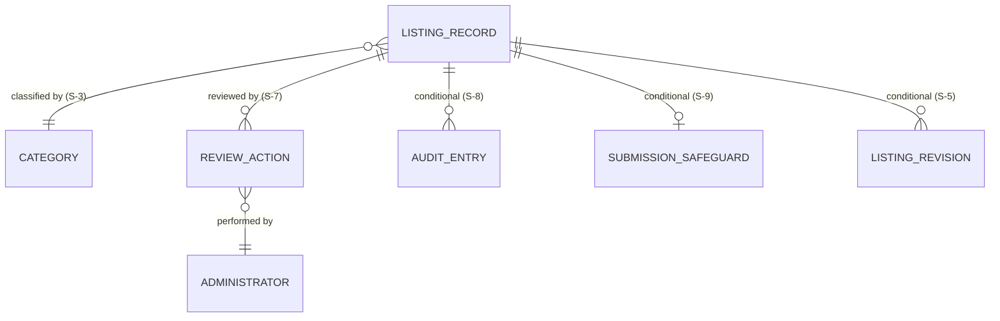
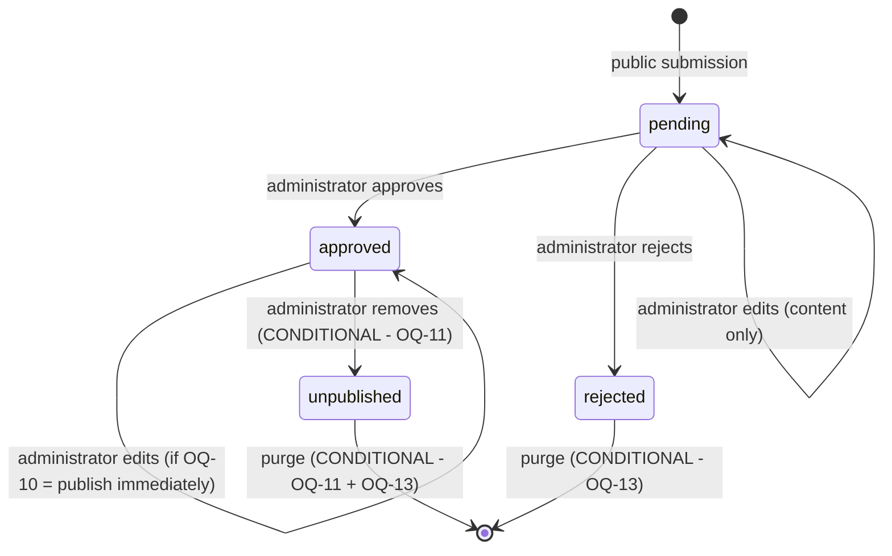

# Community Directory Platform — MVP Data Model

## Purpose and scope

This document defines the **logical data model** for the MVP of the Community
Directory Platform: the entities the system holds, what each is responsible for,
how they relate, what states a record moves through, which data is public and which
is not, and what must be true of the data at all times.

**What this document is.** A technology-neutral description of *what information the
system holds and what must be true of it*, written so that a database design, an API
design, a validation layer, and a test suite can each be derived from it without any
of them having to re-litigate what a listing *is*.

**What this document is not.** It does **not** select a database engine, ORM,
migration tool, hosting provider, or framework. It contains **no** SQL, no schema
definitions, no ORM classes, no migrations, and no deployment resources. Physical
storage decisions — keys, indexes, column types, normalization, table layout — are
deliberately excluded and recorded as deferred decisions. A logical entity is not a
table, and a logical attribute is not a column.

**What this document must not do — the discipline that matters most here.** A data
model is unusually good at making an unmade decision *look settled*. A field drawn on
a diagram reads as a commitment; a table drawn between two entities reads as an
approved behavior. Several genuinely open product questions inherited from `docs/03`
through `docs/07` could each be "resolved" simply by drawing them. This document
therefore treats every unresolved choice as a **named seam** (`S-n`) — an explicit,
labeled place where the model is deliberately incomplete, with the candidate answers
spelled out and the consequence of each stated — rather than as a field that quietly
decides the question. **No open question is closed here.**

**The mini lab is not the model.** The Community Directory Mini Lab prototype used a
single `business_listings` table. This document does not inherit that shape. Where the
model arrives somewhere structurally similar, it is because the requirements led
there, and the reasoning is shown. `docs/07` records this hazard as R-10; it applies
with full force to a data model.

---

## Source documents

This model is derived from, and must remain consistent with:

- [`docs/01-vision.md`](./01-vision.md) — product vision; trust over volume; the mini
  lab informs but does not constrain.
- [`docs/02-stakeholders.md`](./02-stakeholders.md) — stakeholder needs, including the
  administrator interest in clear audit trails.
- [`docs/03-mvp-scope.md`](./03-mvp-scope.md) — approved MVP scope; the candidate
  listing fields and their classification; ten open questions.
- [`docs/04-user-journeys.md`](./04-user-journeys.md) — the six MVP journeys the data
  must support.
- [`docs/05-functional-requirements.md`](./05-functional-requirements.md) —
  `FR-DATA-01..11`, `FR-AUD-01..06`, `FR-VAL-01..06`, `FR-VIS-02`, and `OQ-1..OQ-15`.
- [`docs/06-non-functional-requirements.md`](./06-non-functional-requirements.md) —
  `NFR-DATA-01..06`, `NFR-PRIV-01..05`, `NFR-SEC-05/06/08`, `NFR-BACK-01..05`, and
  `NOQ-1..NOQ-9`.
- [`docs/07-system-architecture.md`](./07-system-architecture.md) — the single-store
  decision, the data-storage responsibilities table, the trust boundaries, and the
  deferred decisions `DD-1..DD-16`.

Where this document cites an identifier such as `OQ-10` or `NFR-DATA-02`, it refers to
the requirement or question of that name in the document above that owns it.

---

## Data-model principles

Seven principles govern the choices below. Where a later section makes a non-obvious
call, it names the principle it followed.

**P1 — Status is the only thing that makes data public.**
Publication is not a property of *where* a record lives or which collection holds it.
It is one attribute, on one record, changed by one authorized action. Any model in
which "public" can be inferred from two different places has two places to get it
wrong. (`FR-VIS-02`, `NFR-DATA-01`; `docs/07` principle 2.)

**P2 — One record, one lifecycle, one identity.**
A submission that is approved is *the same record* it was when pending. It does not
move and it is not copied. Its identity is stable from submission to whatever end
state it reaches. This is what lets publication be a single committed transaction
rather than a multi-step migration with a window in the middle.

**P3 — Administrative data is structurally, not conventionally, protected.**
Status, timestamps, and review information are system- or administrator-owned. "The
form doesn't submit them" is not protection. The model must express that these
attributes are *not part of the submittable surface at all*. (`FR-AUD-04`,
`NFR-DATA-04`.)

**P4 — Collect the minimum; hold it for a reason.**
Every attribute must be justified by a requirement, and every non-public attribute
must have a stated purpose and a retention answer. An attribute with neither is a
liability, not an asset. (`NFR-PRIV-04`, `NFR-PRIV-05`.)

**P5 — Model the shape of what is known; leave seams where it is not.**
Where a question is open, the model records the decision point, the candidate answers,
and what each would cost — and then stops. It does not pick the tidy answer to keep
the diagram clean.

**P6 — Logical is not physical.**
Attributes here have *meanings and obligations*, not types, lengths, or indexes.
"Identity", "timestamp", and "text" are logical notions. Whether identity is a UUID or
an integer, whether category is an enumeration or a reference table, and what is
indexed are implementation decisions, and all are deferred.

**P7 — Distinguish structural rules from policy rules.**
Some rules hold regardless of any open question ("a record has exactly one status").
Others depend entirely on an unmade decision ("name, category, description and city
are required at submission"). The first are stated as rules. The second are stated as
**rule slots** — the rule's *shape* is fixed, its *content* is pending. Confusing the
two is precisely how an open question gets silently closed.

---

## Logical data model overview

The MVP holds one thing of substance — **a listing record** — plus the supporting data
needed to classify it, moderate it, and (conditionally) account for what was done to
it.

**Read the diagram with its conditionals, or do not read it at all.** Only two
entities are unconditionally required by the approved MVP: the **listing record** and
the **category set** it draws from. **Administrator** is required but lives outside the
listing store (`docs/07` `DD-4`). The remaining four exist *only if* the open question
named on the relationship resolves in a particular direction. They are drawn so that
their cost is visible — not because they are approved.

---

## Core entities

| # | Entity | Status | Responsibility | Justified by |
|---|---|---|---|---|
| **E1** | **Listing record** | **Required** | Holds the identity, content, location, contact details, lifecycle status and administrative timestamps of one proposed or published directory entry. | `FR-DATA-01..09`, `FR-AUD-01..03` |
| **E2** | **Category** | **Required** | The finite, predefined set of classifications a listing may be assigned, available to both submission and filtering. | `FR-DATA-02`, `FR-DATA-10` |
| **E3** | **Administrator** | **Required; stored elsewhere** | The identity of a person authorized to review, approve, reject, edit or remove. Never stored inside a listing record. | `NFR-SEC-01/07/08`; `docs/07` `DD-4` |
| **E4** | **Review action** | **Seam S-7** | What an administrator did to a record, when, and any moderation note. May be attributes on E1 or a separate entity. | `FR-ADM-*`, `FR-CONF-02/03/04` |
| **E5** | **Audit entry** | **Conditional — S-8** | An append-only record of an administrator action, for accountability. Exists only if `OQ-14`/`NOQ-8` commits audit logging to the MVP. | `FR-AUD-05`, `NFR-OBS-05` |
| **E6** | **Submission safeguard data** | **Conditional — S-9** | Whatever an anti-abuse measure must retain. Exists only if `OQ-9` commits a safeguard, and its content depends entirely on which one. | `FR-SUB-09`, `NFR-SEC-06` |
| **E7** | **Listing revision** | **Conditional — S-5** | A proposed change to an already-approved listing, held apart from the live content while it awaits review. Exists **only if** `OQ-10` requires secondary review of edits. | `FR-ADM-10` |

**E3 deserves a sentence of its own.** Administrator identity is required for the MVP
to function, but it is deliberately *not* modeled here beyond its existence and its
attributability. `docs/07` defers the authentication mechanism (`DD-4`), and
`NFR-SEC-08` requires that credentials never sit in ordinary storage or appear in
logs. Modeling administrator credentials in the *listing* data model would be both
premature and unsafe. What this model does commit to is narrower and sufficient: **a
review action is attributable to exactly one administrator identity, and that identity
is never part of any listing's public surface.**

---

## Entity relationships

**Listing record → category (many-to-one *as the MVP baseline*; possibly many-to-many
— S-3).** `FR-DATA-02` requires each listing to carry *a single* category from a
predefined set, which reads as many-to-one. But `FR-SRCH-09` contemplates multi-select
filtering, and `OQ-5` leaves open both whether a listing may hold more than one
category and who curates the set. The many-to-one shape is stated as the *baseline the
approved requirement implies*, not as a resolution of `OQ-5`. The distinction matters
because moving to many-to-many is a **structural** change, not a field addition — see
`S-3`.

**Listing record → review action (one-to-many, if E4 is an entity at all — S-7).** A
record may be acted on more than once: submitted, edited, approved, edited again.
Whether each action is an entity or merely mutates attributes on the listing is the
seam. The relationship is drawn one-to-many because that is its shape *if* the entity
exists.

**Review action → administrator (many-to-one).** Every review action is attributable to
exactly one administrator. This is the only relationship in the model with no open
question attached, because `NFR-SEC-01` makes it non-negotiable: an action that cannot
be attributed to an authorized identity is an action the system should not have
permitted.

**Listing record → audit entry (one-to-many; conditional — S-8).** If audit logging is
committed, entries reference the listing they concern and are **append-only**: never
updated, never deleted through the ordinary application path. An audit log that the
audited thing can edit is not an audit log.

**Listing record → listing revision (one-to-many; conditional — S-5).** Exists only
under one resolution of `OQ-10`. Treated at length below, because it is the open
question with the largest structural consequence in this document.

**What is deliberately absent.** There is no owner, account, claim, customer review,
rating, analytics event, advertisement, payment, community event, social relation, or
device registration. Each is excluded by `docs/03`. Their absence is a decision, not an
oversight.

---

## Listing entity

**E1 — the listing record.** One record represents one business, organization, or
resource proposed for, or present in, the directory.

| Attribute | Meaning | Ownership | Requirement |
|---|---|---|---|
| **Identity** | A stable, system-assigned identifier that does not change for the life of the record and is never derived from content. | System | P2; `NFR-DATA-06` |
| **Name** | The business or organization name; the record's core identity to a reader. | Submitter, editable by administrator | `FR-DATA-01` |
| **Category** | One classification drawn from the predefined set (E2). | Submitter, editable by administrator | `FR-DATA-02` |
| **Description** | Short descriptive text. | Submitter, editable by administrator | `FR-DATA-03` |
| **City** | The location value supporting location filtering. | Submitter, editable by administrator | `FR-DATA-04` |
| **State or region** | Optional location refinement. | Submitter, editable by administrator | `FR-DATA-05` |
| **Country** | Location value whose *existence* depends on `OQ-6`. | Submitter, editable by administrator | `FR-DATA-06` |
| **Phone** | Contact method. | Submitter, editable by administrator | `FR-DATA-07` |
| **Email** | Contact method. | Submitter, editable by administrator | `FR-DATA-07` |
| **Website** | Contact method. | Submitter, editable by administrator | `FR-DATA-07` |
| **Status** | Exactly one of *pending*, *approved*, *rejected* at all times. | **System/administrator only** | `FR-AUD-01`, `NFR-DATA-01` |
| **Submitted at** | The moment the record was submitted. Written once; never changes. | **System only** | `FR-AUD-02`, `NFR-DATA-05` |
| **Last updated at** | The moment the record's content or status last changed. | **System only** | `FR-AUD-03`, `NFR-DATA-05` |

**Identity is a logical commitment, not a key choice.** The model requires that a
listing have a stable identity independent of its content — because a listing's name
can be corrected by an administrator (`FR-ADM-*`) and a record must survive that
without becoming a different record. Whether that identity is a UUID, a sequence, or
something else is a physical decision and is deferred (`DDM-2`).

**Why `submitted at` is write-once and `last updated at` is not.** `NFR-DATA-05` fixes
this precisely: the submission date is recorded once at submission and does not
change; the last-updated date changes whenever content *or status* changes. Note the
consequence, which is easy to miss: **approving a listing changes its last-updated
timestamp even though no content changed**, because status is a change. Any
implementation that only touches the timestamp on content edits violates
`NFR-DATA-05`.

**What is *not* on the listing record, deliberately.** No submitter account reference
(no accounts exist — `docs/03`). No owner. No view count, rating, or promotion flag.
No geocoordinates. No opening hours or images. Each of these is a plausible directory
field and each is out of MVP scope; adding any "while we are here" would be exactly the
over-modeling this document is written to avoid.

---

## Listing-submission entity

**There is no separate submission entity, and that is a derived conclusion rather than
a convenience.**

It is natural to model a *pending submission* and an *approved listing* as two
entities — they feel different, they are seen by different people, and they live at
different sides of the trust boundary. The MVP does not model them that way, for a
reason `docs/07` already settled at the architecture level and this document inherits:

> Separating pending from approved records into different stores looks like a stronger
> public/private split. It is not: it replaces a single transactional status change
> with a cross-store move, creating a window in which a record is in both stores or
> neither, and a second place where "public" gets decided.
> — `docs/07`, *Data-storage responsibilities*

The same argument holds one level down, at the data model. If a submission and a
listing are separate entities, then **approval is a copy**, and a copy introduces
three defects the single-entity model simply does not have:

1. **A window of inconsistency.** Between "write the listing" and "delete the
   submission" there is a moment where the record exists twice or not at all. This
   directly threatens `NFR-DATA-03` (a moderation action completes fully or has no
   effect).
2. **A second definition of "public."** Publicity would then be encoded both in *which
   entity you are* and in *what status you hold* — two sources of truth, violating
   **P1**.
3. **Broken identity across the lifecycle.** An approved listing would have a different
   identity from the submission it came from, making any audit trail, any retention
   rule, and any "what happened to my submission" question harder than it needs to be.
   This violates **P2**.

**So: a submission is a listing record whose status is *pending*.** Approval is a
status transition on one record, not a migration between two. "Approved listing",
"pending submission", and "rejected submission" are *three states of one entity*, not
three entities.

**What is genuinely different about a submission is not its structure but its
exposure**, and exposure is governed by status (**P1**) and enforced on the server
(`docs/07`), not by which table a row sits in.

**The one thing that would change this conclusion** is a resolution of `OQ-10`
requiring secondary review of edits to *approved* listings. That would introduce a
genuinely distinct thing — a *proposed change that is not yet live* — which cannot be
the live record, because the public must keep seeing the old version while the new one
awaits review. That is entity **E7**, and it is conditional. See `S-5`.

---

## Administrative review data

The information generated by an administrator's act of moderation — as distinct from
the listing content itself.

| Attribute | Meaning | Requirement | Status |
|---|---|---|---|
| **Reviewed by** | Which administrator identity performed the action. | `NFR-SEC-01` | Seam `S-7` |
| **Reviewed at** | When the action occurred. | `FR-AUD-03` | Seam `S-7` |
| **Action taken** | Approve, reject, or edit. | `FR-ADM-*` | Seam `S-7` |
| **Moderation note** | Free text an administrator records about a decision (for example, why a submission was rejected, or that it duplicates an existing listing). | `FR-ADM-*`, `OQ-12` | Seam `S-7` — **never public** |

**Seam S-7 — where does review data live?** Two shapes are viable and the choice is
not forced by the requirements:

- **(a) Attributes on the listing record.** Simplest. Holds only the *most recent*
  review. Sufficient if no one ever needs to know that a record was rejected, edited,
  and then approved — only that it is approved now.
- **(b) A separate review-action entity, one per action.** Retains the sequence.
  Necessary if review history matters.

**These two are not equally safe to defer, and the reason is worth stating.** Shape (a)
is *lossy*: the moment a second action occurs, the first is gone. If audit logging is
later committed (`OQ-14`) or a retention question turns on "when was this rejected"
(`OQ-13`), shape (a) cannot answer retrospectively — the data was never kept. The
model therefore records that **`S-7` should be resolved together with `S-8`**
(`OQ-14`), because choosing (a) while audit logging is still open risks discovering
later that the history one needs was never recorded.

**The moderation note is non-public data and must be modeled as such.** It may contain
an administrator's candid assessment of a submission. `NFR-PRIV-03` places it firmly on
the non-public side of the boundary, and it must never be reachable through any public
path — including, per `NFR-BACK-04`, through a restored backup.

---

## Status model

Every listing record holds **exactly one status at all times** (`NFR-DATA-01`), drawn
from the three values `FR-AUD-01` fixes: **pending**, **approved**, **rejected**.

**In words, because the diagram alone is not the specification.** A record enters the
system as *pending* — never as anything else, since nothing is public until an
administrator approves it (`docs/03`, `FR-VIS-02`). From *pending*, an administrator
may approve it (it becomes publicly visible) or reject it (it does not). An
administrator may also edit a pending record without changing its status. An approved
record may be edited by an administrator to keep it accurate.

**Two transitions on that diagram are marked conditional, and neither may be treated
as approved:**

- **`approved → unpublished`** exists **only if `OQ-11`** confirms that administrators
  may unpublish or remove an approved listing in the MVP. This is not settled.
  Critically, if it is confirmed, *the three-value status set in `FR-AUD-01` is no
  longer sufficient* — a fourth state is needed, or removal must be modeled some other
  way. **This is the trap in `OQ-11`**: it looks like a permissions question, but it is
  a status-model question, and answering it "yes" changes an approved requirement.
- **`rejected → purge`** exists **only if `OQ-13`** resolves toward deletion rather
  than indefinite retention. See *Data retention considerations*.

**The transition rule, stated as an invariant** (`NFR-DATA-02`): a status change occurs
**only** through a defined administrator action, **only** along a permitted edge above,
and **only** as part of a single all-or-nothing write (`NFR-DATA-03`). No other path
may alter status — not a public form, not a bulk import, not a direct store write.

**What the model does *not* decide.** It does not decide whether an edit to an approved
listing keeps that listing publicly visible while the edit is reviewed (`OQ-10` /
`S-5`), whether a rejected record may be resubmitted, or what ordering or precedence
statuses have. Those are open.

---

## Public versus private data

This is the boundary the whole product rests on, and it has **two independent
dimensions**. Conflating them is the most common way a directory leaks data.

**Dimension 1 — record-level exposure, which is settled.**
A record is publicly visible **if and only if its status is *approved***. No pending
record, no rejected record, and no non-public attribute of any record may be reachable
through a public path (`FR-VIS-02`, `NFR-PRIV-03`). This is **not** an open question and
must be treated as an invariant: `DI-5` below.

**Dimension 2 — field-level exposure, which is *not* settled.**
*Given* an approved record, which of its attributes may a visitor see? `OQ-7` is open,
and the model must not close it.

| Attribute | Record-level | Field-level exposure |
|---|---|---|
| Name, category, description, city | Public only when approved | Public — implied by the browse/search/detail journeys (`FR-VIS-04`) |
| State/region, country | Public only when approved | **Open — `OQ-7`** (and `OQ-6` decides whether they exist) |
| Phone, email, website | Public only when approved | **Open — `OQ-7`.** The submitter's own contact details are the sharpest case: a phone number offered *so administrators can verify a listing* is not the same as a phone number offered *for publication.* |
| Status, submitted at, last updated at | — | **Never public** (`FR-DATA-11`, `NFR-PRIV-01`) |
| Reviewed by, reviewed at, moderation note | — | **Never public** (`NFR-PRIV-03`) |
| Safeguard data (E6) | — | **Never public** (`NFR-PRIV-03/04`) |

**The seam, stated plainly (`S-2`).** The model requires that **every attribute carry an
explicit public-or-not designation**, and that the default for any attribute whose
designation is undecided is **not public**. It does *not* fill in the designations that
`OQ-7` owns. Fail-closed is the only safe default: a field wrongly withheld is a bug
someone reports; a field wrongly published is a privacy incident that cannot be undone.

**A distinction `OQ-7` must draw explicitly.** The form may need to collect data that is
never published — most obviously a contact method used to verify the submitter rather
than to display. `NFR-PRIV-02` anticipates exactly this ("any contact field designated
non-public…"), and `NFR-PRIV-04` limits collection to what is needed. If `OQ-7` resolves
without separating *collected* from *published*, the model will have a category of data
with no home, and the likeliest failure is that it gets published by default.

---

## Required, optional, administrative, and deferred fields

Four classifications, plus a fifth the earlier documents force us to admit: **undecided**.

| Classification | Meaning | Attributes |
|---|---|---|
| **Required** | Must hold a value for the record to be valid. | Name (`FR-DATA-01`), category (`FR-DATA-02`), description (`FR-DATA-03`), city (`FR-DATA-04`) |
| **Optional** | May hold no value; the record is valid either way. | State/region (`FR-DATA-05`), phone, email, website (`FR-DATA-07`, each individually optional) |
| **Administrative** | Set by the system or an authorized administrator; **never** part of the public submittable surface. | Status, submitted at, last updated at (`FR-DATA-09`, `NFR-DATA-04`); reviewed by / at, moderation note (`S-7`) |
| **Undecided** | The attribute's existence or obligation is genuinely open. | Country (`FR-DATA-06`, `OQ-6`); the contact-method minimum (`FR-DATA-08`, `OQ-8b`); the full required set at submission (`OQ-8`) |
| **Deferred** | Deliberately absent from the MVP. | Owner/account reference, claim state, ratings, reviews, analytics, promotion, geocoordinates, hours, images, tags |

**The "Required" column above is narrower than it looks, and this must not be
misread.** It states the fields `FR-DATA-01..04` mark **Must** — that is, the fields a
*valid listing record* carries. It does **not** state which fields the *public
submission form* requires: that is `OQ-8`, and it is open. The two can differ. A model
that silently equates "required on the record" with "required at submission" has
answered `OQ-8` by accident. See rule slot `VR-S1`.

**The contact-method minimum is the subtlest of these.** `FR-DATA-07` makes phone,
email and website *each individually optional*, while `FR-DATA-08` proposes that at
least one be present — a **cross-field** obligation, priced `Should` and explicitly not
yet approved (`OQ-8b`). These are not contradictory, but they are easy to render
contradictory in a schema: marking all three nullable *and* adding a
"at least one non-null" constraint decides `OQ-8b` in the affirmative; marking all three
nullable and adding nothing decides it in the negative. **Either way, drawing it decides
it.** The model therefore holds this as rule slot `VR-S2` and declines both.

---

## Validation rules

Following **P7**, rules that hold regardless of any open question are stated as
**rules**; rules whose *content* depends on an unmade decision are stated as **slots**.

**Structural rules — committed.**

| ID | Rule | Source |
|---|---|---|
| `VR-1` | A listing record must hold exactly one status, and it must be one of the defined values. | `NFR-DATA-01`, `FR-AUD-01` |
| `VR-2` | Category, where present, must reference a member of the predefined set — never a free-text value. | `FR-DATA-02`, `FR-DATA-10` |
| `VR-3` | Administrative attributes may not be set or altered by a public actor, under any input. | `FR-AUD-04`, `NFR-DATA-04` |
| `VR-4` | All submitted input must be validated and constrained before it is recorded, so malformed or malicious input cannot corrupt stored data. | `NFR-SEC-05` |
| `VR-5` | Validation must identify the specific field(s) at fault and preserve already-entered valid input, so the submitter corrects only what is wrong. | `FR-VAL-02`, `FR-VAL-03` |
| `VR-6` | Administrator edits are validated by the **same** field and format rules as public submissions — no privileged bypass. | `FR-VAL-04` |
| `VR-7` | A validation failure must leave **no** record behind — and in particular no publicly visible one. | `FR-SUB-06`, `FR-ERR-05`, `NFR-DATA-03` |

**Rule slots — shape fixed, content pending.**

| ID | Slot | Blocked on |
|---|---|---|
| `VR-S1` | *The set of fields required at submission.* A required-field rule will be enforced; **which** fields it names is not decided. | `OQ-8` |
| `VR-S2` | *The contact-method minimum.* The system will either enforce "at least one of phone/email/website" or not. Which, is not decided. | `OQ-8b`, `FR-DATA-08` |
| `VR-S3` | *Format checks* (phone, email, URL shape). That formats will be checked is committed by `NFR-SEC-05`; the specific rules and their strictness are not. | `OQ-8` |
| `VR-S4` | *Location obligations.* Whether state/region and country are required, optional, or absent. | `OQ-6` |
| `VR-S5` | *Category cardinality.* Whether exactly one category is enforced or several permitted. | `OQ-5` |
| `VR-S6` | *Duplicate detection.* Whether the model must support identifying near-duplicate submissions, and on which attributes. | `OQ-12` |

**Why `VR-S3` is a slot and not a rule.** It is tempting to write "email must match an
email pattern" and call it settled. But format strictness is a product decision with real
consequences: over-strict validation rejects legitimate international phone numbers and
valid-but-unusual addresses, which in a *community* directory falls hardest on exactly
the small and unconventional organizations the vision exists to include (`docs/01` —
accessibility and inclusivity). The obligation to validate is committed. The severity is
a product call, and it is not this document's to make.

---

## Data lifecycle

The life of one record, from arrival to end state.

1. **Creation.** A public submission creates one listing record with status *pending* and
   a `submitted at` timestamp. It is not public. No public actor supplies status or
   timestamps (`VR-3`).
2. **Review.** An administrator reads the pending record, including its non-public
   attributes.
3. **Decision.** Exactly one of: **approve** (status → *approved*; the record becomes
   publicly visible in that same committed write), **reject** (status → *rejected*; it
   does not become visible), or **edit** (content changes; status unchanged).
4. **Maintenance.** An approved record may be edited later to keep it accurate. Every such
   change updates `last updated at`.
5. **End state.** Here the lifecycle **stops being decided**, and the model says so.
   Whether an approved record can be unpublished or removed is `OQ-11`; whether a rejected
   record is retained or purged is `OQ-13`. **The MVP has no approved end state for a
   record.** That is not an omission in this document — it is an accurate report of an
   unmade decision.

**Every step above is a single all-or-nothing write** (`NFR-DATA-03`). There is no
intermediate state in which a record is half-approved, partially edited, or visible before
its status says it should be.

---

## Data retention considerations

**The genuine contradiction, named rather than buried.** `FR-AUD-06` says rejected
submissions should be **retained** for audit. `NFR-PRIV-05` says non-public data must
**not** be kept indefinitely by default, and must have a documented purpose and period.
These pull in opposite directions, and **`OQ-13` must resolve both at once.**

The resolution space is narrower than it first appears:

- **"Retain forever"** satisfies `FR-AUD-06` and **violates** `NFR-PRIV-05`. A rejected
  submission is a body of contact data belonging to someone whose request was *declined* —
  arguably the least justifiable data in the system to keep indefinitely.
- **"Discard immediately"** satisfies `NFR-PRIV-05` and **defeats** `FR-AUD-06`, and
  destroys the only evidence of a moderation decision — awkward if a rejection is disputed.
- **"Retain for a defined period, for a defined purpose, then purge"** is the only shape
  that satisfies both. `docs/07` reaches the same conclusion independently.

**The consequence the model must state:** if retention is chosen, **a purge capability
becomes a requirement rather than a nice-to-have**, and someone must own running it. A
retention period with no mechanism to enforce it is retention forever with extra paperwork.

**Retention questions the model records and does not answer:**

| Question | Owner |
|---|---|
| How long are rejected submissions retained, and for what stated purpose? | `OQ-13` |
| What retention applies to non-public submitter data on *approved* records — e.g. a contact method collected for verification but never published? | `OQ-7` + `NFR-PRIV-05` |
| How long are audit entries kept, if they exist at all? | `OQ-14`, `NOQ-7` |
| How long are safeguard artifacts kept, if a safeguard exists? | `OQ-9`, `NFR-PRIV-04` |
| Does a purge reach into backups, or only the live store? | `NFR-BACK-04` |

**That last row is the one teams miss.** `NFR-BACK-04` requires backups to preserve the
same confidentiality as live data. It follows that purging a rejected submission from the
live store does not, by itself, purge it: it persists in every backup taken before the
purge. Whether that is acceptable is a real decision, and it belongs to `OQ-13` — not to
whoever later configures the backup schedule.

---

## Auditability considerations

**What exists today without any new entity.** The listing record already carries a *weak*
trail: current status, submission time, last-update time. That answers "what is this record
now, and when did it last change." It does **not** answer "who approved this, and why was
that one rejected" — the questions the administrators in `docs/02` actually asked for.

**Seam S-8 — is audit logging in the MVP?** `FR-AUD-05` prices it **Should**; `OQ-14` and
`NOQ-8` leave it open. The model does not decide, and records what each answer costs:

- **If yes:** entity **E5**, an **append-only** collection. Append-only is not a
  performance note — it is the entire property that makes an audit log worth having. Entries
  reference the listing, name the administrator, the action and the time; they are excluded
  from every public path; and per `NFR-SEC-08` and `NOQ-7` they must not capture credentials
  or unnecessary personal data.
- **If no:** the system keeps only the weak trail above and **loses history permanently**.

**That asymmetry is the whole point, and it is why `S-7` and `S-8` must be resolved
together.** Audit data not captured at the moment of the action can never be reconstructed
afterwards. Choosing the lossy review-data shape while audit logging is still open is a
decision to discard history that a later "yes" to `OQ-14` cannot recover.

---

## Privacy and security considerations

**The data model carries privacy obligations that no amount of careful coding can add
later.** Four of them are structural.

**1 — Non-public data must be non-public *by construction*, not by query discipline.**
Pending records, rejected records, moderation notes, administrative timestamps, and any
withheld contact field are reachable only through an authorized administrative path
(`NFR-PRIV-03`). The model's contribution is that **every attribute carries an explicit
public-or-not designation** and the default for anything undecided is *not public* (`S-2`).
A model that leaves exposure implicit forces every future query to re-derive it, and one of
them eventually gets it wrong.

**2 — Collect only what a listing needs** (`NFR-PRIV-04`). Every attribute in this model
traces to a requirement. The pressure to add "just in case" attributes — a submitter name, a
reason for listing, a phone number for follow-up — must be resisted unless a requirement
demands it, because each becomes personal data with a retention obligation attached (**P4**).

**3 — Credentials are not listing data** (`NFR-SEC-08`). Administrator credentials appear
nowhere in this model. The listing record references an administrator *identity* for
attribution and nothing more.

**4 — Backups inherit the boundary** (`NFR-BACK-04`). A backup containing pending and
rejected submissions is as sensitive as the live store, and a restore must not expose what
the live system withholds. This is a data-model consequence, not merely an operations one:
it means the public/private boundary must be a property *of the data*, not of the
application layer sitting in front of it — because a restored backup has no application
layer in front of it.

**Seam S-9 — anti-spam data.** `OQ-9` leaves open whether the unauthenticated submission
form has any abuse safeguard. Its data consequence is real and is easy to overlook: **most
safeguards require retaining something** — a rate-limit counter keyed to a network address,
a token, a challenge result, a timestamp series. Each of those is new data about a person
who has *not* consented to a listing, which puts it squarely under `NFR-PRIV-04`
(collect only what is needed) and `NFR-PRIV-05` (retain for a defined period). The model
records `E6` as conditional and refuses to guess its content, because the content depends
entirely on the safeguard chosen — and choosing the safeguard is `OQ-9`, not this document.

---

## Search and filtering data needs

The MVP must support keyword search (`FR-SRCH-01`), category filtering (`FR-SRCH-04`),
location filtering (`FR-SRCH-05`), and their combination (`FR-SRCH-06`) — **over approved
listings only** (`FR-VIS-02`).

**What the model commits.**

| Need | Data consequence | Source |
|---|---|---|
| Every query is scoped to approved records | Status must be efficiently selectable — it is a predicate on *every* public read, not an afterthought | `FR-VIS-02`, `NFR-PERF-02` |
| Category filtering | Category must be a finite, referenceable value, not free text | `FR-DATA-02`, `FR-DATA-10` |
| Location filtering | At least one location attribute must be filterable | `FR-SRCH-05` |
| Keyword search | At least one textual attribute must be searchable | `FR-SRCH-01` |
| Combined criteria | The filterable attributes must be usable *together* in one query | `FR-SRCH-06` |

**What the model refuses to commit — and this is deliberate.**

- **Which fields are searched (`OQ-4` / `S-4`).** Name only? Name and description? Category
  and city too? This is unresolved, and it is *not* a cosmetic choice: it determines which
  attributes need to be efficiently searchable, and — if withheld contact fields were ever
  searched — could leak the existence of data that `OQ-7` decided not to publish. **Search
  scope must never exceed publication scope.** That constraint is committed here even though
  the scope itself is not.
- **The matching mode** (exact, partial, fuzzy) — `FR-SRCH-02`, `OQ-4`.
- **Which fields are filterable beyond category and location** — open.
- **Default ordering** (`OQ-3`) — which, if it is ever "most recently updated", would make
  `last updated at` a *public-affecting* attribute, and that would need to be reconciled with
  `NFR-PRIV-01`, which says administrative timestamps are never presented as public content.
  Worth flagging now rather than discovering later.

**Indexes are not in this document.** Which attributes are indexed, and how text search is
implemented, are physical decisions (`DDM-4`). The logical requirement is only that the
attributes above *can* be queried efficiently at the expected corpus size — and the expected
corpus size is itself unknown (`NOQ-4`).

---

## Data integrity rules

The invariants. Each must hold at every moment, not merely after a successful operation.

| ID | Invariant | Source |
|---|---|---|
| `DI-1` | Every listing record has **exactly one** status at all times — never none, never two. | `NFR-DATA-01` |
| `DI-2` | Status changes **only** through a defined administrator action, and **only** along a permitted lifecycle transition. | `NFR-DATA-02`, `FR-AUD-01` |
| `DI-3` | Every create, edit, or moderation action completes **fully or not at all**. No record is ever left partially written — and in particular, never **partially public**. | `NFR-DATA-03` |
| `DI-4` | Administrative attributes are settable only by the system or an authorized administrator, and are never modifiable by a public actor. | `NFR-DATA-04` |
| `DI-5` | **No record whose status is not *approved* is reachable through any public path** — not by browsing, not by search, not by direct reference to its identity, and not by a restored backup. | `FR-VIS-02`, `NFR-PRIV-03`, `NFR-BACK-04` |
| `DI-6` | `submitted at` is written once and never changes. `last updated at` changes on **every** content **or status** change. | `NFR-DATA-05` |
| `DI-7` | Stored data reflects the last successful action, with no silent loss or alteration. | `NFR-DATA-06` |
| `DI-8` | A record's identity is stable for its entire life and survives every content edit and status change. | **P2** |
| `DI-9` | A category value on a listing always references a member of the predefined set. | `FR-DATA-02`, `FR-DATA-10` |

**`DI-5` is the one to defend hardest.** It is the single invariant whose violation is a
*trust* failure rather than a *correctness* failure — and the vision's first principle is
trust over volume. Note that it is stated over **paths**, not over queries: "we never write a
query that returns pending records" is a coding convention, and conventions are broken by the
next person in a hurry. `DI-5` demands that the *data itself* be arranged so the public path
has no way to express a request for a non-approved record — which is exactly the guarantee
`docs/07` builds its component boundaries around.

**`DI-3` has a subtlety worth stating.** "Partially public" is a stronger requirement than
"partially written". A record could be fully written and still be partially public — for
example if status were committed before content, leaving a moment where an approved record
has no description. The invariant forbids that ordering, not merely torn writes.

---

## Open questions

**None of these is resolved by this document.** Each is carried forward from `docs/03` to
`docs/07`, with the specific *data* consequence added — which is this document's actual
contribution to them.

| ID | Question | Data consequence if it changes | Seam |
|---|---|---|---|
| `OQ-4` | Which fields are searched, and is matching exact, partial or fuzzy? | Determines which attributes must be efficiently searchable. Search scope must never exceed publication scope. | `S-4` |
| `OQ-5` | Single vs. multiple category; who curates the set; can administrators manage it? | Many-to-one vs. many-to-many is **structural**, not a field addition. If administrators curate the set, the category set becomes *mutable data*, not configuration. | `S-3` |
| `OQ-6` | Location granularity — city only, or state/region and country too? Is launch multi-country? | Decides whether `country` and `state/region` exist at all, and whether they are required. | `S-6` |
| `OQ-7` | Which listing/contact fields are public vs. withheld? | Fills the field-level exposure column. Must separate *collected* from *published*. | `S-2` |
| `OQ-8` | Which fields are required at submission, and with what format checks? | Fills `VR-S1` and `VR-S3`. Distinct from "required on a valid record". | `S-1` |
| `OQ-8b` | Is at least one contact method enforced per listing? | Fills `VR-S2`. A cross-field constraint that cannot be expressed as a per-field obligation. | `S-1` |
| `OQ-9` | Any anti-spam safeguard on the unauthenticated form? | Decides whether `E6` exists and what it holds. Most safeguards retain data about a non-consenting person. | `S-9` |
| `OQ-10` | Does an edit to an approved listing publish immediately, or need secondary review? | **The largest structural consequence in this document.** Secondary review requires entity `E7` and a new lifecycle state. | `S-5` |
| `OQ-11` | Can administrators unpublish or remove an approved listing? | If yes, the three-value status set of `FR-AUD-01` is **no longer sufficient**. | `S-5` |
| `OQ-12` | How are duplicate/near-duplicate submissions resolved? | Fills `VR-S6`; may require attributes or a relationship to express "duplicate of". | `S-10` |
| `OQ-13` | Are rejected submissions retained or discarded? | Resolves the `FR-AUD-06` / `NFR-PRIV-05` contradiction. If retained: a purge capability becomes mandatory. | `S-11` |
| `OQ-14` | Are administrator actions recorded in an audit log? | Decides whether `E5` exists. **Cannot be answered retrospectively** — uncaptured history is gone. | `S-8` |
| `NOQ-3` | Backup frequency, recovery point, recovery time? | Constrains the store's required durability properties. | — |
| `NOQ-4` | Expected corpus size and load? | Determines whether the query needs above are trivial or demanding. | — |
| `NOQ-7` | Log retention period; what counts as sensitive data to exclude? | Constrains what an audit entry may contain. | `S-8` |

### The named seams

| Seam | Where the model is deliberately incomplete | Blocked on |
|---|---|---|
| `S-1` | The submission obligation set — required fields, contact minimum, formats. | `OQ-8`, `OQ-8b` |
| `S-2` | Field-level public/private designation. **Default: not public.** | `OQ-7` |
| `S-3` | Category cardinality and curation; whether the set is configuration or data. | `OQ-5` |
| `S-4` | Searchable attribute set and matching mode. | `OQ-4` |
| `S-5` | Edit-after-approval and removal — whether `E7` and a fourth status state exist. | `OQ-10`, `OQ-11` |
| `S-6` | Location attributes — which exist, which are required. | `OQ-6` |
| `S-7` | Review data shape — attributes on `E1`, or a separate `E4`. **Resolve with `S-8`.** | `OQ-14` (dependency) |
| `S-8` | Audit entries — whether `E5` exists. | `OQ-14`, `NOQ-8` |
| `S-9` | Anti-spam data — whether `E6` exists and what it holds. | `OQ-9` |
| `S-10` | Duplicate representation. | `OQ-12` |
| `S-11` | Rejected-submission retention and purge. | `OQ-13` |

---

## Deferred data decisions

Decisions this document deliberately does **not** make, distinct from the open questions
above: an open question is a *product* decision someone must make; a deferred decision is an
*implementation* decision that must not be made here.

| ID | Deferred decision | Why it is not here | Blocked on |
|---|---|---|---|
| `DDM-1` | **The store product.** No database engine, service or vendor is selected. | `docs/07` `DD-3`. A store cannot be responsibly chosen against an unknown recovery point objective. | `NOQ-3` |
| `DDM-2` | **Identity strategy** — UUID, sequence, natural key. | Physical (**P6**). The logical requirement is only that identity be stable and content-independent (`DI-8`). | — |
| `DDM-3` | **Category representation** — enumeration, reference table, or configuration. | Depends on whether administrators curate the set at runtime. | `OQ-5` |
| `DDM-4` | **Indexing and text-search strategy.** | Physical. Depends on corpus size and search scope. | `OQ-4`, `NOQ-4` |
| `DDM-5` | **Normalization of location** — city/region as free text or a reference table. | Depends on granularity and whether values must be constrained. | `OQ-6` |
| `DDM-6` | **Physical separation of non-public attributes** — same record, or a separate related structure. | An implementation of the `S-2` boundary; the *boundary* is logical, the *mechanism* is not. | `OQ-7` |
| `DDM-7` | **Audit-entry storage** — same store, separate store, or append-only log. | Only meaningful once `E5` is known to exist. | `OQ-14` |
| `DDM-8` | **Revision storage**, if `E7` exists. | Only meaningful once `OQ-10` resolves. | `OQ-10` |
| `DDM-9` | **Soft-delete vs. hard-delete** representation. | Presupposes that removal exists at all. | `OQ-11`, `OQ-13` |
| `DDM-10` | **Migration and schema-evolution tooling.** | Out of scope for a logical model entirely. | — |

**`DDM-6` is worth a second look**, because it is the one most likely to be mistaken for a
logical decision. Whether withheld contact fields sit on the same record as public ones, or
in a separate related structure, is a *mechanism*. The *obligation* — that they never reach a
public path (`DI-5`) — is logical and is committed here. Deciding the mechanism now would
prejudge `OQ-7`, since a separate structure only makes sense once we know something is
actually withheld.

---

## Traceability to requirements

### Functional requirements → data model

| Requirement group | Where it lands |
|---|---|
| `FR-DATA-01..08` (listing content) | `E1` attributes — name, category, description, city, state/region, country, phone, email, website |
| `FR-DATA-09` (administrative fields) | `E1` administrative attributes; `DI-4`; **P3** |
| `FR-DATA-10` (predefined category set) | `E2`; `DI-9`; `VR-2` |
| `FR-DATA-11` (public exposure limits) | *Public versus private data*; `S-2`; `DI-5` |
| `FR-AUD-01` (three statuses, defined transitions) | *Status model*; `DI-1`, `DI-2` |
| `FR-AUD-02/03` (timestamps) | `E1`; `DI-6` |
| `FR-AUD-04` (admin data not public-editable) | `DI-4`; `VR-3` |
| `FR-AUD-05` (audit log) | `E5` — **conditional**, `S-8` |
| `FR-AUD-06` (retain rejected) | *Data retention*; `S-11` — in tension with `NFR-PRIV-05` |
| `FR-VAL-01..06` (validation) | *Validation rules* — `VR-1..7`, slots `VR-S1..S6` |
| `FR-VIS-02` (only approved visible) | `DI-5` — the model's hardest invariant |
| `FR-VIS-04/05` (listing details) | Field-level exposure — `S-2` |
| `FR-SRCH-01..09` (search and filter) | *Search and filtering data needs*; `S-4` |
| `FR-SUB-06`, `FR-ERR-05` (no partial/public record on failure) | `VR-7`; `DI-3` |
| `FR-ADM-10` (edit after approval) | `E7` — **conditional**, `S-5` |
| `FR-ADM-12` (removal) | *Status model*, conditional transition — `S-5` |
| `FR-ADM-13`, `FR-MOD-04` (duplicates) | `VR-S6`; `S-10` |

### Non-functional requirements → data model

| Requirement group | Where it lands |
|---|---|
| `NFR-DATA-01` (exactly one status) | `DI-1` |
| `NFR-DATA-02` (permitted transitions only) | `DI-2`; *Status model* |
| `NFR-DATA-03` (atomic, never partially public) | `DI-3` |
| `NFR-DATA-04` (admin fields system-set) | `DI-4`; **P3** |
| `NFR-DATA-05` (timestamp semantics) | `DI-6` |
| `NFR-DATA-06` (no silent loss) | `DI-7` |
| `NFR-PRIV-01/02` (public field limits) | `S-2`; *Public versus private data* |
| `NFR-PRIV-03` (non-public data unreachable publicly) | `DI-5` |
| `NFR-PRIV-04` (minimal collection) | **P4**; `S-9` |
| `NFR-PRIV-05` (bounded retention) | *Data retention*; `S-11` |
| `NFR-SEC-05` (input constrained) | `VR-4` |
| `NFR-SEC-06` (anti-abuse safeguard) | `E6` — **conditional**, `S-9` |
| `NFR-SEC-01/08` (admin auth; credentials never in ordinary storage) | `E3` — identity referenced, credentials absent |
| `NFR-BACK-04` (backups keep the same confidentiality) | `DI-5`; *Data retention* — a purge that misses backups has not purged |
| `NFR-PERF-02/03` (query performance) | *Search and filtering data needs*; `DDM-4` |
| `NFR-OBS-05` (audit trail) | `E5` — conditional |

### Coverage statement

Every `FR-DATA`, `FR-AUD` and `FR-VAL` requirement is accounted for, as is every
`NFR-DATA` and `NFR-PRIV` requirement. Requirements that depend on an unresolved product
question are **mapped to a seam rather than to a field** — that is the point of the seams, and
the count is deliberate: **eleven seams for fifteen open questions.** A data model that
claimed full coverage today would be claiming to have answered questions nobody has answered.

---

## Future data-model considerations

Recorded for continuity, **not committed**, and deliberately **not modeled**. Each is
excluded from the MVP by `docs/03`. They are listed with their likely data impact so that a
future decision is informed — and so that no one mistakes their absence for an oversight.

| Future capability | Likely data impact | Why it is not modeled now |
|---|---|---|
| Business-owner accounts | A new actor entity, and an ownership relationship on `E1` | Excluded by `docs/03`. Modeling an owner reference "for later" would add a nullable relationship that every query must then consider. |
| Listing claiming | A claim entity with its own lifecycle and verification evidence | Presupposes accounts. |
| Reviews and ratings | A user-generated-content entity — with its own moderation lifecycle | The MVP moderates listing records only (`docs/03`). This would roughly double the moderation surface. |
| Listing analytics | Event or aggregate data, at far higher write volume than listings | Different data-shape entirely; would likely justify a separate store. |
| Paid promotion | A sponsorship relation and a ranking influence | Directly touches the vision's "trust over volume" principle; a data decision with a product-ethics dimension. |
| Community events | A time-bounded entity with recurrence | A genuinely different lifecycle from a listing. |
| Richer categorization | Hierarchical or multi-label taxonomy | `OQ-5` is the first step toward this; do not pre-build it. |
| Geographic browsing | Coordinates, geocoding, spatial queries | Would impose real constraints on the store choice (`DDM-1`). |
| Native mobile apps | No new *logical* entities; would pressure the API, not the model | Worth noting precisely because it changes *nothing* here. |

**The pattern in this table is the warning.** Every row could be accommodated "cheaply" today
by adding one nullable attribute or one empty relationship. That is exactly how a small model
becomes a large one without anyone deciding it should — each addition is individually
defensible and collectively fatal.

---

## Risks of over-modeling

Stated explicitly, because this document's chief risk is not that it models too little.

**R-1 — Resolving an open question by drawing it.** The dominant risk. Adding a `country`
attribute decides `OQ-6`. Adding a revisions relationship decides `OQ-10`. Adding
`deleted_at` decides `OQ-11`. Adding "at least one contact" decides `OQ-8b`. None of these
would feel like a decision at the time — each would feel like drawing an obvious box.
**Mitigation:** the eleven named seams, and the rule-slot device (**P7**) that keeps a
pending rule visible as pending.

**R-2 — Inheriting the mini lab's shape by default.** The prototype's single
`business_listings` table is a plausible answer, and its very plausibility is the danger:
arriving there by *inheritance* rather than by *derivation* would mean the model was never
actually reasoned about. **Mitigation:** the single-entity conclusion in *Listing-submission
entity* is derived from `NFR-DATA-03`, **P1** and **P2**, and would hold even if the
prototype had never existed. `docs/07` tracks the same hazard as R-10.

**R-3 — Confusing logical with physical.** Treating an entity as a table and an attribute as
a column would smuggle in `DDM-1..DDM-10` without anyone deciding them. **Mitigation:** **P6**,
and the deferred-decision register.

**R-4 — Modeling for the roadmap.** Adding an owner reference, a rating attribute, or a
promotion flag "since we know they are coming" imports future scope into present constraints.
**Mitigation:** the future-considerations table above states the impact without reserving the
space.

**R-5 — Under-modeling the lossy paths.** The mirror risk, and it is real: `S-7` and `S-8`
are the two places where choosing the *simpler* option destroys information that cannot be
recovered later. Minimalism is right nearly everywhere in this document — but not on the
audit path, where the cheap choice is irreversible. **Mitigation:** the dependency between
`S-7` and `S-8`, stated twice and deliberately.

---

## Summary

The MVP data model is **one entity and one reference set**: a listing record whose status —
*pending*, *approved*, or *rejected* — is the sole determinant of whether it is public, drawn
from a finite category set. A submission is not a separate thing; it is a listing record that
has not been approved yet. Approval is a status transition on one record in one committed
write, not a copy between two places.

That single decision is what makes the model both **small** and **safe**, and the two are not
in tension: there is exactly one place where "public" is decided, exactly one identity per
record for its whole life, and no window in which a record is half-published.

Everything genuinely undecided stays undecided, behind **eleven named seams**. Two deserve
attention before data design begins, because both are cheap now and expensive later:
**`OQ-10`** (edit-after-approval), which is the only open question that would add an entity
and a lifecycle state; and **`OQ-14`** (audit logging), which is the only one whose "no"
answer destroys information permanently.

The model introduces no schema, no SQL, no store product, and no deployment resource — and it
resolves none of the product questions that are not its to resolve.
