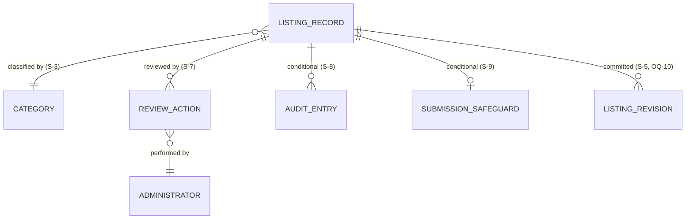
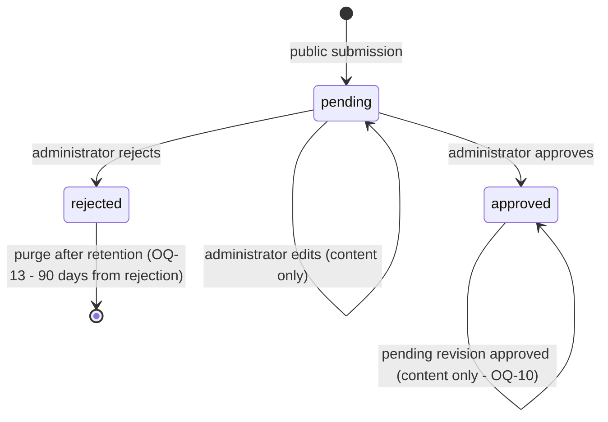
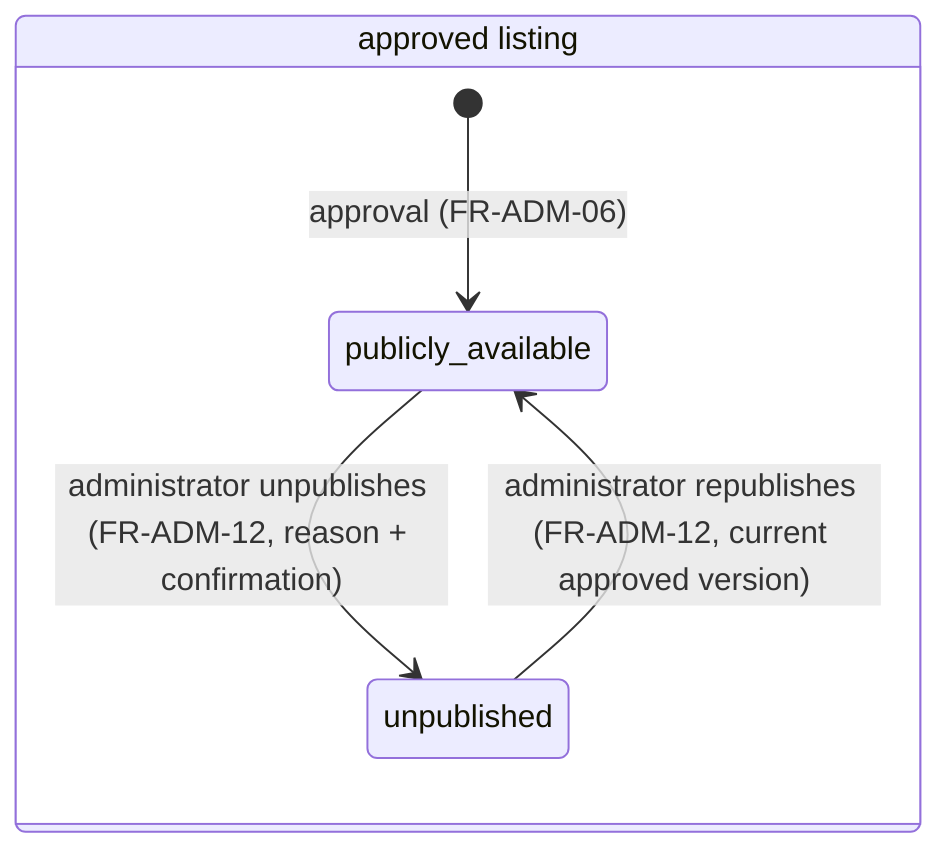

# Community Directory Platform — MVP Data Model

## Purpose and scope

This document defines the **logical data model** for the MVP of the Community
Directory Platform: the entities the system holds, what each is responsible for,
how they relate, what states a record moves through, which data is public and which
is not, and what must be true of the data at all times.

**What this document is.** A technology-neutral description of *what information the
system holds and what must be true of it*, written so that a database design, an API
design, a validation layer, and a test suite can each be derived from it without any
of them having to re-litigate what a listing *is*.

**What this document is not.** It does **not** select a database engine, ORM,
migration tool, hosting provider, or framework. It contains **no** SQL, no schema
definitions, no ORM classes, no migrations, and no deployment resources. Physical
storage decisions — keys, indexes, column types, normalization, table layout — are
deliberately excluded and recorded as deferred decisions. A logical entity is not a
table, and a logical attribute is not a column.

**What this document must not do — the discipline that matters most here.** A data
model is unusually good at making an unmade decision *look settled*. A field drawn on
a diagram reads as a commitment; a table drawn between two entities reads as an
approved behavior. Several genuinely open product questions inherited from `docs/03`
through `docs/07` could each be "resolved" simply by drawing them. This document
therefore treats every unresolved choice as a **named seam** (`S-n`) — an explicit,
labeled place where the model is deliberately incomplete, with the candidate answers
spelled out and the consequence of each stated — rather than as a field that quietly
decides the question. **No open question is closed here.**

**The mini lab is not the model.** The Community Directory Mini Lab prototype used a
single `business_listings` table. This document does not inherit that shape. Where the
model arrives somewhere structurally similar, it is because the requirements led
there, and the reasoning is shown. `docs/07` records this hazard as R-10; it applies
with full force to a data model.

---

## Source documents

This model is derived from, and must remain consistent with:

- [`docs/01-vision.md`](./01-vision.md) — product vision; trust over volume; the mini
  lab informs but does not constrain.
- [`docs/02-stakeholders.md`](./02-stakeholders.md) — stakeholder needs, including the
  administrator interest in clear audit trails.
- [`docs/03-mvp-scope.md`](./03-mvp-scope.md) — approved MVP scope; the candidate
  listing fields and their classification; ten open questions.
- [`docs/04-user-journeys.md`](./04-user-journeys.md) — the six MVP journeys the data
  must support.
- [`docs/05-functional-requirements.md`](./05-functional-requirements.md) —
  `FR-DATA-01..11`, `FR-AUD-01..06`, `FR-VAL-01..06`, `FR-VIS-02`, and `OQ-1..OQ-15`.
- [`docs/06-non-functional-requirements.md`](./06-non-functional-requirements.md) —
  `NFR-DATA-01..06`, `NFR-PRIV-01..05`, `NFR-SEC-05/06/08`, `NFR-BACK-01..05`, and
  `NOQ-1..NOQ-9`.
- [`docs/07-system-architecture.md`](./07-system-architecture.md) — the single-store
  decision, the data-storage responsibilities table, the trust boundaries, and the
  deferred decisions `DD-1..DD-16`.

Where this document cites an identifier such as `OQ-10` or `NFR-DATA-02`, it refers to
the requirement or question of that name in the document above that owns it.

---

## Data-model principles

Seven principles govern the choices below. Where a later section makes a non-obvious
call, it names the principle it followed.

**P1 — Status is the only thing that makes data public.**
Publication is not a property of *where* a record lives or which collection holds it.
It is one attribute, on one record, changed by one authorized action. Any model in
which "public" can be inferred from two different places has two places to get it
wrong. (`FR-VIS-02`, `NFR-DATA-01`; `docs/07` principle 2.)

**P2 — One record, one lifecycle, one identity.**
A submission that is approved is *the same record* it was when pending. It does not
move and it is not copied. Its identity is stable from submission to whatever end
state it reaches. This is what lets publication be a single committed transaction
rather than a multi-step migration with a window in the middle.

**P3 — Administrative data is structurally, not conventionally, protected.**
Status, timestamps, and review information are system- or administrator-owned. "The
form doesn't submit them" is not protection. The model must express that these
attributes are *not part of the submittable surface at all*. (`FR-AUD-04`,
`NFR-DATA-04`.)

**P4 — Collect the minimum; hold it for a reason.**
Every attribute must be justified by a requirement, and every non-public attribute
must have a stated purpose and a retention answer. An attribute with neither is a
liability, not an asset. (`NFR-PRIV-04`, `NFR-PRIV-05`.)

**P5 — Model the shape of what is known; leave seams where it is not.**
Where a question is open, the model records the decision point, the candidate answers,
and what each would cost — and then stops. It does not pick the tidy answer to keep
the diagram clean.

**P6 — Logical is not physical.**
Attributes here have *meanings and obligations*, not types, lengths, or indexes.
"Identity", "timestamp", and "text" are logical notions. Whether identity is a UUID or
an integer, whether category is an enumeration or a reference table, and what is
indexed are implementation decisions, and all are deferred.

**P7 — Distinguish structural rules from policy rules.**
Some rules hold regardless of any open question ("a record has exactly one status").
Others depend entirely on an unmade decision ("name, category, description and locality
are required at submission"). The first are stated as rules. The second are stated as
**rule slots** — the rule's *shape* is fixed, its *content* is pending. Confusing the
two is precisely how an open question gets silently closed.

---

## Logical data model overview

The MVP holds one thing of substance — **a listing record** — plus the supporting data
needed to classify it, moderate it, and (conditionally) account for what was done to
it.

```mermaid
erDiagram
    LISTING_RECORD }o--|| CATEGORY : "classified by (S-3)"
    LISTING_RECORD ||--o{ REVIEW_ACTION : "reviewed by (S-7)"
    REVIEW_ACTION }o--|| ADMINISTRATOR : "performed by"
    LISTING_RECORD ||--o{ AUDIT_ENTRY : "conditional (S-8)"
    LISTING_RECORD ||--o| SUBMISSION_SAFEGUARD : "conditional (S-9)"
    LISTING_RECORD ||--o{ LISTING_REVISION : "committed (S-5, OQ-10)"
```

**Read the diagram with its conditionals, or do not read it at all.** Three
entities are unconditionally required by the approved MVP: the **listing record**, the
**category set** it draws from, and — since `OQ-10` was decided — the **listing
revision**. **Administrator** is required but lives outside the listing store
(`docs/07` `DD-4`). The remaining entities exist *only if* the open question named on
the relationship resolves in a particular direction. They are drawn so that their cost
is visible — not because they are approved.

**The listing-to-revision relationship is one-to-many, and stays one-to-many.** A
listing may accumulate revisions over its life, and that history is not restricted by
this decision. What *is* restricted is how many of them may be **pending** at once:
**no more than one active pending revision per listing** (`DI-11`). The cardinality
expresses history; the invariant expresses concurrency. They are different rules, and
collapsing the relationship to one-to-one would destroy the first while enforcing the
second.

---

## Core entities

| # | Entity | Status | Responsibility | Justified by |
|---|---|---|---|---|
| **E1** | **Listing record** | **Required** | Holds the identity, content, location, contact details, lifecycle status and administrative timestamps of one proposed or published directory entry. | `FR-DATA-01..09`, `FR-AUD-01..03` |
| **E2** | **Category** | **Required** | The finite, predefined set of classifications a listing may be assigned, available to both submission and filtering. | `FR-DATA-02`, `FR-DATA-10` |
| **E3** | **Administrator** | **Required; stored elsewhere** | The identity of a person authorized to review, approve, reject, edit or remove. Never stored inside a listing record. | `NFR-SEC-01/07/08`; `docs/07` `DD-4` |
| **E4** | **Review action** | **Seam S-7** | What an administrator did to a record, when, and any moderation note. May be attributes on E1 or a separate entity. | `FR-ADM-*`, `FR-CONF-02/03/04` |
| **E5** | **Audit entry** | **Conditional — S-8** | An append-only record of an administrator action, for accountability. Exists only if `OQ-14`/`NOQ-8` commits audit logging to the MVP. | `FR-AUD-05`, `NFR-OBS-05` |
| **E6** | **Submission safeguard data** | **Conditional — S-9** | Whatever an anti-abuse measure must retain. Exists only if `OQ-9` commits a safeguard, and its content depends entirely on which one. | `FR-SUB-09`, `NFR-SEC-06` |
| **E7** | **Listing revision** | **Required — `S-5` resolved for `OQ-10`** | A proposed change to an already-approved listing, held apart from the currently effective public version while it awaits review. **Never publicly visible** (`DI-10`). On approval its information becomes the effective public version; on rejection the approved listing is unchanged. **Committed by `OQ-10` (Decided 2026-08-02).** | `FR-ADM-10`, `FR-ADM-10b` |

**E3 deserves a sentence of its own.** Administrator identity is required for the MVP
to function, but it is deliberately *not* modeled here beyond its existence and its
attributability. `docs/07` defers the authentication mechanism (`DD-4`), and
`NFR-SEC-08` requires that credentials never sit in ordinary storage or appear in
logs. Modeling administrator credentials in the *listing* data model would be both
premature and unsafe. What this model does commit to is narrower and sufficient: **a
review action is attributable to exactly one administrator identity, and that identity
is never part of any listing's public surface.**

---

## Entity relationships

**Listing record → category (many-to-one *as the MVP baseline*; possibly many-to-many
— S-3).** `FR-DATA-02` requires each listing to carry *a single* category from a
predefined set, which reads as many-to-one. But `FR-SRCH-09` contemplates multi-select
filtering, and `OQ-5` leaves open both whether a listing may hold more than one
category and who curates the set. The many-to-one shape is stated as the *baseline the
approved requirement implies*, not as a resolution of `OQ-5`. The distinction matters
because moving to many-to-many is a **structural** change, not a field addition — see
`S-3`.

**Listing record → review action (one-to-many, if E4 is an entity at all — S-7).** A
record may be acted on more than once: submitted, edited, approved, edited again.
Whether each action is an entity or merely mutates attributes on the listing is the
seam. The relationship is drawn one-to-many because that is its shape *if* the entity
exists.

**Review action → administrator (many-to-one).** Every review action is attributable to
exactly one administrator. This is the only relationship in the model with no open
question attached, because `NFR-SEC-01` makes it non-negotiable: an action that cannot
be attributed to an authorized identity is an action the system should not have
permitted.

**Listing record → audit entry (one-to-many; conditional — S-8).** If audit logging is
committed, entries reference the listing they concern and are **append-only**: never
updated, never deleted through the ordinary application path. An audit log that the
audited thing can edit is not an audit log.

**Listing record → listing revision (one-to-many; committed — S-5 / `OQ-10`).** A
listing may have many revisions over its life, but **no more than one in the pending
state at a time** (`DI-11`). Treated at length below, because `OQ-10` was the open
question with the largest structural consequence in this document.

**What is deliberately absent.** There is no owner, account, claim, customer review,
rating, analytics event, advertisement, payment, community event, social relation, or
device registration. Each is excluded by `docs/03`. Their absence is a decision, not an
oversight.

---

## Listing entity

**E1 — the listing record.** One record represents one business, organization, or
resource proposed for, or present in, the directory.

| Attribute | Meaning | Ownership | Requirement |
|---|---|---|---|
| **Identity** | A stable, system-assigned identifier that does not change for the life of the record and is never derived from content. | System | P2; `NFR-DATA-06` |
| **Name** | The business or organization name; the record's core identity to a reader. | Submitter, editable by administrator | `FR-DATA-01` |
| **Category** | One classification drawn from the predefined set (E2). | Submitter, editable by administrator | `FR-DATA-02` |
| **Description** | Short descriptive text. | Submitter, editable by administrator | `FR-DATA-03` |
| **Locality** | **Required.** The town, city, village, municipality, or comparable named place associated with the business; the neutral underlying concept for a place name, and the location value supporting location filtering. | Submitter, editable by administrator | `FR-DATA-04` (`OQ-6`) |
| **Administrative area** | **Optional.** A state, province, region, county, district, parish, or comparable subdivision. Not required where no such subdivision meaningfully applies. | Submitter, editable by administrator | `FR-DATA-05` (`OQ-6`) |
| **Country** | **Required on every record.** Drawn where practical from a standardised country list and represented consistently; the model is multi-country capable from launch and no record is defaulted to a single country. | Submitter, editable by administrator | `FR-DATA-06` (`OQ-6`) |
| **Postal code** | **Optional.** Textual, not numeric: letters, digits, spaces, and hyphens, in international formats. Never subject to a universal United States five-digit rule, and never used to infer a street address. | Submitter, editable by administrator | `FR-DATA-06b` (`OQ-6`) |
| **Phone** | Contact method. | Submitter, editable by administrator | `FR-DATA-07` |
| **Email** | Contact method. | Submitter, editable by administrator | `FR-DATA-07` |
| **Website** | Contact method. | Submitter, editable by administrator | `FR-DATA-07` |
| **Status** | Exactly one of *pending*, *approved*, *rejected* at all times. | **System/administrator only** | `FR-AUD-01`, `NFR-DATA-01` |
| **Submitted at** | The moment the record was submitted. Written once; never changes. | **System only** | `FR-AUD-02`, `NFR-DATA-05` |
| **Last updated at** | The moment the record's content or status last changed. | **System only** | `FR-AUD-03`, `NFR-DATA-05` |

**Identity is a logical commitment, not a key choice.** The model requires that a
listing have a stable identity independent of its content — because a listing's name
can be corrected by an administrator (`FR-ADM-*`) and a record must survive that
without becoming a different record. Whether that identity is a UUID, a sequence, or
something else is a physical decision and is deferred (`DDM-2`).

**Why `submitted at` is write-once and `last updated at` is not.** `NFR-DATA-05` fixes
this precisely: the submission date is recorded once at submission and does not
change; the last-updated date changes whenever content *or status* changes. Note the
consequence, which is easy to miss: **approving a listing changes its last-updated
timestamp even though no content changed**, because status is a change. Any
implementation that only touches the timestamp on content edits violates
`NFR-DATA-05`.

**What is *not* on the listing record, deliberately.** No submitter account reference
(no accounts exist — `docs/03`). No owner. No view count, rating, or promotion flag.
No geocoordinates. No opening hours or images. Each of these is a plausible directory
field and each is out of MVP scope; adding any "while we are here" would be exactly the
over-modeling this document is written to avoid.

---

## Listing-submission entity

**There is no separate submission entity, and that is a derived conclusion rather than
a convenience.**

It is natural to model a *pending submission* and an *approved listing* as two
entities — they feel different, they are seen by different people, and they live at
different sides of the trust boundary. The MVP does not model them that way, for a
reason `docs/07` already settled at the architecture level and this document inherits:

> Separating pending from approved records into different stores looks like a stronger
> public/private split. It is not: it replaces a single transactional status change
> with a cross-store move, creating a window in which a record is in both stores or
> neither, and a second place where "public" gets decided.
> — `docs/07`, *Data-storage responsibilities*

The same argument holds one level down, at the data model. If a submission and a
listing are separate entities, then **approval is a copy**, and a copy introduces
three defects the single-entity model simply does not have:

1. **A window of inconsistency.** Between "write the listing" and "delete the
   submission" there is a moment where the record exists twice or not at all. This
   directly threatens `NFR-DATA-03` (a moderation action completes fully or has no
   effect).
2. **A second definition of "public."** Publicity would then be encoded both in *which
   entity you are* and in *what status you hold* — two sources of truth, violating
   **P1**.
3. **Broken identity across the lifecycle.** An approved listing would have a different
   identity from the submission it came from, making any audit trail, any retention
   rule, and any "what happened to my submission" question harder than it needs to be.
   This violates **P2**.

**So: a submission is a listing record whose status is *pending*.** Approval is a
status transition on one record, not a migration between two. "Approved listing",
"pending submission", and "rejected submission" are *three states of one entity*, not
three entities.

**What is genuinely different about a submission is not its structure but its
exposure**, and exposure is governed by status (**P1**) and enforced on the server
(`docs/07`), not by which table a row sits in.

**The one thing that changes this conclusion is `OQ-10`, and it has now been
decided.** Secondary review of changes to *approved* listings introduces a genuinely
distinct thing — a *pending revision, which is not the effective public version* —
which cannot be the listing record itself, because the public must keep seeing the
currently approved version while the pending revision awaits review. That is entity
**E7**, and it is **committed**. See `S-5`.

---

## Administrative review data

The information generated by an administrator's act of moderation — as distinct from
the listing content itself.

| Attribute | Meaning | Requirement | Status |
|---|---|---|---|
| **Reviewed by** | Which administrator identity performed the action. | `NFR-SEC-01` | Seam `S-7` |
| **Reviewed at** | When the action occurred. | `FR-AUD-03` | Seam `S-7` |
| **Action taken** | Approve, reject, or edit. | `FR-ADM-*` | Seam `S-7` |
| **Moderation note** | Free text an administrator records about a decision (for example, why a submission was rejected, or that it duplicates an existing listing). | `FR-ADM-*`, `OQ-12` | Seam `S-7` — **never public** |

**Seam S-7 — where does review data live?** Two shapes are viable and the choice is
not forced by the requirements:

- **(a) Attributes on the listing record.** Simplest. Holds only the *most recent*
  review. Sufficient if no one ever needs to know that a record was rejected, edited,
  and then approved — only that it is approved now.
- **(b) A separate review-action entity, one per action.** Retains the sequence.
  Necessary if review history matters.

**These two are not equally safe to defer, and the reason is worth stating.** Shape (a)
is *lossy*: the moment a second action occurs, the first is gone. If audit logging is
later committed (`OQ-14`) or a retention question turns on "when was this rejected"
(`OQ-13`), shape (a) cannot answer retrospectively — the data was never kept. The
model therefore records that **`S-7` should be resolved together with `S-8`**
(`OQ-14`), because choosing (a) while audit logging is still open risks discovering
later that the history one needs was never recorded.

**The moderation note is non-public data and must be modeled as such.** It may contain
an administrator's candid assessment of a submission. `NFR-PRIV-03` places it firmly on
the non-public side of the boundary, and it must never be reachable through any public
path — including, per `NFR-BACK-04`, through a restored backup.

---

## Status model

Every listing record holds **exactly one status at all times** (`NFR-DATA-01`), drawn
from the three values `FR-AUD-01` fixes: **pending**, **approved**, **rejected**.

```mermaid
stateDiagram-v2
    [*] --> pending : public submission
    pending --> approved : administrator approves
    pending --> rejected : administrator rejects
    pending --> pending : administrator edits (content only)
    approved --> approved : pending revision approved (content only - OQ-10)
    rejected --> [*] : purge after retention (OQ-13 - 90 days from rejection)
```

**`OQ-11` adds no edge to this diagram, and that is the decision, not an omission.**
Unpublishing and republishing change a listing's **publication state**, not its
**listing status** — an unpublished listing is still *approved*. The publication-state
concept is modelled separately below; it is deliberately **not** a fourth node here.

**Publication state — a separate product concept** (`OQ-11`, Decided 2026-08-04). An
**approved** listing is, independently of its status, in exactly one of two publication
states:

```mermaid
stateDiagram-v2
    state "approved listing" as A {
        [*] --> publicly_available : approval (FR-ADM-06)
        publicly_available --> unpublished : administrator unpublishes (FR-ADM-12, reason + confirmation)
        unpublished --> publicly_available : administrator republishes (FR-ADM-12, current approved version)
    }
```

This second diagram describes a **product concept**, not a stored field, a status value,
an enum, a flag, a timestamp, a table, or any other representation — all of which remain
`ADR-006` and `DDM-9`. *Pending* and *rejected* records are not publicly available for
reasons already settled elsewhere, and publication state does not apply to them.

**In words, because the diagram alone is not the specification.** A record enters the
system as *pending* — never as anything else, since nothing is public until an
administrator approves it (`docs/03`, `FR-VIS-02`). From *pending*, an administrator
may approve it (it becomes publicly visible) or reject it (it does not). An
administrator may also edit a pending record without changing its status. An approved
listing may be changed to keep it accurate — but **only through the revision lifecycle
below**, never by writing over the effective public version.

### The revision lifecycle (`OQ-10` — Decided 2026-08-02)

**`OQ-10` adds no listing status.** The three values `FR-AUD-01` fixes are unchanged
and remain sufficient: a listing carrying a pending revision **is still *approved***,
and `DI-1` — exactly one status at all times — holds throughout. The pending revision
is a **separate entity** (`E7`), not a fourth state of the listing.

```mermaid
stateDiagram-v2
    [*] --> pending_revision : change proposed to an approved listing
    pending_revision --> approved_revision : administrator approves the revision
    pending_revision --> rejected_revision : administrator rejects the revision
    approved_revision --> [*] : its information is now the effective public version
    rejected_revision --> [*] : approved listing unchanged; purge after 90 days (OQ-13)
```

**In words.** A proposed change to an approved listing is recorded as a **pending
revision**. Throughout its review:

- The **approved listing remains publicly visible at its last approved version** — the
  **effective public version**. It is never withdrawn from the directory because a
  change is under review.
- The **pending revision is not publicly visible** — not by browsing, search, direct
  reference, or any other public read path (`DI-10`).
- On **approval**, the revision's information becomes the **effective public version**.
- On **rejection**, the **approved listing is unchanged** and stays public exactly as
  it was. Rejection never removes, alters, or unpublishes the approved listing.
- **At most one pending revision exists per listing at a time** (`DI-11`). Historical
  revisions may still be retained — the constraint is on the *pending* state, not on
  history.

**The listing's identity is stable across the whole cycle** (`DI-8`): approving a
revision updates what the listing publicly says, never which listing it is.

**The administrator atomic path is part of this lifecycle, not an alternative to it**
(`FR-ADM-10b`). An authorized administrator may create and approve a revision within
**one atomic authorized operation**, but only where every validation, authorization,
and publication safeguard that applies to a separately submitted revision is
successfully enforced (`FR-VAL-04`, `VR-6`). No revised information becomes publicly
visible before those checks succeed, and if any required check fails **the currently
approved listing remains unchanged** — `DI-3` covers this: the operation completes
fully or not at all, and is never partially public. **This is a safeguarded exception
to the two-step sequence, not a bypass of the revision lifecycle and not a direct
unvalidated overwrite.**

**What this decision does not select.** Whether the effective public version is carried
by updating a row, writing a version record, moving a pointer, copying content, keeping
immutable history, or any other persistence mechanism is **`DDM-8`, which remains
open**. "Becomes the effective public version" is policy language about *which
information the public sees*, and nothing more.

**No transition on the listing-status diagram remains conditional.**

- **`rejected → purge`** is **committed by `OQ-13` (Decided 2026-08-04)**: a rejected
  record is retained for **90 days from the rejection** and is then purged. See *Data
  retention considerations*. It is an **end state reached by the passage of the retention
  period**, not an administrator action, and it applies equally to a rejected initial
  submission and a rejected approved-listing revision.

**`approved → unpublished` — resolved, and resolved by removing it from this diagram.**
This edge was previously drawn as a conditional **listing-status** transition, on the
reading that permitting unpublishing would make `FR-AUD-01`'s three-value set
insufficient and force a fourth state. **`OQ-11` (Decided 2026-08-04) settled the
question the other way, and that earlier reading is superseded.** The trap was real —
it *is* a status-model question, not a permissions question — but the answer is that
**publication state is modelled as a separate product concept**, exactly as `OQ-10`
modelled a pending revision as a separate entity rather than a fourth state (`DI-1`).
So: administrators **may** unpublish and republish; **`FR-AUD-01` is unchanged**; **no
fourth listing status exists**; and **no status transition edge is added**, so
`NFR-DATA-02` is preserved rather than extended.

**The transition rule, stated as an invariant** (`NFR-DATA-02`): a status change occurs
**only** through a defined administrator action, **only** along a permitted edge above,
and **only** as part of a single all-or-nothing write (`NFR-DATA-03`). No other path
may alter status — not a public form, not a bulk import, not a direct store write.

**The unpublish and republish lifecycle** (`OQ-11`, Decided 2026-08-04):

- An authorized administrator may **unpublish** an approved listing. It becomes
  unavailable through **every** public read path — keyword search, category results,
  location results, public listing collections, and direct public retrieval — while the
  record continues to exist and remains **administratively visible**.
- Unpublishing requires a **recorded current reason** and an **explicit confirmation**
  before it takes effect. The reason is **administrator-visible, never public**, and is
  **current administrative state**, not a durable audit-event record (`OQ-14`/`NOQ-8`).
- Unpublishing is **reversible** and destroys nothing. **Permanent deletion is excluded
  from the MVP**; the MVP provides no capability that destroys a listing record.
- An authorized administrator may **republish**, as an explicit confirmed action
  requiring **no separate review or approval workflow**. Republishing exposes the
  listing's **current approved version at the time of republication** — which is not
  necessarily the version that was public when it was unpublished.
- **Pending-revision interaction.** A pending revision **remains pending** when its
  listing is unpublished: unpublishing does not approve, reject, cancel, or discard it,
  and `DI-11` (at most one per listing) continues to hold. **Approving a revision while
  the listing is unpublished** updates the listing's current approved version, leaves it
  **unpublished**, and does **not** republish it — publication is never accidental or
  implicit (`FR-MOD-01`). **Rejecting a revision while the listing is unpublished** leaves
  the approved listing unchanged (`FR-ADM-10`) and likewise **leaves it unpublished** — a
  rejection is not a publication act either. A later explicit republish exposes the
  then-current approved version.
- **Ordinary public-user removal requests are outside MVP scope.** Unpublishing is
  administrator-initiated only.

**What the model now decides, and what it still does not.** Whether an approved listing
keeps its public visibility while a change is reviewed **is decided**: it does, at its
last approved version (`OQ-10`). Whether an approved listing may be unpublished and
republished **is decided**: it may (`OQ-11`), through publication state rather than
listing status — **`S-5` is now fully resolved**. Whether rejected records are retained
**is decided**: they are, for 90 days from rejection, and then purged (`OQ-13`) — **`S-11`
is now resolved too**. Still open: whether a rejected record may be resubmitted, which
`OQ-13` **explicitly excluded** and which is assigned to no open question; and what
ordering or precedence statuses have.

---

## Public versus private data

This is the boundary the whole product rests on, and it has **two independent
dimensions**. Conflating them is the most common way a directory leaks data.

**Dimension 1 — record-level exposure, which is settled.**
A record is publicly visible **if and only if its status is *approved***. No pending
record, no rejected record, and no non-public attribute of any record may be reachable
through a public path (`FR-VIS-02`, `NFR-PRIV-03`). This is **not** an open question and
must be treated as an invariant: `DI-5` below.

**Dimension 2 — field-level exposure, now settled by `OQ-7`.**
*Given* an approved record, which of its attributes may a visitor see? **`OQ-7` is
Decided**, and the designations are filled in below.

**The public-projection principle.** The public directory exposes only what a visitor
needs in order to **identify the business**, **understand what it offers**, **understand
its general location**, and **contact it through an intentionally public business contact
method**. The public read path **does not expose every stored field**; it serves an
explicit **public projection** that separates public business information from
administrator-visible information, audit-only information, and information outside MVP
collection scope. *How* that separation is enforced is not decided here.

| Attribute | Record-level | Field-level exposure |
|---|---|---|
| Name, category, description, locality | Public only when approved | **Public** (`FR-DATA-11`, `FR-VIS-04`) |
| Country, administrative area (where provided) | Public only when approved | **Public** (`FR-DATA-11`; inventory settled by `OQ-6`) |
| Postal code | Public only when approved | **Public only where provided** and designated for public display; withholdable by a home-based or privacy-sensitive business; **never used to infer or expose a precise residential address** (`FR-DATA-06b`, `FR-DATA-11`) |
| Phone, email, website | Public only when approved | **Public only where the business designated that method public**, it was intentionally supplied as a *business* contact, and it passed moderation; otherwise **administrator-visible** (`FR-DATA-11c`, `NFR-PRIV-02`) |
| Submitter identity and submitter contact details; separate business-owner identity | — | **Never public** (`FR-DATA-11b`, `NFR-PRIV-03`) — where such data exists at all |
| Status, submitted at, last updated at | — | **Never public** (`FR-DATA-11`, `NFR-PRIV-01`) |
| Reviewed by, reviewed at, moderation note, rejection reason, approval/unpublishing history | — | **Never public** (`NFR-PRIV-03`) |
| Audit entries (`E5`), security-event records, safeguard data (`E6`), addresses of network origin, device information, provider/infrastructure metadata | — | **Never public** (`NFR-PRIV-03/04`, `NFR-OBS-02`) |
| Precise business or residential street address | — | **Not collected in the MVP** (`FR-DATA-06c`, `OQ-6`) — therefore never public |

**A person's name may appear publicly only where it is intentionally part of the approved
business name or description.** `OQ-7` creates **no separate public owner-name field**.

**The seam, now filled (`S-2`).** The model requires that **every attribute carry an
explicit public-or-not designation**, and that the default for any attribute whose
designation is undecided is **not public**. `OQ-7` supplies those designations; the
fail-closed default remains in force for any attribute added later. A field wrongly
withheld is a bug someone reports; a field wrongly published is a privacy incident that
cannot be undone.

**The distinction `OQ-7` draws explicitly.** *Collected* is not *published*. The form may
need to hold a contact method used to verify the submitter rather than to display, and
such a value is administrator-visible, never public (`NFR-PRIV-02`). Conversely, `OQ-7`
adds **no** field to the collection inventory: it decides exposure only, and the fields
`OQ-6` recorded as not collected stay not collected.

---

## Field classification

The classification the public projection is built from. Four categories: **Public**,
**Administrator-visible**, **Audit-only**, and **Not collected during the MVP**. Decided
by `OQ-7` (2026-07-31), against the field inventory settled by `OQ-6`.

| Group | Field | Classification | Condition and source |
|---|---|---|---|
| **Core business** | Business name | **Public** | Always, once approved. `FR-DATA-01` |
| **Core business** | Category | **Public** | Always, once approved. `FR-DATA-02` |
| **Core business** | Short business description | **Public** | Always, once approved. `FR-DATA-03` |
| **Location** | Locality | **Public** | Required field. `FR-DATA-04` (`OQ-6`) |
| **Location** | Country | **Public** | Required field. `FR-DATA-06` (`OQ-6`) |
| **Location** | Administrative area | **Public** | Where provided; optional field. `FR-DATA-05` (`OQ-6`) |
| **Location** | Postal code | **Public only where provided and designated for public display** | Optional; withholdable by home-based or privacy-sensitive businesses; subject to the listing's approved visibility designation and moderation; never used to infer or expose a residential address. `FR-DATA-06b` |
| **Location** | Precise business or residential street address | **Not collected during the MVP** | Never held, therefore never published. `FR-DATA-06c` (`OQ-6`) |
| **Contact** | Business phone | **Public only where designated public by the business** | Optional; must be intentionally supplied as a business contact and pass moderation; otherwise administrator-visible. `FR-DATA-07`, `FR-DATA-11c` |
| **Contact** | Business email | **Public only where designated public by the business** | As above. `FR-DATA-07`, `FR-DATA-11c` |
| **Contact** | Business website | **Public only where designated public by the business** | As above. `FR-DATA-07`, `FR-DATA-11c` |
| **Submitter / owner** | Submitter identity; submitter contact details; separate business-owner identity | **Administrator-visible; never public** | Only where another approved requirement authorises collection at all — `OQ-7` authorises none. `FR-DATA-11b`, `NFR-PRIV-03/04` |
| **Moderation / workflow** | Record status | **Administrator-visible** | `FR-DATA-09`, `NFR-PRIV-01` |
| **Moderation / workflow** | Submitted-at, last-updated-at | **Administrator-visible** | `FR-AUD-02/03`, `NFR-PRIV-01` |
| **Moderation / workflow** | Reviewer identity, reviewed-at, moderation note, rejection reason | **Administrator-visible** | Where they exist — shape is `S-7`. `NFR-PRIV-03` |
| **Moderation / workflow** | **Current publication state** (publicly available or unpublished) and the **current unpublish reason** | **Administrator-visible; never public** | **Required by `OQ-11`** (Decided) — current administrative state, not a historical record. `NFR-PRIV-03` |
| **Moderation / workflow** | Approval history, unpublishing history, other internal workflow information | **Administrator-visible** | Where they exist — **whether durable historical event records exist is `OQ-14`/`NOQ-8`**, not `OQ-11`; retention is `OQ-13`. `NFR-PRIV-03` |
| **Moderation / workflow** | Pending revision content and revision workflow information (`E7`) | **Administrator-visible; never public** | A pending revision is never returned by any public read path (`DI-10`). Only the currently effective public version is public, and it is projected by the `OQ-7` field classification above — **which this decision does not change**. `FR-ADM-10`, `NFR-PRIV-01/03` |
| **Audit / security** | Audit entries (`E5`) | **Audit-only; never public** | Existence and content governed by `OQ-14`/`NOQ-8`. `NFR-OBS-05` |
| **Audit / security** | Security-event records, safeguard data (`E6`), addresses of network origin, device information, provider or infrastructure metadata | **Audit-only; never public** | Where they exist — `OQ-9`, `NOQ-7`. `NFR-PRIV-03/04`, `NFR-OBS-02` |

**What this table does not do.** It does not decide **whether** an administrator-visible
or audit-only field is collected or retained at all — that remains
`OQ-14`/`NOQ-8` (audit). **`OQ-10` is Decided and adds no field:** a revision changes
the *values* of already-approved fields and the public field set is unchanged.
**`OQ-8`/`OQ-8b` are Decided and likewise add no field:** they set *obligation and
validation* over the existing inventory — which fields must be present at initial
submission, and that at least one contact method must be usable before approval —
and they leave this classification, and the `OQ-7` public/withheld boundary, exactly
as they were. It adds no business-profile field, no contact form, no messaging
service, and no social-media field. And it selects **no mechanism**: whether the
public/withheld boundary and the per-contact visibility designation are expressed as
flags, a separate structure, or otherwise remains `DDM-6`.

---

## Required, optional, administrative, and deferred fields

Five classifications. An earlier revision of this document also carried five, one of which
was **undecided** — the row that held the submission obligations while `OQ-8`/`OQ-8b` were
open. **Both are now Decided, so that row is gone**, and the single *required* row it sat
beside has been split into the explicit *required at initial submission* and *required
before approval* distinctions the decision draws, with *optional* likewise qualified to
*optional at initial submission*. The count is unchanged at five.
**No attribute was added, removed, renamed, or combined** — only its obligation is now
stated.

| Classification | Meaning | Attributes |
|---|---|---|
| **Required at initial submission** | Must hold a value for a public submission to be accepted at all. **Decided by `OQ-8`.** | Name (`FR-DATA-01`), category (`FR-DATA-02`), description (`FR-DATA-03`), locality (`FR-DATA-04`), country (`FR-DATA-06`) |
| **Optional at initial submission** | May hold no value and the submission is still accepted into moderation. **Required when supplied:** any value actually provided must pass the applicable checks. **Decided by `OQ-8`.** | Administrative area (`FR-DATA-05`), postal code (`FR-DATA-06b`), phone, email, website (`FR-DATA-07`, each individually optional) |
| **Required before approval** | A **cross-field** obligation that gates approval, not submission. **Decided by `OQ-8b`.** | At least one **usable** contact method — phone, email, or website (`FR-DATA-08`). Location attributes never satisfy it |
| **Administrative** | Set by the system or an authorized administrator; **never** part of the public submittable surface. | Status, submitted at, last updated at (`FR-DATA-09`, `NFR-DATA-04`); reviewed by / at, moderation note (`S-7`) |
| **Deferred** | Deliberately absent from the MVP. | **Precise business street address and residential street address — not collected** (`FR-DATA-06c`, `OQ-6`); owner/account reference, claim state, ratings, reviews, analytics, promotion, geocoordinates, hours, images, tags |

**"Required" is three different things here, and the distinction is the decision.**
This document previously warned that "required on the record" and "required at
submission" could differ and must not be conflated. `OQ-8`/`OQ-8b` resolve the question
by keeping **three** stages apart, and every statement about obligation in this model
now names which one it means:

| Stage | What it demands | Where it is enforced |
|---|---|---|
| **Required at initial submission** | Name, category, description, locality, country are present and valid. | `FR-VAL-01`, `VR-S1` |
| **Required when supplied** | Any optional value that *was* provided passes the applicable format and safety checks. An invalid one is **not** treated as absent. | `FR-VAL-01`, `FR-VAL-03`, `VR-S3` |
| **Required before approval** | All of the above, **plus at least one usable contact method**. | `FR-DATA-08`, `FR-ADM-06`, `VR-S2` |

A record sitting in *pending* may therefore be legitimately incomplete against the
before-approval obligations. **That is a valid state, not a modelling error** — it is
precisely the state an administrator completes under `FR-ADM-04`.

**The contact-method minimum is the subtlest of these, and it is now settled.**
`FR-DATA-07` makes phone, email and website *each individually optional* — that is
unchanged, and no one of the three is ever required. `FR-DATA-08` adds a **cross-field**
obligation over the group: **at least one must be usable before the listing may be
approved**. It is now `Must` (`OQ-8b`). The two are not in tension once the stage is
named: all three attributes remain individually omissible at submission, and the group
constraint is evaluated at the approval step, not at the write. **This is a rule, not a
schema instruction** — the model states the obligation and still selects **no** null
constraint, check constraint, or storage mechanism to express it (that remains `DD-1`).
"Usable" means non-blank, passing the permissive checks of `VR-S3`, and retained as the
proposed value — **structurally usable, never verified as owned, reachable, or active.**
**Locality, administrative area, postal code, country, and any physical-location
information are not contact methods.**

---

## Validation rules

Following **P7**, rules that hold regardless of any open question are stated as
**rules**; rules whose *content* depends on an unmade decision are stated as **slots**.

**Structural rules — committed.**

| ID | Rule | Source |
|---|---|---|
| `VR-1` | A listing record must hold exactly one status, and it must be one of the defined values. | `NFR-DATA-01`, `FR-AUD-01` |
| `VR-2` | Category, where present, must reference a member of the predefined set — never a free-text value. | `FR-DATA-02`, `FR-DATA-10` |
| `VR-3` | Administrative attributes may not be set or altered by a public actor, under any input. | `FR-AUD-04`, `NFR-DATA-04` |
| `VR-4` | All submitted input must be validated and constrained before it is recorded, so malformed or malicious input cannot corrupt stored data. | `NFR-SEC-05` |
| `VR-5` | Validation must identify the specific field(s) at fault and preserve already-entered valid input, so the submitter corrects only what is wrong. | `FR-VAL-02`, `FR-VAL-03` |
| `VR-6` | Administrator edits, and the content of a pending revision, are validated by the **same** applicable field-obligation and format rules as public submissions — **no privileged bypass**. This is the bridge that carries `VR-S1`, `VR-S2`, and `VR-S3` to revisions: a pending revision may be **incomplete or invalid while it is being edited or corrected**, the currently approved listing stays publicly visible throughout (`OQ-10`), and the revision **cannot be approved** until every before-approval obligation holds — including at least one usable contact method. **Rejection or failed validation leaves the currently approved listing unchanged.** Administrator *completion* of missing optional information (`FR-ADM-04`) runs through this same rule, which is what makes completion a convenience rather than an exemption. | `FR-VAL-04`, `FR-ADM-04` |
| `VR-7` | A validation failure must leave **no** record behind — and in particular no publicly visible one. | `FR-SUB-06`, `FR-ERR-05`, `NFR-DATA-03` |

**Rule slots — shape fixed, content pending.** `VR-S1`, `VR-S2`, `VR-S3`, and `VR-S4` are
now **filled**; they are retained here under their established identifiers, struck through,
so the record of what was open and how it closed stays legible. `VR-S5` and `VR-S6` remain
genuinely open.

| ID | Slot | Blocked on |
|---|---|---|
| ~~`VR-S1`~~ | *The set of fields required at submission.* **Resolved by `OQ-8`** and now a rule, not a slot: **at initial submission a listing must carry business name, category, description, locality, and country.** Administrative area, postal code, phone, email, and website may all be omitted, and a submission omitting every one of them is **accepted into moderation**. A revision is held to the same field obligations (`VR-6`). | ~~`OQ-8`~~ — **Decided** |
| ~~`VR-S2`~~ | *The contact-method minimum.* **Resolved by `OQ-8b`** and now a rule, not a slot: **a listing must carry at least one usable contact method — phone, email, or website — before it may be approved.** The rule is evaluated **before approval, not at initial submission**. A contact value is **usable** when it is non-blank, passes `VR-S3`, and is retained as the value proposed for the listing. **Locality, administrative area, postal code, country, and physical-location or address information are not contact methods and never satisfy the minimum.** A business with no usable phone, email, or website **cannot be approved**; there is **no offline-business exemption**. "Usable" is structural — **no confirmation email, SMS, call, ownership proof, domain check, or third-party validation is introduced**. The model states the obligation and selects **no** constraint mechanism to express it (`DD-1`). | ~~`OQ-8b`~~ — **Decided**; `FR-DATA-08` **Must** |
| ~~`VR-S3`~~ | *Format checks* (phone, email, URL shape). **Resolved by `OQ-8` as a posture, not a pattern**, and now a rule: validation is **permissive, international-friendly, and technology-neutral**. It must reject a value that is **blank where required, malformed beyond practical use, unsafe, outside established length or content boundaries, or incompatible with the field's basic purpose** — and it must do no more than that. It prescribes **no** regular expression, validation library, form control, schema type, database constraint, country-specific phone format, URL parser, or email-validation algorithm. **When an optional value is supplied but fails:** validation **fails visibly**, the entered value is **preserved for correction**, it is **not silently dropped**, and the submission or revision **cannot proceed through that validation step as though the value had not been supplied** (`VR-5`, `FR-VAL-03`). An invalid contact value therefore **does not count** toward `VR-S2`. | ~~`OQ-8`~~ — **Decided**; posture per `NFR-SEC-05` |
| ~~`VR-S4`~~ | *Location obligations.* **Resolved by `OQ-6`** and now a rule, not a slot: locality **required**, country **required**, administrative area **optional**, postal code **optional**, street address **not collected**. Postal code is validated as international text, never against a fixed national format. | ~~`OQ-6`~~ — **Decided** |
| `VR-S5` | *Category cardinality.* Whether exactly one category is enforced or several permitted. | `OQ-5` |
| `VR-S6` | *Duplicate detection.* Whether the model must support identifying near-duplicate submissions, and on which attributes. | `OQ-12` |

**Why `VR-S3` was a slot, and what filling it did — and did not — settle.** It was always
tempting to write "email must match an email pattern" and call it settled. But format
strictness is a product decision with real consequences: over-strict validation rejects
legitimate international phone numbers and valid-but-unusual addresses, which in a
*community* directory falls hardest on exactly the small and unconventional organizations
the vision exists to include (`docs/01` — accessibility and inclusivity). **The product
owner answered that question directly, and answered it generously: permissive.** What was
filled is the **posture** — how strict validation may be, and what it must catch. What
remains unfilled, deliberately, is every **expression** of that posture: the pattern, the
library, the parser, the control, the constraint. **A model that writes a concrete regular
expression here has not implemented `VR-S3`; it has overwritten it.** That choice belongs
to `DD-1`/`DD-2`, and it must remain answerable to the permissive posture recorded above.

---

## Data lifecycle

The life of one record, from arrival to end state.

1. **Creation.** A public submission creates one listing record with status *pending* and
   a `submitted at` timestamp. It is not public. No public actor supplies status or
   timestamps (`VR-3`). **The record must satisfy the initial-submission obligations
   (`VR-S1`) and the format checks on every value supplied (`VR-S3`) — but not yet the
   contact minimum (`VR-S2`).** A submission carrying no phone, email, or website is
   created and enters the queue normally.
2. **Review.** An administrator reads the pending record, including its non-public
   attributes, and **may complete missing optional information or correct submitted
   information** (`FR-ADM-04`). Everything the administrator supplies passes the same
   rules as a public submission (`VR-6`) — this is completion, **not** a bypass.
3. **Decision.** Exactly one of: **approve** (status → *approved*; the record becomes
   publicly visible in that same committed write), **reject** (status → *rejected*; it
   does not become visible), or **edit** (content changes; status unchanged).
   **Approval is permitted only where every before-approval obligation holds** — the
   initial-submission fields present and valid, every supplied value valid, and **at
   least one usable contact method** (`VR-S2`, `FR-DATA-08`, `FR-ADM-06`). A record that
   never acquires one cannot be approved; it stays pending or is rejected.
4. **Maintenance.** An approved record may be edited later to keep it accurate. Every such
   change updates `last updated at`.
5. **Unpublish and republish** (`OQ-11`, **Decided**). An approved record may be
   **unpublished** by an authorized administrator — withdrawn from every public read path,
   retained administratively, with a recorded current reason and explicit confirmation —
   and may later be **republished**, exposing its current approved version. This is a
   **publication-state** change, not a status change, and it is **reversible**.
6. **End state — for a rejected record** (`OQ-13`, **Decided 2026-08-04**). A rejected
   initial submission and a rejected approved-listing revision are **retained for 90 days
   from the rejection**, administrator-visible only throughout, then become
   **purge-eligible** and are **purged**. Purge-eligibility permits purging and changes
   nothing else — the record stays administratively visible until purged. Purge is a
   **system obligation**, **all-or-nothing** (`NFR-DATA-03`, `DI-3`), **idempotent**, and
   **never alters an approved listing or any current approved version**. **This is the
   MVP's one approved end state.**
7. **No end state for an approved record.** `OQ-11` deliberately created none: it
   authorises reversible withdrawal from public view, **not** destruction, and
   **permanent deletion is excluded from the MVP**. **`OQ-13` explicitly excluded
   unpublished approved listings** from its retention and purge policy; whether an
   unpublished approved listing is ever subject to one **remains an open product
   question, assigned to no existing open question**. That is not an omission in this
   document — it is an accurate report of an unmade decision.

**Every step above is a single all-or-nothing write** (`NFR-DATA-03`). There is no
intermediate state in which a record is half-approved, partially edited, or visible before
its status says it should be.

---

## Data retention considerations

**The contradiction is resolved** (`OQ-13`, **Decided 2026-08-04**). `FR-AUD-06` said
rejected submissions should be **retained** for audit. `NFR-PRIV-05` said non-public data
must **not** be kept indefinitely by default, and must have a documented purpose and
period. These pulled in opposite directions, and **`OQ-13` resolved both at once** by
taking the third shape below: **retained for 90 days from the rejection, for the stated
purpose of allowing an administrator to review, explain, or reconsider a moderation
decision and to provide moderation context for a bounded time — then purged.** One
uniform rule covers **rejected initial submissions and rejected approved-listing
revisions**. Both requirements are now **Must**, and neither had to be amended.

The resolution space is narrower than it first appears:

- **"Retain forever"** satisfies `FR-AUD-06` and **violates** `NFR-PRIV-05`. A rejected
  submission is a body of contact data belonging to someone whose request was *declined* —
  arguably the least justifiable data in the system to keep indefinitely.
- **"Discard immediately"** satisfies `NFR-PRIV-05` and **defeats** `FR-AUD-06`, and
  destroys the only evidence of a moderation decision — awkward if a rejection is disputed.
- **"Retain for a defined period, for a defined purpose, then purge"** is the only shape
  that satisfies both. `docs/07` reaches the same conclusion independently. **This is the
  shape `OQ-13` chose.**

**The consequence, now committed:** retention was chosen, so **a purge capability is a
requirement rather than a nice-to-have**. `OQ-13` committed **purge execution to the MVP
as a system obligation** (`FR-AUD-06`) precisely because a retention period with no
mechanism to enforce it is retention forever with extra paperwork. It is not an
administrator-invoked action and needs no per-record decision. **How it is carried out —
soft delete, hard delete, or otherwise — remains `DDM-9` and `ADR-006`.**

**Retention questions the model records and does not answer:**

| Question | Owner |
|---|---|
| ~~How long are rejected submissions retained, and for what stated purpose?~~ **Answered by `OQ-13`: 90 days from rejection, to allow review, explanation, or reconsideration of a moderation decision and to provide moderation context for a bounded time. Same rule for rejected revisions.** | ~~`OQ-13`~~ — **Decided** |
| What retention applies to non-public submitter data on *approved* records — e.g. a contact method collected for verification but never published? | `OQ-7` + `NFR-PRIV-05` |
| How long are audit entries kept, if they exist at all? | `OQ-14`, `NOQ-7` |
| How long are safeguard artifacts kept, if a safeguard exists? | `OQ-9`, `NFR-PRIV-04` |
| ~~Does a purge reach into backups, or only the live store?~~ **Answered by `OQ-13`: the purge obligation applies to the live product; pre-purge backup copies may temporarily persist under equal protection; a restoration must not silently return an expired or purged record to live use. Backup mechanics stay deferred.** | ~~`OQ-13`~~ — **Decided**; `NFR-BACK-04` |

**That last row is the one teams miss, and `OQ-13` answered it deliberately.** `NFR-BACK-04`
requires backups to preserve the same confidentiality as live data. It follows that purging
a rejected record from the live store does not, by itself, purge it: it persists in every
backup taken before the purge. The approved rule is narrow and has three parts — the purge
obligation applies to the **live product**; **pre-purge copies may temporarily remain** in
backup or disaster-recovery media and stay subject to `NFR-BACK-04` while they do; and a
**restoration must not silently return an expired or purged record to live product use**.
Backup retention, rotation, deletion mechanics, and restoration procedure remain deferred —
the decision was made here rather than left to whoever later configures the backup
schedule, but **no schedule, product, or mechanism was selected**.

---

## Auditability considerations

**What exists today without any new entity.** The listing record already carries a *weak*
trail: current status, submission time, last-update time. That answers "what is this record
now, and when did it last change." It does **not** answer "who approved this, and why was
that one rejected" — the questions the administrators in `docs/02` actually asked for.

**Seam S-8 — is audit logging in the MVP?** `FR-AUD-05` prices it **Should**; `OQ-14` and
`NOQ-8` leave it open. The model does not decide, and records what each answer costs:

- **If yes:** entity **E5**, an **append-only** collection. Append-only is not a
  performance note — it is the entire property that makes an audit log worth having. Entries
  reference the listing, name the administrator, the action and the time; they are excluded
  from every public path; and per `NFR-SEC-08` and `NOQ-7` they must not capture credentials
  or unnecessary personal data.
- **If no:** the system keeps only the weak trail above and **loses history permanently**.

**That asymmetry is the whole point, and it is why `S-7` and `S-8` must be resolved
together.** Audit data not captured at the moment of the action can never be reconstructed
afterwards. Choosing the lossy review-data shape while audit logging is still open is a
decision to discard history that a later "yes" to `OQ-14` cannot recover.

---

## Privacy and security considerations

**The data model carries privacy obligations that no amount of careful coding can add
later.** Four of them are structural.

**1 — Non-public data must be non-public *by construction*, not by query discipline.**
Pending records, rejected records, moderation notes, administrative timestamps, and any
withheld contact field are reachable only through an authorized administrative path
(`NFR-PRIV-03`). The model's contribution is that **every attribute carries an explicit
public-or-not designation** and the default for anything undecided is *not public* (`S-2`).
A model that leaves exposure implicit forces every future query to re-derive it, and one of
them eventually gets it wrong.

**2 — Collect only what a listing needs** (`NFR-PRIV-04`). Every attribute in this model
traces to a requirement. The pressure to add "just in case" attributes — a submitter name, a
reason for listing, a phone number for follow-up — must be resisted unless a requirement
demands it, because each becomes personal data with a retention obligation attached (**P4**).

**3 — Credentials are not listing data** (`NFR-SEC-08`). Administrator credentials appear
nowhere in this model. The listing record references an administrator *identity* for
attribution and nothing more.

**4 — Backups inherit the boundary** (`NFR-BACK-04`). A backup containing pending and
rejected submissions is as sensitive as the live store, and a restore must not expose what
the live system withholds. This is a data-model consequence, not merely an operations one:
it means the public/private boundary must be a property *of the data*, not of the
application layer sitting in front of it — because a restored backup has no application
layer in front of it.

**Seam S-9 — anti-spam data.** `OQ-9` leaves open whether the unauthenticated submission
form has any abuse safeguard. Its data consequence is real and is easy to overlook: **most
safeguards require retaining something** — a rate-limit counter keyed to a network address,
a token, a challenge result, a timestamp series. Each of those is new data about a person
who has *not* consented to a listing, which puts it squarely under `NFR-PRIV-04`
(collect only what is needed) and `NFR-PRIV-05` (retain for a defined period). The model
records `E6` as conditional and refuses to guess its content, because the content depends
entirely on the safeguard chosen — and choosing the safeguard is `OQ-9`, not this document.

---

## Search and filtering data needs

The MVP must support keyword search (`FR-SRCH-01`), category filtering (`FR-SRCH-04`),
location filtering (`FR-SRCH-05`), and their combination (`FR-SRCH-06`) — **over approved
listings only** (`FR-VIS-02`).

**What the model commits.**

| Need | Data consequence | Source |
|---|---|---|
| Every query is scoped to approved records | Status must be efficiently selectable — it is a predicate on *every* public read, not an afterthought | `FR-VIS-02`, `NFR-PERF-02` |
| Category filtering | Category must be a finite, referenceable value, not free text | `FR-DATA-02`, `FR-DATA-10` |
| Location filtering | At least one location attribute must be filterable; locality and country are present on every record (`OQ-6`) | `FR-SRCH-05`, `FR-DATA-04`, `FR-DATA-06` |
| Keyword search | At least one textual attribute must be searchable | `FR-SRCH-01` |
| Combined criteria | The filterable attributes must be usable *together* in one query | `FR-SRCH-06` |

**What the model refuses to commit — and this is deliberate.**

- **Which fields are searched (`OQ-4` / `S-4`).** Name only? Name and description? Category
  and locality too? This is unresolved, and it is *not* a cosmetic choice: it determines which
  attributes need to be efficiently searchable, and — if withheld contact fields were ever
  searched — could leak the existence of data that `OQ-7` decided not to publish. **Search
  scope must never exceed publication scope.** That constraint is committed here even though
  the scope itself is not.
- **The matching mode** (exact, partial, fuzzy) — `FR-SRCH-02`, `OQ-4`.
- **Which fields are filterable beyond category and location** — open.
- **Default ordering** (`OQ-3`) — which, if it is ever "most recently updated", would make
  `last updated at` a *public-affecting* attribute, and that would need to be reconciled with
  `NFR-PRIV-01`, which says administrative timestamps are never presented as public content.
  Worth flagging now rather than discovering later.

**Indexes are not in this document.** Which attributes are indexed, and how text search is
implemented, are physical decisions (`DDM-4`). The logical requirement is only that the
attributes above *can* be queried efficiently at the expected corpus size — and the expected
corpus size is itself unknown (`NOQ-4`).

---

## Data integrity rules

The invariants. Each must hold at every moment, not merely after a successful operation.

| ID | Invariant | Source |
|---|---|---|
| `DI-1` | Every listing record has **exactly one** status at all times — never none, never two. | `NFR-DATA-01` |
| `DI-2` | Status changes **only** through a defined administrator action, and **only** along a permitted lifecycle transition. | `NFR-DATA-02`, `FR-AUD-01` |
| `DI-3` | Every create, edit, or moderation action completes **fully or not at all**. No record is ever left partially written — and in particular, never **partially public**. | `NFR-DATA-03` |
| `DI-4` | Administrative attributes are settable only by the system or an authorized administrator, and are never modifiable by a public actor. | `NFR-DATA-04` |
| `DI-5` | **No record whose status is not *approved* is reachable through any public path** — not by browsing, not by search, not by direct reference to its identity, and not by a restored backup. | `FR-VIS-02`, `NFR-PRIV-03`, `NFR-BACK-04` |
| `DI-6` | `submitted at` is written once and never changes. `last updated at` changes on **every** content **or status** change. | `NFR-DATA-05` |
| `DI-7` | Stored data reflects the last successful action, with no silent loss or alteration. | `NFR-DATA-06` |
| `DI-8` | A record's identity is stable for its entire life and survives every content edit and status change. | **P2** |
| `DI-9` | A category value on a listing always references a member of the predefined set. | `FR-DATA-02`, `FR-DATA-10` |
| `DI-10` | **Public read paths expose only the currently approved listing version.** A pending revision is **not** returned, rendered, indexed, searched, or otherwise exposed through any public read path. | `FR-ADM-10`, `FR-VIS-02`, `NFR-PRIV-01/03` |
| `DI-11` | An approved listing has **no more than one pending revision at a time.** Another revision request does not enter the pending state until the existing pending revision has been approved, rejected, or otherwise resolved through an already-authorized lifecycle outcome. **This constrains the pending state, not revision history** — a listing may retain many revisions over time. | `FR-ADM-10` |

**`DI-10` extends `DI-5`'s guarantee to a thing that has no listing status.** `DI-5` is
stated over records *by status*; a pending revision is not a listing record and carries
no listing status, so `DI-5` does not reach it on its own terms. `DI-10` closes that gap
explicitly rather than leaving it to inference — and it is stated over **paths**, for
the same reason `DI-5` is.

**`DI-11` is a concurrency rule, not a history rule.** It says nothing about how many
revisions a listing may accumulate, and it must not be implemented by restricting the
listing-to-revision relationship to one-to-one. What it forbids is two proposals
competing to become the effective public version at the same time — an ambiguity with no
correct resolution.

**`DI-5` is the one to defend hardest.** It is the single invariant whose violation is a
*trust* failure rather than a *correctness* failure — and the vision's first principle is
trust over volume. Note that it is stated over **paths**, not over queries: "we never write a
query that returns pending records" is a coding convention, and conventions are broken by the
next person in a hurry. `DI-5` demands that the *data itself* be arranged so the public path
has no way to express a request for a non-approved record — which is exactly the guarantee
`docs/07` builds its component boundaries around.

**`DI-3` has a subtlety worth stating.** "Partially public" is a stronger requirement than
"partially written". A record could be fully written and still be partially public — for
example if status were committed before content, leaving a moment where an approved record
has no description. The invariant forbids that ordering, not merely torn writes.

---

## Open questions

**None of these is resolved by this document.** Each is carried forward from `docs/03` to
`docs/07`, with the specific *data* consequence added — which is this document's actual
contribution to them.

| ID | Question | Data consequence if it changes | Seam |
|---|---|---|---|
| `OQ-4` | Which fields are searched, and is matching exact, partial or fuzzy? | Determines which attributes must be efficiently searchable. Search scope must never exceed publication scope. | `S-4` |
| `OQ-5` | Single vs. multiple category; who curates the set; can administrators manage it? | Many-to-one vs. many-to-many is **structural**, not a field addition. If administrators curate the set, the category set becomes *mutable data*, not configuration. | `S-3` |
| ~~`OQ-6`~~ **Decided** | Location granularity and the location-field set. | **Answered:** locality and country **required**; administrative area and postal code **optional**; precise/residential street address **not collected**; multi-country capable from launch. The `E1` attributes and the required/optional classification above are updated accordingly. Normalisation remains open (`DDM-5`). | `S-6` — **resolved** |
| ~~`OQ-7`~~ **Decided** | Which listing/contact fields are public vs. withheld? | **Answered:** public = business name, category, description, locality, country, administrative area where provided, postal code where provided and designated public, and each contact method the business designated public. Everything else is administrator-visible or audit-only. *Collected* and *published* are separated explicitly; no field was added to the collection inventory. Mechanism remains `DDM-6`. | `S-2` — **resolved** |
| ~~`OQ-8`~~ **Decided** | Which fields are required at submission, and with what format checks? | **Answered:** required at initial submission = name, category, description, locality, country; optional at initial submission = administrative area, postal code, phone, email, website. Format checks are **permissive, international-friendly, technology-neutral**. A supplied-but-invalid optional value fails visibly, is preserved for correction, and is never treated as absent. An administrator may complete or correct information before approval **without bypassing validation**. Fills `VR-S1` and `VR-S3`. **"Required at submission" and "required before approval" are now separate and separately stated.** No field added or removed. | `S-1` — **resolved** |
| ~~`OQ-8b`~~ **Decided** | Is at least one contact method enforced per listing? | **Answered: yes — before approval, not at initial submission.** At least one **usable** phone, email, or website is required before a listing may be approved; a submission may enter moderation with none. Location and address information never count. **No offline-business exemption.** Fills `VR-S2` — a cross-field constraint that cannot be expressed as a per-field obligation, and is deliberately still **not** expressed as a schema constraint (`DD-1`). | `S-1` — **resolved** |
| `OQ-9` | Any anti-spam safeguard on the unauthenticated form? | Decides whether `E6` exists and what it holds. Most safeguards retain data about a non-consenting person. | `S-9` |
| ~~`OQ-10`~~ **Decided** | Does a change to an approved listing publish immediately, or need secondary review? | **Answered:** secondary review. The approved listing stays public at its last approved version; the change is held as a **pending revision** that is never public (`DI-10`); approval makes it the effective public version; rejection leaves the approved listing unchanged. At most one pending revision per listing (`DI-11`). Entity **`E7` is committed**; **no listing status was added**. Storage mechanism remains `DDM-8`. | `S-5` — **resolved for `OQ-10`** |
| ~~`OQ-11`~~ **Decided** | Can administrators unpublish or remove an approved listing? | **Answered:** an authorized administrator may **unpublish** and **republish**; unpublishing is reversible, needs a current reason and explicit confirmation, and excludes the listing from every public read path. **The three-value status set of `FR-AUD-01` survives unchanged** — publication state is modelled as a **separate product concept**, not a fourth status, on the `OQ-10` precedent. A pending revision stays pending; approving one while unpublished does not republish. **Permanent deletion is excluded from the MVP.** Representation remains `ADR-006` / `DDM-9`. | `S-5` — **resolved** |
| `OQ-12` | How are duplicate/near-duplicate submissions resolved? | Fills `VR-S6`; may require attributes or a relationship to express "duplicate of". | `S-10` |
| ~~`OQ-13`~~ **Decided** | Are rejected submissions retained or discarded? | **Answered:** retained, then purged. **Rejected initial submissions and rejected approved-listing revisions**, one uniform rule: **90 days from rejection**, administrator-visible only, **terminal**, then **purge-eligible** and purged. The `FR-AUD-06` / `NFR-PRIV-05` contradiction is resolved with **neither requirement amended** — both are now **Must**. **A purge capability is mandatory and committed** as a **system obligation**; its representation stays `DDM-9` / `ADR-006`. **Unpublished approved listings excluded**; audit events remain `OQ-14`/`NOQ-8`. | `S-11` — **resolved** |
| `OQ-14` | Are administrator actions recorded in an audit log? | Decides whether `E5` exists. **Cannot be answered retrospectively** — uncaptured history is gone. | `S-8` |
| `NOQ-3` | Backup frequency, recovery point, recovery time? | Constrains the store's required durability properties. | — |
| `NOQ-4` | Expected corpus size and load? | Determines whether the query needs above are trivial or demanding. | — |
| `NOQ-7` | Log retention period; what counts as sensitive data to exclude? | Constrains what an audit entry may contain. | `S-8` |

### The named seams

| Seam | Where the model is deliberately incomplete | Blocked on |
|---|---|---|
| ~~`S-1`~~ **Resolved** | The submission obligation set — required fields, contact minimum, formats. **Filled by `OQ-8` and `OQ-8b`:** required at initial submission = name, category, description, locality, country; optional at initial submission = administrative area, postal code, phone, email, website; **at least one usable contact method before approval**; permissive, international-friendly, technology-neutral format checks. See `VR-S1`, `VR-S2`, `VR-S3` above. **Only the obligations and the validation posture are fixed — no field was added or removed, and the mechanism that expresses them remains `DD-1`.** | ~~`OQ-8`~~, ~~`OQ-8b`~~ — **Decided** |
| ~~`S-2`~~ **Resolved** | Field-level public/private designation. **Default: not public** — and the default stands for any attribute added later. **Filled by `OQ-7`:** see *Field classification* above. **Only the designation is fixed — the enforcement mechanism remains `DDM-6`.** | ~~`OQ-7`~~ — **Decided** |
| `S-3` | Category cardinality and curation; whether the set is configuration or data. | `OQ-5` |
| `S-4` | Searchable attribute set and matching mode. | `OQ-4` |
| ~~`S-5`~~ **Fully resolved** | Edit-after-approval and removal. **Resolved for `OQ-10`:** `E7` exists and is committed; the revision lifecycle is defined above; **no fourth listing status was introduced**. **Resolved for `OQ-11` (2026-08-04):** an approved listing **may** be unpublished and republished; this is a **publication-state** change modelled separately from listing status, so again **no fourth listing status was introduced** and `FR-AUD-01` is unchanged. The complete surface is recorded — the status-model question and the pending-revision interaction (`R-11`/`R-12`) included. **The seam is closed.** Representation remains `DDM-9`; retention remains `OQ-13`. | ~~`OQ-10`~~ — **Decided**; ~~`OQ-11`~~ — **Decided** |
| ~~`S-6`~~ **Resolved** | Location attributes — which exist, which are required. **Filled by `OQ-6`:** locality (required), country (required), administrative area (optional), postal code (optional); no street address. **Only the obligation is fixed — representation and normalisation remain `DDM-5`.** | ~~`OQ-6`~~ — **Decided** |
| `S-7` | Review data shape — attributes on `E1`, or a separate `E4`. **Resolve with `S-8`.** | `OQ-14` (dependency) |
| `S-8` | Audit entries — whether `E5` exists. | `OQ-14`, `NOQ-8` |
| `S-9` | Anti-spam data — whether `E6` exists and what it holds. | `OQ-9` |
| `S-10` | Duplicate representation. | `OQ-12` |
| ~~`S-11`~~ **Resolved** | Rejected-record retention and purge. **Filled by `OQ-13` (2026-08-04):** rejected initial submissions and rejected approved-listing revisions are retained **90 days from rejection**, administrator-visible only, terminal, then purge-eligible and purged; purge is a committed **system obligation**. **Only the policy is fixed — the representation of retention and purge remains `DDM-9` and `ADR-006`.** | ~~`OQ-13`~~ — **Decided** |

---

## Deferred data decisions

Decisions this document deliberately does **not** make, distinct from the open questions
above: an open question is a *product* decision someone must make; a deferred decision is an
*implementation* decision that must not be made here.

| ID | Deferred decision | Why it is not here | Blocked on |
|---|---|---|---|
| `DDM-1` | **The store product.** No database engine, service or vendor is selected. | `docs/07` `DD-3`. A store cannot be responsibly chosen against an unknown recovery point objective. | `NOQ-3` |
| `DDM-2` | **Identity strategy** — UUID, sequence, natural key. | Physical (**P6**). The logical requirement is only that identity be stable and content-independent (`DI-8`). | — |
| `DDM-3` | **Category representation** — enumeration, reference table, or configuration. | Depends on whether administrators curate the set at runtime. | `OQ-5` |
| `DDM-4` | **Indexing and text-search strategy.** | Physical. Depends on corpus size and search scope. | `OQ-4`, `NOQ-4` |
| `DDM-5` | **Normalization of location** — locality, administrative area, country, and postal code as free text, a reference table, or a standardised list. | **Still open.** `OQ-6` fixed *which* location attributes exist and their obligations; it selected **no** country list, format library, validation expression, storage type, or external service. | — (open; physical) |
| `DDM-6` | **Physical separation of non-public attributes, and the representation of per-contact public-display designations** — same record, separate related structure, flags, or otherwise. | **Still open.** An implementation of the `S-2` boundary; `OQ-7` fixed the *boundary* and the designation *obligation*, not the *mechanism*. | — (open; physical) |
| `DDM-7` | **Audit-entry storage** — same store, separate store, or append-only log. | Only meaningful once `E5` is known to exist. | `OQ-14` |
| `DDM-8` | **Revision storage and the representation of the effective public version** — row update, version record, pointer, copy, immutable history, or otherwise. | **Still open, and now meaningful.** `OQ-10` committed `E7` and fixed *which information the public sees and when*; it selected **no** persistence mechanism. "Becomes the effective public version" is policy language, not a storage design. | — (open; physical) |
| `DDM-9` | **Soft-delete vs. hard-delete** representation, **and the representation of publication state and of purge** — status value, flag, timestamp, separate structure, or otherwise. | **Still open, and now fully meaningful.** `OQ-11` is Decided: it authorises **reversible unpublishing**, excludes **permanent deletion** from the MVP, and fixes publication state as a **product concept** — selecting **no** representation. `OQ-13` is Decided: it commits **purge as a system obligation** for rejected records — and likewise selects **no** representation. **Whether a purge is a physical destruction or a logical marking is precisely what this question still owns**, and both decisions deliberately left it here. | ~~`OQ-13`~~, ~~`OQ-11`~~ — **both Decided, both select no representation** |
| `DDM-10` | **Migration and schema-evolution tooling.** | Out of scope for a logical model entirely. | — |

**`DDM-6` is worth a second look**, because it is the one most likely to be mistaken for a
logical decision. Whether withheld contact fields sit on the same record as public ones, or
in a separate related structure, is a *mechanism*. The *obligation* — that they never reach a
public path (`DI-5`) — is logical and is committed here. Deciding the mechanism now would
prejudge `OQ-7`, since a separate structure only makes sense once we know something is
actually withheld.

---

## Traceability to requirements

### Functional requirements → data model

| Requirement group | Where it lands |
|---|---|
| `FR-DATA-01..08` (listing content, incl. `FR-DATA-06b/06c`) | `E1` attributes — name, category, description, locality, administrative area, country, postal code, phone, email, website; **no street address** (`FR-DATA-06c`) |
| `FR-DATA-09` (administrative fields) | `E1` administrative attributes; `DI-4`; **P3** |
| `FR-DATA-10` (predefined category set) | `E2`; `DI-9`; `VR-2` |
| `FR-DATA-11`, `FR-DATA-11b`, `FR-DATA-11c` (public projection, field classification, contact visibility) | *Public versus private data*; *Field classification*; `S-2` (resolved); `DI-5` |
| `FR-AUD-01` (three statuses, defined transitions) | *Status model*; `DI-1`, `DI-2` |
| `FR-AUD-02/03` (timestamps) | `E1`; `DI-6` |
| `FR-AUD-04` (admin data not public-editable) | `DI-4`; `VR-3` |
| `FR-AUD-05` (audit log) | `E5` — **conditional**, `S-8` |
| `FR-AUD-06` (retain rejected, then purge) | *Data retention considerations*; *Data lifecycle* end state; `S-11` — **resolved**. The former tension with `NFR-PRIV-05` is settled by `OQ-13`: 90 days from rejection, then purge; **both requirements now `Must`, neither amended** |
| `FR-VAL-01..06` (validation) | *Validation rules* — `VR-1..7`, slots `VR-S1..S6` |
| `FR-VIS-02` (only approved visible) | `DI-5` — the model's hardest invariant |
| `FR-VIS-04/05` (listing details) | Field-level exposure — `S-2` |
| `FR-SRCH-01..09` (search and filter) | *Search and filtering data needs*; `S-4` |
| `FR-SUB-06`, `FR-ERR-05` (no partial/public record on failure) | `VR-7`; `DI-3` |
| `FR-ADM-10` (revision lifecycle after approval) | `E7` — **committed**; *Status model → The revision lifecycle*; `DI-10`, `DI-11`; `S-5` (resolved for `OQ-10`) |
| `FR-ADM-10b` (administrator atomic operation) | *The revision lifecycle*; `DI-3`, `DI-10`; `VR-6` |
| `FR-ADM-12` (unpublish / republish) | *Status model → Publication state* and *The unpublish and republish lifecycle*; `S-5` — **resolved**. **Not** a listing-status transition |
| `FR-ADM-13`, `FR-MOD-04` (duplicates) | `VR-S6`; `S-10` |

### Non-functional requirements → data model

| Requirement group | Where it lands |
|---|---|
| `NFR-DATA-01` (exactly one status) | `DI-1` |
| `NFR-DATA-02` (permitted transitions only) | `DI-2`; *Status model* |
| `NFR-DATA-03` (atomic, never partially public) | `DI-3` |
| `NFR-DATA-04` (admin fields system-set) | `DI-4`; **P3** |
| `NFR-DATA-05` (timestamp semantics) | `DI-6` |
| `NFR-DATA-06` (no silent loss) | `DI-7` |
| `NFR-PRIV-01/02` (public field limits) | `S-2`; *Public versus private data* |
| `NFR-PRIV-03` (non-public data unreachable publicly) | `DI-5` |
| `NFR-PRIV-04` (minimal collection) | **P4**; `S-9` |
| `NFR-PRIV-05` (bounded retention) | *Data retention considerations*; `S-11` — **resolved**. Period and purpose fixed by `OQ-13` |
| `NFR-SEC-05` (input constrained) | `VR-4` |
| `NFR-SEC-06` (anti-abuse safeguard) | `E6` — **conditional**, `S-9` |
| `NFR-SEC-01/08` (admin auth; credentials never in ordinary storage) | `E3` — identity referenced, credentials absent |
| `NFR-BACK-04` (backups keep the same confidentiality) | `DI-5`; *Data retention* — a purge that misses backups has not purged |
| `NFR-PERF-02/03` (query performance) | *Search and filtering data needs*; `DDM-4` |
| `NFR-OBS-05` (audit trail) | `E5` — conditional |

### Coverage statement

Every `FR-DATA`, `FR-AUD` and `FR-VAL` requirement is accounted for, as is every
`NFR-DATA` and `NFR-PRIV` requirement. Requirements that depend on an unresolved product
question are **mapped to a seam rather than to a field** — that is the point of the seams, and
the count is deliberate: **eleven seams for fifteen open questions.** A data model that
claimed full coverage today would be claiming to have answered questions nobody has answered.

---

## Future data-model considerations

Recorded for continuity, **not committed**, and deliberately **not modeled**. Each is
excluded from the MVP by `docs/03`. They are listed with their likely data impact so that a
future decision is informed — and so that no one mistakes their absence for an oversight.

| Future capability | Likely data impact | Why it is not modeled now |
|---|---|---|
| Business-owner accounts | A new actor entity, and an ownership relationship on `E1` | Excluded by `docs/03`. Modeling an owner reference "for later" would add a nullable relationship that every query must then consider. |
| Listing claiming | A claim entity with its own lifecycle and verification evidence | Presupposes accounts. |
| Reviews and ratings | A user-generated-content entity — with its own moderation lifecycle | The MVP moderates listing records only (`docs/03`). This would roughly double the moderation surface. |
| Listing analytics | Event or aggregate data, at far higher write volume than listings | Different data-shape entirely; would likely justify a separate store. |
| Paid promotion | A sponsorship relation and a ranking influence | Directly touches the vision's "trust over volume" principle; a data decision with a product-ethics dimension. |
| Community events | A time-bounded entity with recurrence | A genuinely different lifecycle from a listing. |
| Richer categorization | Hierarchical or multi-label taxonomy | `OQ-5` is the first step toward this; do not pre-build it. |
| Geographic browsing | Coordinates, geocoding, spatial queries | Would impose real constraints on the store choice (`DDM-1`). |
| Native mobile apps | No new *logical* entities; would pressure the API, not the model | Worth noting precisely because it changes *nothing* here. |

**The pattern in this table is the warning.** Every row could be accommodated "cheaply" today
by adding one nullable attribute or one empty relationship. That is exactly how a small model
becomes a large one without anyone deciding it should — each addition is individually
defensible and collectively fatal.

---

## Risks of over-modeling

Stated explicitly, because this document's chief risk is not that it models too little.

**R-1 — Resolving an open question by drawing it.** The dominant risk. Adding a `country`
attribute would once have decided `OQ-6`; it is drawn now only because `OQ-6` **was** decided
through the workflow and recorded above. The same applies to the revisions relationship: it is
drawn now only because `OQ-10` **was** decided through the workflow and recorded above. The
same applies to the contact minimum: "at least one contact" is stated now only because
`OQ-8b` **was** decided through the workflow — and even now it is stated as a **rule**, not
as a null-or-check constraint, because *which* mechanism expresses it is still `DD-1`.
Adding `deleted_at` would once have decided `OQ-11`; `OQ-11` is now Decided, but the same
risk simply moved — with `OQ-13` also Decided, adding a `deleted_at`, a publication flag, a
retention timestamp, or a fourth status value now decides **`DDM-9`** and pre-empts
**`ADR-006`**, and choosing *how* the committed purge is carried out decides `DDM-9` rather
than `OQ-13`. None of these would feel like a decision at the time —
each would feel like drawing an obvious box. **Mitigation:** the eleven named seams, and the
rule-slot device (**P7**) that keeps a pending rule visible as pending — and, when it is
answered, records *how far* the answer reached.

**R-2 — Inheriting the mini lab's shape by default.** The prototype's single
`business_listings` table is a plausible answer, and its very plausibility is the danger:
arriving there by *inheritance* rather than by *derivation* would mean the model was never
actually reasoned about. **Mitigation:** the single-entity conclusion in *Listing-submission
entity* is derived from `NFR-DATA-03`, **P1** and **P2**, and would hold even if the
prototype had never existed. `docs/07` tracks the same hazard as R-10.

**R-3 — Confusing logical with physical.** Treating an entity as a table and an attribute as
a column would smuggle in `DDM-1..DDM-10` without anyone deciding them. **Mitigation:** **P6**,
and the deferred-decision register.

**R-4 — Modeling for the roadmap.** Adding an owner reference, a rating attribute, or a
promotion flag "since we know they are coming" imports future scope into present constraints.
**Mitigation:** the future-considerations table above states the impact without reserving the
space.

**R-5 — Under-modeling the lossy paths.** The mirror risk, and it is real: `S-7` and `S-8`
are the two places where choosing the *simpler* option destroys information that cannot be
recovered later. Minimalism is right nearly everywhere in this document — but not on the
audit path, where the cheap choice is irreversible. **Mitigation:** the dependency between
`S-7` and `S-8`, stated twice and deliberately.

---

## Summary

The MVP data model is **one entity and one reference set**: a listing record whose status —
*pending*, *approved*, or *rejected* — is the sole determinant of whether it is public, drawn
from a finite category set. A submission is not a separate thing; it is a listing record that
has not been approved yet. Approval is a status transition on one record in one committed
write, not a copy between two places.

That single decision is what makes the model both **small** and **safe**, and the two are not
in tension: there is exactly one place where "public" is decided, exactly one identity per
record for its whole life, and no window in which a record is half-published.

Everything genuinely undecided stays undecided, behind **eleven named seams** — two of
which, `S-5` and `S-11`, are now **fully resolved**. **`OQ-10`** — the only open question that would add an
entity — was answered before data design began, at zero data volume, and entity `E7` is
committed with no listing status added. **`OQ-11`** was answered the same way and for the
same reason: publication state is modelled as a separate product concept, so the second half
of `S-5` also closed **without adding a listing status**. **`OQ-13`** closed `S-11` the same
way: it fixed a retention period and a purge obligation as **policy**, and selected no
representation for either. **`OQ-14`** (audit logging) still deserves attention
first, because it is the one whose "no" answer destroys information permanently — and
note that `OQ-13` deliberately did **not** decide whether purging a rejected record
reaches any audit entry that may later exist.

The model introduces no schema, no SQL, no store product, and no deployment resource — and it
resolves none of the product questions that are not its to resolve.
