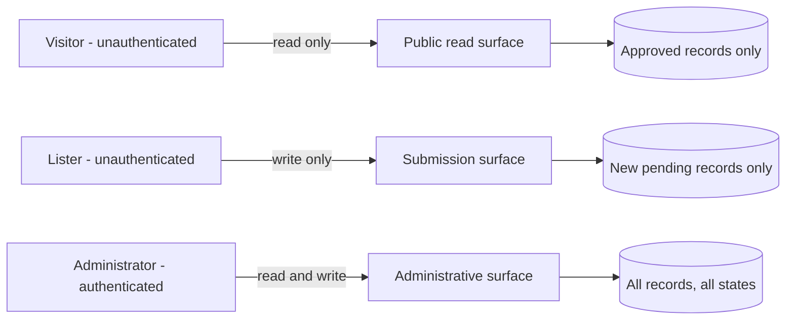

# Community Directory Platform — MVP API Design

## Purpose and scope

This document defines the **logical API** for the MVP of the Community Directory
Platform: the operations the system offers, who may perform each one, what information
each accepts and returns, what validation and authorization apply, and what errors and
empty states may result.

**What this document is.** A description of *operations* — the units of behavior the
system exposes to its clients. Each is specified as: **who** may call it, **what
journey** it serves, **what it accepts**, **what it may return**, **what validates**,
**what authorizes**, and **what can go wrong**.

**What this document is not.** It does **not** choose REST, GraphQL, or RPC. It defines
no routes, endpoints, URL shapes, HTTP verbs, status codes, query-string conventions,
payload encodings, controllers, services, DTOs, OpenAPI or Swagger documents,
frameworks, routers, API gateways, authentication products, hosting, or libraries. Those
are a later specification, and every one of them is recorded as a deferred decision.

**The distinction that governs the whole document.** A *logical operation* says "an
administrator may approve a pending submission, which transitions it to approved and
returns the resulting state." An *endpoint* says `POST /admin/listings/{id}/approve`.
The first is a product commitment; the second is an implementation of it. Writing the
second here would silently decide protocol, naming, resource modeling, and error
conventions — none of which this document is entitled to decide.

**Why the operation is the right unit.** `docs/07` places the public/administrative
boundary on the server and requires that the public read path have *no way to express a
non-approved query*. That guarantee lives or dies at the API. An operation-level design
can state it as an invariant; an endpoint-level design tends to reduce it to a filter
parameter that someone eventually forgets to constrain.

**No open question is resolved here.** As in `docs/08`, unresolved product decisions are
held as **named seams** and carried forward — not answered by drawing a request field or
a response body.

---

## Source documents

- [`docs/01-vision.md`](./01-vision.md) — trust over volume; low friction; no account for
  core discovery.
- [`docs/02-stakeholders.md`](./02-stakeholders.md) — visitors, listers, administrators.
- [`docs/03-mvp-scope.md`](./03-mvp-scope.md) — the approved capability set.
- [`docs/04-user-journeys.md`](./04-user-journeys.md) — journeys **V1–V7**, **L1–L4**,
  **A1–A7**. *Every operation below traces to at least one of these. An operation that
  traces to none does not belong in the MVP.*
- [`docs/05-functional-requirements.md`](./05-functional-requirements.md) — `FR-VIS`,
  `FR-SRCH`, `FR-SUB`, `FR-VAL`, `FR-CONF`, `FR-ADM`, `FR-MOD`, `FR-AUTH`, `FR-ERR`,
  `FR-AUD`, `FR-DATA`.
- [`docs/06-non-functional-requirements.md`](./06-non-functional-requirements.md) —
  `NFR-SEC`, `NFR-PRIV`, `NFR-DATA`, `NFR-PERF`, `NFR-ERR`-adjacent behavior, `NFR-OBS`.
- [`docs/07-system-architecture.md`](./07-system-architecture.md) — the component
  boundary, the trust boundaries, and the rule that the public path cannot express a
  non-approved query.
- [`docs/08-data-model.md`](./08-data-model.md) — entities `E1`–`E7`, invariants
  `DI-1`–`DI-9`, validation rules `VR-1`–`VR-7` and slots `VR-S1`–`VR-S6`, and the
  **eleven seams `S-1`–`S-11`** this document must not close.

---

## API design principles

**P1 — An operation is a permission, not a query.**
The API exposes named operations with fixed semantics. It does **not** expose a general
query facility. A caller may say "search approved listings for a keyword"; a caller may
never say "return records where status = pending". This is the single most important
principle here, and it is what separates this design from the mini lab's
browser-direct-database pattern, which `docs/07` rejected outright.

**P2 — The public read path cannot express a non-approved query.**
Approval is not a filter the caller supplies and the server validates. It is a property
*of the operation*. There is no parameter — present, absent, or malformed — by which a
public caller can reach a pending or rejected record. (`FR-VIS-02`, `DI-5`.)

**P3 — The public write path cannot express an approved record.**
A submission operation does not accept status, timestamps, or any administrative
attribute. Not "ignores them if sent" — **does not accept them**. Rejecting unknown
administrative fields outright is safer than ignoring them, because ignoring them is a
behavior someone later mistakes for a bug and "fixes". (`FR-AUD-04`, `DI-4`, `VR-3`.)

**P4 — Projection is part of the operation's contract.**
What a caller receives is determined by *who is asking*, not by what they request. The
public projection of a listing and the administrative projection of the same record are
different contracts over the same entity. A caller cannot request additional fields.
(`NFR-PRIV-01/02/03`.)

**P5 — Search scope never exceeds publication scope.**
If a field is not published, it is not searched. Otherwise search becomes an oracle: a
caller learns a withheld phone number by guessing it and observing which guess returns a
match. This constraint is committed here even though the scopes themselves are open
(`S-2`, `S-4`).

**P6 — Every operation traces to a journey.**
An operation with no journey behind it is not a requirement; it is a convenience someone
imagined. Where the MVP does not need an operation, this document says so rather than
inventing one for symmetry.

**P7 — Every state-changing operation is atomic and confirms its outcome.**
A write completes fully or has no effect (`NFR-DATA-03`), and returns the *resulting
state* unambiguously (`FR-CONF-01..04`) — not "OK", but "this submission is now pending
and is not yet public".

---

## Logical API overview

**Three surfaces, separated by trust, not by convenience.**

**In words.** There are exactly three surfaces. The **public read surface** returns
approved records and nothing else. The **submission surface** creates pending records
and nothing else — it reads nothing back beyond the confirmation of what it just did.
The **administrative surface** is the only one that can see a non-approved record or
change any record's status, and it is unreachable without an authorized identity.

**The asymmetry is deliberate and is the whole security argument.** The public read
surface cannot write. The submission surface cannot read. Neither can name a status.
Only the administrative surface spans both, and it is the only one behind
authentication. A defect in the public surface cannot publish anything; a defect in the
submission surface cannot expose anything.

| Surface | Actor | Authentication | Can read | Can write |
|---|---|---|---|---|
| Public read | Visitor | None (`FR-VIS-01`) | Approved records, public projection | Nothing |
| Submission | Lister | None (`docs/03` — no accounts) | Only its own just-created result | New pending records only |
| Administrative | Administrator | **Required** (`NFR-SEC-01`) | All records, all states, admin projection | Content and status, within the lifecycle |

---

## API actors and clients

**Actors** (from `docs/02` and `docs/03`):

- **Visitor** — anonymous, read-only. Requires no account (`FR-VIS-01`), and the vision's
  "low friction" principle makes that non-negotiable.
- **Lister** — anonymous. In the MVP a lister is simply *anyone using the submission
  form*; there is no lister identity, no account, and therefore **no way for a lister to
  retrieve their submission later**. This is a real consequence, not an oversight: it is
  why `OQ-2` (does a lister get any reference or outcome notification?) matters, and the
  API cannot answer it alone.
- **Administrator** — authenticated, authorized, and **attributable**. Every
  state-changing administrative operation is attributable to exactly one identity
  (`NFR-SEC-01`, `docs/08` `E3`).

**Clients.** The MVP has one first-party client — the web application described in
`docs/07`. The API is designed as if it had more, in one narrow respect only: the
operations are named and specified independently of any one client's screens. It is
**not** designed for third-party consumption; there is no public API programme, no
partner access, and no client registration in the MVP.

**Why that restraint matters.** Designing for hypothetical third parties would justify
versioning schemes, capability discovery, pagination contracts, and rate-limit tiers
that no approved journey needs. `docs/03` has one client. The design says so.

---

## Public browsing operations

### OP-1 — Retrieve approved listings

| | |
|---|---|
| **Who** | Visitor (unauthenticated) |
| **Journeys** | V1 (browse), V2 (search), V3 (category filter), V4 (location filter), V6 (no results) |
| **Provides** | Optional criteria: a keyword, a category, a location. All optional; all may be combined. |
| **Returns** | Zero or more approved listings, in the **public projection**, in a defined order. |
| **Validation** | Criteria are validated and constrained (`NFR-SEC-05`). An empty or whitespace-only keyword is a request to browse everything, **not** an error (`FR-SRCH-03`). |
| **Authorization** | None required. The operation is *inherently* scoped to approved records — status is not an input (**P2**). |
| **Errors / empty states** | *No results* (a valid outcome, distinct from an error and from an empty directory — `FR-SRCH-08`, `FR-VIS-06`); *system error*. |

**This is one operation, not three, and that is a derived conclusion.** It is tempting to
model "list", "search", and "filter" separately, because they are three journeys. But
`FR-SRCH-06` requires that keyword, category, and location criteria **combine** — a
visitor may search *and* filter at once — and `FR-SRCH-07` requires that any criterion be
individually cleared. Three separate operations cannot satisfy those two requirements
without one of them secretly becoming the general case. So the general case is the
operation, and browsing is simply the call with no criteria.

**What this operation must never accept.** A status. A record identifier belonging to a
non-approved record. A field-selection parameter. A sort expression or filter expression
of arbitrary shape (**P1**). Each of those would turn a named operation back into a query
language — which is precisely the mini lab pattern `docs/07` rejected.

**Ordering** is a defined, consistent order (`FR-VIS-03`) whose *content* is open
(`OQ-3`). Note the interaction worth flagging: if ordering resolves to "most recently
updated", then `last updated at` — an **administrative** field that `NFR-PRIV-01` says is
never presented publicly — begins to *influence* public output. That is not necessarily
a violation, but it must be a deliberate decision rather than an accident.

---

## Search and filtering operations

**There is no separate search operation.** Search is `OP-1` with a keyword criterion;
filtering is `OP-1` with a category or location criterion; combined search-and-filter is
`OP-1` with both. This section exists to record the *criteria* and what remains open
about them — not to add an operation.

| Criterion | Behavior | Seam |
|---|---|---|
| **Keyword** | Matches approved listings against a defined set of fields, using a defined matching mode. | **`S-4` / `OQ-4`** — *which* fields are searched and whether matching is exact, partial, or fuzzy is **not decided here**. |
| **Category** | Restricts results to listings in a category drawn from the predefined set. | **`S-3` / `OQ-5`** — single vs. multiple selection is open. `FR-SRCH-04` commits single; `FR-SRCH-09` contemplates multiple. |
| **Location** | Restricts results to listings matching a location value. | **`S-6` / `OQ-6`** — the granularity (city; state/region; country) is open. |

**The invariant this document does commit, despite the seams (P5):** *the set of searched
fields may never exceed the set of published fields.* If `OQ-7` withholds a contact field
and `OQ-4` searches it, then a caller can confirm a withheld value by searching for it and
observing whether a match returns. That is a data leak via a side channel, and it would
pass every test that only checks response bodies. The scopes are open; **the relationship
between them is not.**

**Category values are referenced, never free-typed** (`docs/08` `DI-9`, `VR-2`). A caller
filters by a member of the predefined set. Whether that set is *readable through the API*
is treated under *Status and lifecycle operations* below, because it raises the same
question as reading status values.

---

## Listing-detail operations

### OP-2 — Retrieve one approved listing

| | |
|---|---|
| **Who** | Visitor (unauthenticated) |
| **Journeys** | V5 (view details), V7 (encounter inaccurate information) |
| **Provides** | The identity of one listing. |
| **Returns** | The listing in the **public projection**, with fields that hold no value omitted or clearly indicated (`FR-VIS-05`). |
| **Validation** | The identity is validated in shape. |
| **Authorization** | None. Inherently scoped to approved records (**P2**). |
| **Errors / empty states** | **Not available** — returned when the identity does not correspond to an approved listing, *whatever the reason* (`FR-VIS-08`). |

**The "not available" response is a security decision disguised as an error message, and
it is the subtlest point in this document.**

The naive design distinguishes *not found* from *exists but is pending* from *exists but
was rejected*. That distinction leaks precisely the thing the system is built to protect:
it tells an anonymous caller that a pending submission exists, and lets them poll for the
moment it is approved — or confirm that a named business was rejected. `NFR-SEC-02`
requires that an unauthorized attempt be denied "without revealing protected content,
whether a target record exists, or why access failed."

Therefore: **`OP-2` returns exactly one negative outcome, for every non-approved case.**
A listing that never existed, one awaiting review, one rejected, and — if `OQ-11` permits
it — one unpublished are **indistinguishable** through the public surface. `FR-VIS-08`
already asks for "a clear *listing not available* message, rather than stale content";
this document adds the reason that message must not be refined into something more
helpful.

---

## Listing-submission operations

### OP-3 — Submit a listing request

| | |
|---|---|
| **Who** | Lister (unauthenticated) |
| **Journeys** | L1 (open form), L2 (submit), L3 (correct validation errors), L4 (receive confirmation) |
| **Provides** | The submittable field set — listing content only. |
| **Returns** | Confirmation of the **resulting state**: the submission is recorded and is **pending**, and is **not yet public** (`FR-CONF-01`). |
| **Validation** | Full validation before anything is recorded (`FR-VAL-01`, `VR-4`). Field-level errors identifying what to fix (`FR-VAL-02`). Entered input preserved so only the faulty fields need correcting (`FR-VAL-03`). |
| **Authorization** | None — by design (`docs/03`: no accounts; `docs/01`: low friction). |
| **Errors / empty states** | *Validation failure* (field-level, retryable); *save failure* (safe retry, input preserved — `FR-ERR-05/06`); *rejected by an abuse safeguard* (conditional — `S-9` / `OQ-9`). |

**The submittable field set is defined by exclusion, and that is deliberate (P3).** It
contains listing **content** only. It does **not** contain status, submission timestamp,
last-updated timestamp, moderation notes, review attribution, or any identity of an
existing record. These are not "ignored if present" — the operation does not accept them,
and a request containing them is malformed rather than merely over-specified.

**Which content fields are *required* is not decided here.** That is `docs/08`'s seam
`S-1` (`OQ-8`, `OQ-8b`) and rule slots `VR-S1`, `VR-S2`, `VR-S3`. The API commits to
*having* a required-field rule and to reporting violations at field level; it does not
name the fields, does not enforce a contact-method minimum, and does not fix format
strictness. Naming them in a request contract would close `OQ-8` by drawing it.

**On validation failure, nothing is recorded** (`VR-7`, `FR-SUB-06`, `NFR-DATA-03`). There
is no partial record and — critically — no publicly visible one.

### Two operations this document deliberately does *not* create

**"Validate a listing request" as a standalone operation.** No journey requires it. L3
describes correcting errors *after* a submit attempt, and `FR-VAL-01..03` place validation
inside the submission flow. A separate pre-validation operation would be a second place
where the rules live — and two places where validation rules live is one place too many.
**Deferred**; revisit only if a journey demands live field-level feedback before submit.

**"Confirm a pending submission" as a standalone operation.** The confirmation is the
*response* to `OP-3` (`FR-CONF-01`), not a subsequent call. There is also no way to build
it correctly: with no lister identity, a confirmation-retrieval operation would need a
reference that anyone holding it could use — which would expose a pending record through
an unauthenticated path, violating `DI-5`. This is not merely unnecessary; **it is unsafe
in the MVP's actor model**, and remains so until `OQ-2` decides whether listers get a
reference at all.

---

## Administrative review operations

### OP-4 — Retrieve the pending queue

| | |
|---|---|
| **Who** | Administrator (authenticated) |
| **Journeys** | A1 (view pending submissions) |
| **Provides** | Optional criteria for working the queue. |
| **Returns** | Pending submissions in the **administrative projection**. |
| **Validation** | Criteria validated in shape. |
| **Authorization** | **Required.** Denial reveals nothing about what exists (`NFR-SEC-01/02`). |
| **Errors / empty states** | *Empty queue* — a valid, distinct outcome ("nothing awaiting review"), not an error and not a no-results state. |

### OP-5 — Retrieve one record for review

| | |
|---|---|
| **Who** | Administrator (authenticated) |
| **Journeys** | A2 (review a submission), A6 (review an existing listing), A7 (handle problem content) |
| **Provides** | The identity of one record. |
| **Returns** | The record in the **administrative projection** — all content, all administrative fields, any moderation data — **in any status**. |
| **Authorization** | **Required.** |
| **Errors / empty states** | *Not found* (here the distinction is safe — the caller is already authorized); *unauthorized*. |

**Note the asymmetry with `OP-2`, and why it is correct rather than inconsistent.** The
public detail operation refuses to distinguish "absent" from "not approved"; the
administrative one does distinguish them. That is not a double standard — it is the
boundary doing its job. Concealment protects against an *unauthorized* observer. An
authorized administrator is entitled to know a record exists; telling them costs nothing
and withholding it would make the queue unusable.

**The seam `OP-5` must not close (`S-7`).** Does the administrative projection show the
record's **review history** — that it was rejected, edited, then approved — or only its
*current* state and most recent action? `docs/08` leaves this open, because it depends on
whether review data is a separate entity (`E4`) or merely attributes on the record. The
API commits only that the administrative projection carries the record's current status,
administrative fields, and moderation data. **It does not commit to history**, because
committing to it here would decide `S-7` — and, as `docs/08` notes, `S-7` must be resolved
together with `S-8` (`OQ-14`), since choosing the lossy shape discards history that a later
"yes" to audit logging cannot recover.

---

## Administrative editing operations

### OP-6 — Edit a record's content

| | |
|---|---|
| **Who** | Administrator (authenticated) |
| **Journeys** | A3 (edit submitted information), A6 (update an existing listing), A7 (correct problem content) |
| **Provides** | The record identity and the content fields to change. |
| **Returns** | Confirmation of the **resulting state** (`FR-CONF-04`). |
| **Validation** | **The same field and format rules as a public submission** — no privileged bypass (`FR-VAL-04`, `VR-6`). An administrator may not save a record a lister could not have submitted. |
| **Authorization** | **Required.** |
| **Errors / empty states** | *Validation failure* (field-level); *save failure* (safe retry, input preserved); *not found*; *unauthorized*. |

**`OP-6` changes content, never status.** Editing a pending record leaves it pending;
editing an approved record leaves it approved. Status changes belong exclusively to
`OP-7` and `OP-8`. Collapsing "edit" and "approve" into one operation — "save and
publish" — would make it possible to publish by accident while correcting a typo, and
would put two decisions behind one action. They stay separate.

**The seam this operation must not close (`S-5` / `OQ-10`).** What happens when an
administrator edits an **already-approved** listing? Two answers are live, and they
produce *different APIs*:

- **Publish immediately** — `OP-6` writes the live record; the public sees the change at
  once. No new operation, no new entity.
- **Secondary review** — the edit becomes a *proposed change* that is not yet live. The
  public must keep seeing the old version while the new one awaits review. That requires
  `docs/08`'s conditional entity `E7`, **a new lifecycle state**, and **at least one new
  operation** (approve-a-revision) — plus an administrative projection that can show both
  the live and proposed versions of the same record.

**This document does not choose, and it does not hedge by building the general case.**
Building revision support "just in case" would resolve `OQ-10` in the expensive direction
by default. `OP-6` is specified for the *approved-listing-edit-publishes-immediately*
reading **only as far as `FR-ADM-10` already permits**, and the alternative is recorded
as a conditional operation `OP-10` below.

---

## Approval and rejection operations

### OP-7 — Approve a pending submission

| | |
|---|---|
| **Who** | Administrator (authenticated) |
| **Journeys** | A4 |
| **Provides** | The record identity. |
| **Returns** | Confirmation of the resulting state — *approved and now publicly visible* (`FR-CONF-02`). |
| **Validation** | The record must be in a status from which approval is permitted (`DI-2`). The content must satisfy the same validation rules (`VR-6`) — approving invalid content would publish it. |
| **Authorization** | **Required**, and **attributable** to one identity (`NFR-SEC-01`). |
| **Errors / empty states** | *Not in an approvable status*; *validation failure*; *not found*; *unauthorized*; *save failure*. |

### OP-8 — Reject a pending submission

| | |
|---|---|
| **Who** | Administrator (authenticated) |
| **Journeys** | A5, A7 (duplicate, incomplete, misleading, or abusive content) |
| **Provides** | The record identity, and optionally a **moderation note**. |
| **Returns** | Confirmation of the resulting state — *rejected and not public* (`FR-CONF-03`). |
| **Authorization** | **Required**, attributable. |
| **Errors / empty states** | *Not in a rejectable status*; *not found*; *unauthorized*; *save failure*. |

**Both operations are single, atomic status transitions** (`NFR-DATA-03`, `DI-3`). An
approval that half-succeeds — status written, content not, or the reverse — is forbidden.
And note the ordering constraint `docs/08` `DI-3` implies: there must be no instant at
which a record is *approved* but incompletely written, because that instant is a
partially public record.

**The moderation note is never public** (`docs/08`, `NFR-PRIV-03`). It appears in the
administrative projection only. This matters because `A7` invites administrators to record
candid assessments — "duplicate of #41", "appears fraudulent" — and any path that surfaced
those publicly would be severe.

**`A7` (duplicate, incomplete, misleading, abusive content) gets no operation of its own,
and that is a finding rather than an omission.** Every action `A7` describes is already
expressible: reject with a note, edit to correct, or — if `OQ-11` allows — remove. What
`A7` would additionally need is a way to *express that one record duplicates another*, and
that is `docs/08`'s seam `S-10` (`OQ-12`), which is open. Inventing a "mark as duplicate"
operation now would close it. **Deferred to `OQ-12`.**

---

## Status and lifecycle operations

### OP-9 *(conditional — `S-5` / `OQ-11`)* — Remove or unpublish an approved listing

| | |
|---|---|
| **Who** | Administrator (authenticated) |
| **Journeys** | A6, A7 |
| **Status** | **Conditional. Exists only if `OQ-11` confirms that administrators may unpublish or remove an approved listing in the MVP.** |
| **Returns** | Confirmation of the resulting state. |
| **Authorization** | **Required**, attributable. |

**Why this is not simply specified and moved past.** `docs/08` found that answering
`OQ-11` "yes" means **the three-value status set in `FR-AUD-01` is no longer sufficient** —
an *unpublished* record is neither pending, approved, nor rejected. So `OP-9` cannot be
designed without also changing the lifecycle, which is an approved requirement. It is
recorded as conditional, and the consequence is stated so that whoever decides `OQ-11`
knows it is not a permissions toggle.

### OP-10 *(conditional — `S-5` / `OQ-10`)* — Approve a proposed revision

Exists **only if** `OQ-10` resolves to *secondary review*. Would accept a revision
identity and transition the proposed change to live. Requires `docs/08` entity `E7`.
**Not designed here.**

### "Read allowed status values" — evaluated, and *not* included

The issue asks for this operation to be evaluated. Evaluated, it fails **P6**, and the
reasoning is worth recording rather than just the verdict:

- **No visitor journey needs it.** Visitors never see status at all — `FR-DATA-11` and
  `NFR-PRIV-01` say status is *never* presented as public content. A public operation
  returning status values would expose a vocabulary the public has no use for, and would
  hint at the existence of states the public must not be able to reason about.
- **No administrator journey needs it either.** The three values are fixed by `FR-AUD-01`
  and known to the single first-party client at build time. An operation to discover them
  would serve a third-party client — and the MVP has none.
- **It would create a maintenance liability**: a second source of truth for a set that
  `FR-AUD-01` already fixes.

**Verdict: unnecessary for the MVP.** Recorded here rather than built, precisely so that
nobody later adds it "for completeness". If a future third-party client or an
administrator-managed lifecycle arrives, revisit.

**The category set is a different case, and the difference is instructive.** Unlike
status, the category set is *not* fixed by a requirement — `FR-DATA-10` requires it to be
"a defined, finite list available for both submission and filtering", and `OQ-5` leaves
open whether administrators curate it. The submission form and the filter UI both need to
*present* it, so a **read-the-category-set** capability is genuinely required by V3 and L1.

### OP-11 — Retrieve the category set

| | |
|---|---|
| **Who** | Visitor / Lister (unauthenticated) |
| **Journeys** | V3 (filter by category), L1 (open the form) |
| **Returns** | The predefined category set. |
| **Authorization** | None. |
| **Seam** | **`S-3` / `OQ-5`** — whether this set is static configuration or administrator-managed *data* is open. If administrators curate it, a further administrative operation to manage it is needed, and that operation is **not designed here**. |

---

## Public versus administrative API boundaries

**The boundary is structural, and it is expressible as four properties.** Each is stated
so that it can be tested, because a boundary that cannot be tested is a hope.

1. **No public operation accepts a status.** There is no input — named, unnamed,
   malformed, or injected — by which a public caller selects which statuses to see
   (**P2**). Test: no public operation's contract contains a status.
2. **No public operation returns a non-approved record.** Not in a list, not in a detail
   view, not in an error message, not in a count, not in a "did you mean" hint (`DI-5`).
3. **No public operation accepts an administrative field.** Status, timestamps, review
   attribution and moderation notes are absent from every public request contract
   (**P3**).
4. **No administrative operation is reachable without an authorized identity**, and denial
   discloses nothing — not whether the record exists, not why access failed
   (`NFR-SEC-01/02`).

**Two projections, one entity.** The same listing record appears in two contracts:

| | Public projection | Administrative projection |
|---|---|---|
| Content fields | The **approved public field set** — membership open (`S-2` / `OQ-7`) | All |
| Status | **Never** | Yes |
| Submitted at / last updated at | **Never** (`NFR-PRIV-01`) | Yes |
| Moderation note, review attribution | **Never** (`NFR-PRIV-03`) | Yes |
| Records in non-approved statuses | **Never** (`DI-5`) | Yes |

**Projection is fixed by the operation, not chosen by the caller** (**P4**). There is no
"include" or "fields" parameter. A caller cannot ask for more, so a bug in a caller
cannot leak more.

**This is where the mini lab pattern would return if we let it.** Its shape was
browser-direct database access with row-level security — the client holds a store
credential and composes queries; the store decides what to return. Reproducing that here
would mean a public operation accepting arbitrary filter expressions. That is a query
language with extra steps, and it moves the security boundary into policy configuration —
exactly what `docs/07` rejected (its Option C). **`docs/08` calls this hazard R-2; here it
is R-A2.** The defense is **P1**: named operations with fixed semantics, never a query
facility.

---

## Request data concepts

**Concepts, not schemas.** No field names, types, encodings, or payload structures are
fixed here — those are the later specification (`DA-3`).

| Concept | Meaning | Appears in | Seam |
|---|---|---|---|
| **Listing content** | The submittable field set: name, category, description, location values, contact methods. | `OP-3`, `OP-6` | **`S-1`** — which are *required* is open (`OQ-8`, `OQ-8b`); **`S-6`** — which location fields exist (`OQ-6`) |
| **Record identity** | A stable reference to one record (`docs/08` `DI-8`). | `OP-2`, `OP-5`–`OP-9` | — |
| **Search criteria** | Keyword, category, location — all optional, all combinable. | `OP-1` | **`S-4`** (keyword scope), **`S-3`** (category cardinality), **`S-6`** (location) |
| **Moderation note** | Free text an administrator records with a decision. | `OP-8`, `OP-6` | Never public |
| **Administrator identity** | Established by authentication; **never a request field**. | All administrative operations | — |

**Administrator identity is never a parameter.** It is derived from the authenticated
session, not supplied by the caller. An operation that accepted "acting as" would be an
impersonation facility.

---

## Response data concepts

| Concept | Meaning | Governed by |
|---|---|---|
| **Public listing projection** | The approved public field set of one approved listing. Fields holding no value are omitted or clearly indicated (`FR-VIS-05`). | **`S-2`** / `OQ-7` — *membership is open and this document does not fill it in* |
| **Administrative record projection** | Full content, administrative fields, moderation data, any status. | `NFR-PRIV-03` — administrative surface only |
| **Result set** | Zero or more public projections in a defined order. | `FR-VIS-03`; ordering open (`OQ-3`) |
| **Outcome confirmation** | The **resulting state** of a state-changing operation, stated unambiguously. | `FR-CONF-01..04` |
| **Field-level validation report** | Which fields failed, and what to fix — not a single opaque message. | `FR-VAL-02`, `FR-VAL-06` |
| **Empty state** | A valid "nothing here" outcome, distinct from an error. | `FR-VIS-06`, `FR-SRCH-08` |
| **Failure** | Something went wrong; safe to retry; nothing was recorded. | `FR-ERR-05/06`, `NFR-DATA-03` |

**"Outcome confirmation" is a stronger contract than it sounds.** `FR-CONF-01..04` require
the *resulting state*, not an acknowledgement. "Submitted" is insufficient; "recorded, and
pending review — not yet publicly visible" is the requirement. The distinction matters
because the entire lister journey (L4) rests on the submitter *understanding* that nothing
is public yet. An API that returns a bare success indicator makes that a UI problem, and
the UI will get it wrong eventually.

**The public projection's membership is the sharpest seam in this document.** Writing out
the public response fields *is* answering `OQ-7`. This document therefore names the
concept — "the approved public field set" — and states its default: **any field whose
public designation is undecided is not public** (`docs/08` `S-2`, fail-closed). A field
wrongly withheld is a bug report; a field wrongly published is a privacy incident that
cannot be undone.

---

## Validation behavior

**Committed** (regardless of any open question):

| | Rule | Source |
|---|---|---|
| `AV-1` | All input to every operation is validated and constrained before anything is recorded. | `NFR-SEC-05`, `VR-4` |
| `AV-2` | Validation failures are reported **at field level**, describing what to fix. | `FR-VAL-02` |
| `AV-3` | Valid entered input is **preserved** across a failure, so only faulty fields need correcting. | `FR-VAL-03` |
| `AV-4` | Administrator edits are validated by the **same rules** as public submissions. No bypass. | `FR-VAL-04`, `VR-6` |
| `AV-5` | A validation failure records **nothing** — no partial record, no public record. | `FR-SUB-06`, `VR-7` |
| `AV-6` | Validation errors are perceivable by means other than colour alone. | `FR-VAL-06`, `FR-ACC-*` |
| `AV-7` | Category values are validated against the predefined set — never accepted as free text. | `VR-2`, `DI-9` |
| `AV-8` | Administrative fields submitted to a public operation make the request **malformed** — they are rejected, not ignored. | **P3**, `VR-3` |

**Pending — the rules whose *content* is not decided** (inherited as slots from `docs/08`,
and *not* filled in here):

| Slot | What is open | Blocked on |
|---|---|---|
| `VR-S1` | Which fields are required at submission | `OQ-8` |
| `VR-S2` | Whether at least one contact method is enforced | `OQ-8b` |
| `VR-S3` | Format checks and their strictness | `OQ-8` |
| `VR-S4` | Whether state/region and country are required | `OQ-6` |
| `VR-S5` | Whether one or several categories are permitted | `OQ-5` |

**`AV-8` deserves defending, because "ignore unknown fields" is the conventional choice.**
Ignoring an administrative field silently accepts a request that was *wrong* — the caller
believed it was setting a status. Silence teaches the caller that the field is accepted,
and a later maintainer, seeing the field arrive and be dropped, may "fix" the omission.
Rejecting the request makes the boundary loud, and a loud boundary is a maintained one.

---

## Error and empty-state behavior

**Three outcomes that are routinely confused, and must not be** (`FR-VIS-06`,
`FR-SRCH-08`):

| Outcome | Meaning | Correct response |
|---|---|---|
| **Empty directory** | No approved listings exist at all. | A distinct empty state — "the directory has no listings yet". |
| **No results** | Approved listings exist; none match the criteria. | A distinct no-results state, **with a way to adjust or clear the criteria** (`FR-SRCH-07/08`). |
| **Error** | The system failed. | A failure outcome — *not* an empty list. |

**Returning an empty result set for a system error is the classic failure here**, and it is
worse than an error: it silently tells a visitor that a business is not in the directory
when in truth the system is broken. That directly attacks the vision's trust principle.

**Failures never expose sensitive data** (`NFR-SEC-02`, `NFR-OBS-06`). A failure response
carries what the actor needs to retry and nothing more: no internal identifiers, no store
diagnostics, no record contents, no indication of whether a non-approved record exists.

**Every failure leaves a consistent state** (`FR-ERR-05`, `NFR-DATA-03`) and, where the
actor entered data, **preserves it** so the action can be retried without re-entry
(`FR-ERR-06`).

**The public "not available" outcome is deliberately uninformative** — see `OP-2`. This is
the one place where a *less* helpful error message is the correct design.

---

## Authorization and access-control behavior

| | Rule | Source |
|---|---|---|
| `AA-1` | Every administrative operation requires an authenticated, authorized identity. | `NFR-SEC-01` |
| `AA-2` | Denial reveals nothing: not whether the record exists, not why access failed. | `NFR-SEC-02` |
| `AA-3` | Public actors can perform **only** the public operations. There is no public operation that publishes, edits, or deletes. | `FR-VIS-09`, `FR-AUTH-*`, `NFR-SEC-03` |
| `AA-4` | Every state-changing administrative operation is **attributable** to exactly one identity. | `NFR-SEC-01`, `docs/08` `E3` |
| `AA-5` | Authorization is enforced **server-side, on every operation** — never by the client withholding a control. | `docs/07` |

**`AA-5` is aimed squarely at the mini lab pattern.** "The admin page is only linked from
the admin area" is not authorization; neither is a hidden button, nor a client-side route
guard, nor a row-level-security policy trusted from an untrusted client. The operation
itself refuses.

**Authentication *strength* is open** (`NOQ-9`), and the authentication **mechanism** is
deferred by `docs/07` (`DD-4`). This document requires only that an authorized identity
exist and be attributable — it does **not** select a product, protocol, or session model.

---

## Privacy and data-exposure rules

| | Rule | Source |
|---|---|---|
| `AP-1` | Public operations return **only** the approved public field set of **approved** records. | `FR-VIS-02`, `FR-DATA-11`, `NFR-PRIV-01`, `DI-5` |
| `AP-2` | Administrative fields — status, timestamps, review attribution, moderation notes — never appear in a public response. | `NFR-PRIV-01/03` |
| `AP-3` | Contact details are published only to the extent `OQ-7` designates public. **Default: not public.** | `NFR-PRIV-02`, `S-2` |
| `AP-4` | The submission operation collects only what a listing needs. | `NFR-PRIV-04` |
| `AP-5` | **Search scope never exceeds publication scope.** | **P5** |
| `AP-6` | No public response — including errors, counts, and empty states — discloses the existence of a non-approved record. | `NFR-SEC-02`, `DI-5` |

**`AP-6` covers the channels people forget.** A result *count* that includes pending
records leaks their existence. A "no results, but 3 pending" hint leaks it. A detail error
that distinguishes "rejected" from "never existed" leaks it. So does a search that matches
against a withheld field (`AP-5`). The rule is stated over *every* public output, not just
listing bodies.

---

## Idempotency and duplicate-submission considerations

**This is the one genuinely new problem the API layer introduces** — no earlier document
raises it, because it does not exist until there is a request that can be repeated.

**The scenario.** A lister submits the form. The response is slow. They click again, or
the network retries, or they refresh. Without an idempotency concept, the system now holds
**two identical pending records**.

**Why this is more than an annoyance.** `docs/01` and `docs/03` assume that submission
volume is low enough that **manual administrative review is practical** (assumption A-1).
Duplicate submissions consume that manual capacity directly. A duplicate is not just
untidy data — it is a tax on the scarcest resource in the operating model. And it
compounds with `OQ-9`: an unauthenticated form with neither an idempotency concept nor an
abuse safeguard can be flooded trivially.

**What this document commits.** `OP-3` **must have a defined duplicate-submission
behavior.** A repeated identical submission must not silently create a second pending
record.

**What it does not commit — and why.** *How* that is achieved (a client-supplied request
key, a content fingerprint, a time-window suppression, a form token) is an implementation
decision (`DA-5`), and it entangles two open questions:

- **`OQ-12`** — how duplicates are resolved during review. If administrators need to *see*
  duplicates to merge or compare them, then suppressing them at the API is wrong.
- **`OQ-9`** — an anti-spam safeguard may already supply a mechanism, in which case a
  separate idempotency mechanism would be redundant.

**Idempotency of administrative operations** is simpler and *is* committed: approving an
already-approved record, or rejecting an already-rejected one, is **not an error and not a
second transition** — it is a no-op that returns the current state. This falls directly out
of `DI-1` and `DI-2`: a record has exactly one status, and only defined transitions occur.
A double-click in the moderation queue must not produce two audit entries or two
last-updated bumps.

---

## Rate limiting or abuse-prevention considerations

**The API is where `OQ-9` becomes concrete**, and it is unresolved.

**What the requirements say.** `NFR-SEC-06` asks that the public submission form be
protected by a safeguard limiting automated abuse **without requiring a lister account** —
which rules out the easiest answer. `FR-SUB-09` is the functional counterpart, and `OQ-9`
leaves the whole question open.

**What is at risk.** The exposed surface is exactly one unauthenticated write operation
(`OP-3`). It cannot publish anything — the moderation boundary holds regardless — so abuse
here is **not** a publication risk. It is a **capacity** risk: bulk submissions overwhelm
the manual review capacity that assumption A-1 depends on. That is an attack on the
operating model rather than on the data, and it is why "nothing gets published anyway" is
not a sufficient answer.

**What this document commits:** `OP-3` **must be able to refuse a request** on abuse
grounds, and that refusal is a defined outcome of the operation rather than an
afterthought bolted on in front of it.

**What it does not commit:** the mechanism. And two constraints must be respected by
whoever chooses it:

- **Accessibility.** A visual challenge collides head-on with `NFR-ACC-01/02`. The
  accessible answers are not the obvious ones. `docs/07` flags this; it is repeated here
  because the API is where the temptation to "just add a captcha" surfaces.
- **Privacy.** Most safeguards **retain data about a person who has not consented to a
  listing** — a network address, a token, a timing series. That is new personal data,
  falling under `NFR-PRIV-04` (collect only what is needed) and `NFR-PRIV-05` (retain for
  a defined period). `docs/08` holds it as conditional entity `E6` behind seam `S-9`, and
  this document does not populate it.

**Rate limiting of public *read* operations** is not required by any approved requirement.
It may be an operational concern (`NOQ-4` — expected load is unknown), but it is not an
API design commitment, and inventing tiers or quotas now would be designing for a scale
nobody has estimated.

---

## Auditability and operational logging considerations

**Two different things that are easily conflated:**

**Operational logging** — diagnostics for maintainers. Committed (`NFR-OBS-*`). It must
**not** capture credentials, and must not capture non-public record content or personal
data beyond what `NOQ-7` defines as acceptable (`NFR-SEC-08`, `NFR-OBS-06`). An operational
log that quietly contains rejected submissions has moved non-public data outside the
boundary `DI-5` protects — and, per `NFR-BACK-04`'s logic, into every log backup too.

**Audit logging** — accountability for administrative actions. **Open** (`OQ-14`/`NOQ-8`,
`docs/08` seam `S-8`). If committed, every state-changing administrative operation
(`OP-6`, `OP-7`, `OP-8`, and `OP-9` if it exists) emits an **append-only** entry naming the
record, the administrator, the action, and the time.

**The asymmetry, restated because it is the reason not to defer this quietly:** an audit
entry not written at the moment of the action **can never be reconstructed**. Deciding
`OQ-14` by omission is deciding it "no", permanently, for every action taken before someone
notices. This document therefore records audit emission as a **conditional obligation of
every administrative write operation**, not as a separate feature to be added later.

---

## Versioning and compatibility considerations

**The MVP has one first-party client** (`docs/07`), deployed together with the system.
There is no third-party consumer, no partner integration, and no published contract.

**What follows from that — and what does not.** It does *not* follow that versioning is
unnecessary; it follows that the *reason* to version is absent today. The distinction
matters, because "we never decided" and "we decided not to" produce the same code and very
different futures.

**This document therefore states a decision rather than an omission:** the MVP does **not**
commit to an API version scheme, on the grounds that a single co-deployed client makes the
contract internal. **`AQ-5` records this as an open question** so that it is revisited
before any second client — a native app, a partner, a public API — exists. The moment a
consumer the team does not deploy appears, the contract becomes external and versioning
stops being optional.

**Compatibility rules that hold regardless, and cost nothing now:**

- **Additive changes are safe.** A new optional response field must not break a client.
- **Removing or repurposing a field is a breaking change**, even with one client — because
  it is the *deploy ordering* that breaks, not the contract.
- **The public projection is the one contract that must never quietly widen.** Adding a
  field to it is not an additive nicety; it is a publication decision, and it belongs to
  `OQ-7` (`S-2`).

**API documentation level** before implementation is open (`AQ-6`). This document is a
*design*, not a specification; what specification artifact is required — and in what form —
is a decision for the team, and it is deliberately not made here.

---

## Open questions

**None is resolved here.** Inherited questions are listed with their *API* consequence —
that is this document's contribution. New questions raised by the API layer itself are
prefixed `AQ`.

### Inherited

| ID | Question | API consequence | Seam |
|---|---|---|---|
| `OQ-2` | Does a lister get any reference or outcome notification? | Decides whether any lister-facing retrieval operation can exist at all. Today none can, safely. | — |
| `OQ-3` | Default ordering of listings? | `OP-1` result order. If "most recently updated", an administrative field begins influencing public output. | — |
| `OQ-4` | Which fields are searched; exact, partial or fuzzy? | `OP-1` keyword criterion. Bounded by **P5**. | `S-4` |
| `OQ-5` | Category model — single or multiple; who curates? | `OP-1` category criterion; `OP-11`; whether an administrative category-management operation is needed. | `S-3` |
| `OQ-6` | Location granularity? | `OP-1` location criterion; the submittable field set. | `S-6` |
| `OQ-7` | Which fields are public vs. withheld? | **The public projection's membership.** The single largest open question in this document. | `S-2` |
| `OQ-8` / `OQ-8b` | Required submission fields; contact-method minimum? | `OP-3`'s validation rules (`VR-S1`–`VR-S3`). | `S-1` |
| `OQ-9` | Anti-spam safeguard? | Whether `OP-3` has an abuse-refusal outcome and what it retains. | `S-9` |
| `OQ-10` | Edit-after-approval: publish immediately, or secondary review? | Whether `OP-10` exists, and whether `OP-6` writes live content or a proposed revision. | `S-5` |
| `OQ-11` | May administrators unpublish or remove? | Whether `OP-9` exists — **and whether `FR-AUD-01`'s three-status set survives**. | `S-5` |
| `OQ-12` | How are duplicates resolved at review? | Whether any "duplicate of" concept enters the API; interacts with idempotency. | `S-10` |
| `OQ-13` | Are rejected submissions retained or purged? | Whether any purge-triggering operation exists, and who may invoke it. | `S-11` |
| `OQ-14` | Audit logging? | Whether administrative writes emit audit entries. **Cannot be answered retrospectively.** | `S-8` |
| `NOQ-4` | Expected load? | Whether read rate limiting or pagination is warranted at all. | — |
| `NOQ-7` | Log retention; what counts as sensitive? | What an operational log may contain. | — |
| `NOQ-9` | Administrator credential/session strength? | The strength behind `AA-1`; not the mechanism. | — |

### New — raised by the API layer

| ID | Question | Why it matters |
|---|---|---|
| `AQ-1` | **What is `OP-3`'s duplicate-submission behavior?** | Without one, a double-click creates two pending records and taxes manual review capacity (assumption A-1). Entangled with `OQ-9` and `OQ-12`. |
| `AQ-2` | Is a result set **paginated**, and if so how? | Unknowable without `NOQ-4`. Pagination is a contract, not a detail — it is hard to add compatibly later. |
| `AQ-3` | Does the administrative queue need **filtering or sorting** beyond "pending"? | A1 does not say. Guessing would invent surface area. |
| `AQ-4` | May an administrator **reverse** a decision — approve a rejected record, or re-reject? | The lifecycle in `docs/08` permits `pending → approved/rejected` but is silent on reversal. Real moderation practice usually needs it. |
| `AQ-5` | **What API versioning strategy applies?** | Deliberately *not* adopted for the MVP (single co-deployed client). Must be revisited before a second consumer exists. |
| `AQ-6` | What **API documentation** is required before implementation? | This document is a design, not a specification. |

---

## Deferred API decisions

Implementation decisions this document must **not** make. Distinct from open questions: an
open question is a *product* decision; a deferred decision is a *technical* one that
belongs to a later specification.

| ID | Deferred | Why not here |
|---|---|---|
| `DA-1` | **API style** — REST, GraphQL, RPC, or other. | A style choice imports resource modeling, error conventions, and caching semantics. It follows from the architecture and the client, not from the operations. |
| `DA-2` | **Transport, routes, verbs, status codes, naming.** | Pure specification. |
| `DA-3` | **Payload encoding and schemas** — including any OpenAPI/Swagger artifact. | Presupposes `DA-1`. |
| `DA-4` | **Authentication mechanism and session model.** | `docs/07` `DD-4`; strength is `NOQ-9`. |
| `DA-5` | **Idempotency mechanism** (request key, fingerprint, token, time window). | The *obligation* is committed (`AQ-1`); the mechanism depends on `OQ-9` and `OQ-12`. |
| `DA-6` | **Rate-limiting mechanism and thresholds.** | Depends on `OQ-9` and `NOQ-4`. |
| `DA-7` | **Pagination mechanism.** | Depends on `AQ-2` and `NOQ-4`. |
| `DA-8` | **Framework, router, API gateway, hosting.** | Not an API design concern. `docs/07` defers the stack entirely. |
| `DA-9` | **Caching semantics** for public reads. | A performance decision needing `NOQ-1` and `NOQ-4`. |
| `DA-10` | **Error code taxonomy.** | The *outcomes* are specified above; their encoding is not. |

---

## Traceability to functional requirements and data model

### Journeys → operations

**Every approved MVP journey is served, and every operation serves a journey** (**P6**).

| Journey | Operation(s) |
|---|---|
| V1 Browse approved listings | `OP-1` (no criteria) |
| V2 Search by keyword | `OP-1` (keyword) |
| V3 Filter by category | `OP-1` (category) + `OP-11` (category set) |
| V4 Filter by location | `OP-1` (location) |
| V5 View listing details | `OP-2` |
| V6 Search with no results | `OP-1` — no-results empty state |
| V7 Encounter inaccurate information | `OP-2`. **No reporting operation** — `FR-VIS-10` is **Deferred** and `OQ-1` is open. Not invented here. |
| L1 Open the listing-request form | `OP-11` (category set) |
| L2 Submit a listing request | `OP-3` |
| L3 Correct validation errors | `OP-3` — field-level validation report, input preserved |
| L4 Receive confirmation | `OP-3` — outcome confirmation (`FR-CONF-01`) |
| A1 View pending submissions | `OP-4` |
| A2 Review a submission | `OP-5` |
| A3 Edit submitted information | `OP-6` |
| A4 Approve a submission | `OP-7` |
| A5 Reject a submission | `OP-8` |
| A6 Review or update an existing listing | `OP-5`, `OP-6`; removal only if `OQ-11` (`OP-9`) |
| A7 Handle duplicate/abusive content | `OP-6`, `OP-8` (with note); duplicate *expression* is `OQ-12` |

### Functional requirements → API

| Requirement | Where |
|---|---|
| `FR-VIS-01` (no account to browse) | `OP-1`, `OP-2` — unauthenticated |
| `FR-VIS-02` (only approved visible) | **P2**; `AP-1`; `AP-6` |
| `FR-VIS-03` (defined order) | `OP-1`; ordering open (`OQ-3`) |
| `FR-VIS-04/05` (details; omit empty fields) | `OP-2`; public projection |
| `FR-VIS-06` (empty state) | *Error and empty-state behavior* |
| `FR-VIS-08` (not-available message) | `OP-2` — deliberately uninformative |
| `FR-VIS-09` (visitors read-only) | `AA-3` |
| `FR-SRCH-01..09` | `OP-1` criteria; seams `S-3`, `S-4`, `S-6` |
| `FR-SUB-*` | `OP-3` |
| `FR-VAL-01..06` | `AV-1`–`AV-8`; slots `VR-S1`–`VR-S5` |
| `FR-CONF-01..04` | *Response data concepts* — outcome confirmation; **P7** |
| `FR-ADM-*` | `OP-4`–`OP-8`; `OP-9` conditional |
| `FR-AUTH-*` | `AA-1`–`AA-5` |
| `FR-ERR-04/05/06` | *Error and empty-state behavior* |
| `FR-AUD-01` (three statuses, defined transitions) | `OP-7`, `OP-8`; status never a public input |
| `FR-AUD-04` (admin data not public-editable) | **P3**; `AV-8` |
| `FR-AUD-05` (audit log) | Conditional — `S-8` / `OQ-14` |
| `FR-DATA-11` (public field limits) | `AP-1`–`AP-3`; **P4** |

### Non-functional requirements → API

| Requirement | Where |
|---|---|
| `NFR-SEC-01/02/03` | `AA-1`–`AA-5`; `OP-2`'s single negative outcome |
| `NFR-SEC-05` (input constrained) | `AV-1` |
| `NFR-SEC-06` (abuse safeguard) | *Rate limiting* — conditional, `S-9` |
| `NFR-SEC-08` (credentials never logged) | *Auditability and operational logging* |
| `NFR-PRIV-01..05` | `AP-1`–`AP-6` |
| `NFR-DATA-01/02/03` | **P7**; `OP-7`/`OP-8` atomic transitions; admin idempotency |
| `NFR-OBS-05/06` | *Auditability and operational logging* |
| `NFR-ACC-*` | `AV-6`; the accessibility constraint on `OQ-9` |

### Data model → API

| `docs/08` concept | API expression |
|---|---|
| `E1` listing record | The entity behind every operation |
| `E2` category set | `OP-11` |
| `E3` administrator | The authenticated identity; **never a request field** |
| `E4`–`E7` conditional entities | Conditional operations and obligations only |
| `S-7` review-data shape | Whether the administrative projection exposes review **history** — `OP-5`. Not committed. |
| `DI-5` (non-approved unreachable publicly) | **P2**; `AP-1`; `AP-6`; `OP-2` |
| `DI-1`/`DI-2` (one status; defined transitions) | `OP-7`/`OP-8`; administrative idempotency |
| `DI-3` (atomic) | **P7** |
| `VR-1..VR-7` | `AV-1`–`AV-8` |
| `VR-S1..VR-S6` | Carried forward unfilled |
| **Seams `S-1`–`S-11`** | **All preserved. None closed by this document.** |

---

## Future API considerations

Recorded for continuity, **not committed**, and deliberately **not designed**. Each is
excluded from the MVP by `docs/03`.

| Future capability | Likely API impact | Why not now |
|---|---|---|
| Business-owner accounts | An authenticated non-administrator actor — a **third trust level**, which every operation would have to reason about | Excluded by `docs/03`. This is the change that would most complicate the three-surface model. |
| Listing claiming | A claim lifecycle with its own operations and verification | Presupposes accounts. |
| Reviews and ratings | A user-generated-content surface with its own moderation flow | Roughly doubles the moderation surface. |
| Listing analytics | A read surface at far higher volume, plus an ingest path | Different performance profile entirely. |
| Paid promotion | Ranking influence on `OP-1` — touching the vision's "trust over volume" principle | A design decision with a product-ethics dimension. |
| Native mobile app | **No new logical operations** — but it makes the contract external, which forces `AQ-5` (versioning) | Worth noting because it changes *nothing* here and *everything* about versioning. |
| Third-party/partner API | Versioning, rate-limit tiers, client registration, published documentation | The MVP has one client. Designing for hypothetical consumers is the fastest route to over-design. |
| Reporting inaccurate listings (`FR-VIS-10`, `OQ-1`) | A public write operation — the **second** unauthenticated write, doubling the abuse surface | **Deferred**, not out of scope forever. Note it inherits every `OQ-9` concern. |

---

## Risks of over-designing the API

**R-A1 — Drifting from operations into endpoints.** The moment this document says "GET
/listings?status=approved", it has chosen a protocol, a URL scheme, a parameter convention
— and, worse, has made `status` a *caller-supplied input*, breaking **P2** in the very act
of illustrating it. **Mitigation:** operations only. No verbs, no paths, no codes.

**R-A2 — The mini lab pattern returning in disguise.** Its shape was a client composing
queries directly against the store, with policy deciding what came back. It would return
here as a public operation accepting arbitrary filter or field-selection expressions — a
query language with extra steps. **Mitigation:** **P1** (an operation is a permission, not
a query) and **P4** (projection is fixed by the operation, not chosen by the caller).

**R-A3 — Inventing operations for symmetry.** "Read allowed status values" is the worked
example: it *sounds* like something an API should have, and no journey needs it. It is
documented as unnecessary rather than built. **Mitigation:** **P6** — every operation
traces to a journey, and the traceability table is the check.

**R-A4 — Closing a seam by drawing a contract.** Writing out the public response fields
answers `OQ-7`. Naming the searched fields answers `OQ-4`. Listing the required submission
fields answers `OQ-8`. An API contract is *even better than a schema* at making an unmade
decision look settled, because it is the thing clients are built against. **Mitigation:**
concepts rather than schemas, and the seam table.

**R-A5 — Designing for scale nobody estimated.** Pagination contracts, cursors, rate-limit
tiers, and caching semantics are all reasonable — and all unjustifiable while `NOQ-4`
(expected load) is unknown. **Mitigation:** `AQ-2` and `DA-6`/`DA-7`/`DA-9` record them as
open rather than guessing.

**R-A6 — Under-designing the irreversible.** The mirror risk, and it is real. Two things
are cheap now and expensive later: **audit emission** (`OQ-14` — history not captured
cannot be reconstructed) and **duplicate-submission behavior** (`AQ-1` — retrofitting
idempotency onto a live unauthenticated write is painful). Minimalism is right nearly
everywhere in this document; it is wrong on these two.

---

## Summary

The MVP API is **three surfaces and eleven operations** — nine unconditional, two
conditional on open questions.

The public read surface (`OP-1` retrieve approved listings, `OP-2` retrieve one approved
listing, `OP-11` retrieve the category set) cannot write and **cannot express a
non-approved query**. The submission surface (`OP-3`) cannot read and **cannot express an
approved record**. The administrative surface (`OP-4`–`OP-8`, plus conditional `OP-9`
remove/unpublish and `OP-10` approve-a-revision) is the only one that spans both, and the
only one behind authentication.

That asymmetry is the security argument in one line: **a defect in the public surface
cannot publish anything, and a defect in the submission surface cannot expose anything.**

Three conclusions were *derived* rather than assumed, and each removed surface area:
browse, search and filter are **one** operation, because `FR-SRCH-06` requires them to
combine; **"read allowed status values" is unnecessary** and is documented as such rather
than built; and the public not-available response is **deliberately uninformative**,
because distinguishing "rejected" from "never existed" leaks exactly what the moderation
boundary protects.

The API layer raises one genuinely new problem the earlier documents could not:
**duplicate submission** (`AQ-1`). It is not untidiness — it is a tax on the manual review
capacity the whole operating model assumes.

All **eleven data-model seams survive intact**, and no protocol, framework, schema, or
product is chosen.
