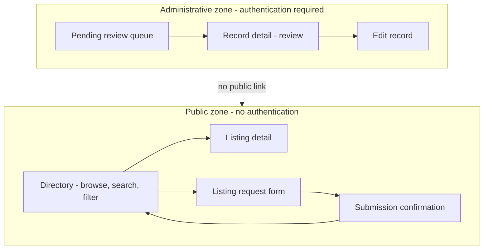

# Community Directory Platform — MVP UI Design

## Purpose and scope

This document defines the **user interface design** for the MVP of the Community
Directory Platform: the screens the system presents, what each is for, who uses it, what
can be done on it, what states it can be in, how a user moves between them, and what
information may and may not appear.

**What this document is.** A description of **purpose, actors, actions, states,
navigation, and information boundaries**. Each screen is specified as: **who** uses it,
**which journey** it serves, **what it is for**, **what can be done on it**, **what it
shows**, **what states it can be in**, and **where it leads**.

**What this document is not.** It selects no framework, component library, CSS framework,
design system, icon set, router, or form library. It contains no JSX, HTML, CSS,
components, routes, API calls, schemas, or code. It specifies **no colours, typography,
spacing, visual branding, component styling, or final layout**. Those are visual design
and implementation, and both are deliberately downstream of this document.

**Why appearance is excluded, and not merely postponed.** It is not yet *decidable*. The
accessibility standard and contrast target are open (`NOQ-5`) and the supported
browser/device matrix is open (`NOQ-6`) — so a contrast ratio committed here would be a
guess dressed as a decision. More importantly, appearance is the part of a UI that is
cheap to change late; **structure, states, and boundaries are the parts that are
expensive to change late**, and they are what this document is for.

**The discipline this document must hold hardest.** A screen is the most concrete artifact
the project has produced. A field drawn on a form reads as a promise; a button drawn on a
toolbar reads as an approved capability. Several product questions inherited from `docs/03`
through `docs/09` remain genuinely open, and **any of them could be closed by accident
simply by drawing it.** Every such point is marked as a **seam** and left open. **No open
question is resolved here.**

**The mini lab is not the design.** The prototype had a single page with a search box, a
list, and a form. That shape may prove close to right — but it must be *derived*, not
inherited (`docs/07` R-10, `docs/08` R-2, `docs/09` R-A2).

---

## Source documents

- [`docs/01-vision.md`](./01-vision.md) — trust over volume; **low friction — core
  discovery works without an account**; accessibility and inclusivity as product
  principles.
- [`docs/02-stakeholders.md`](./02-stakeholders.md) — visitors, listers, administrators.
- [`docs/03-mvp-scope.md`](./03-mvp-scope.md) — the approved capability set.
- [`docs/04-user-journeys.md`](./04-user-journeys.md) — **V1–V7, L1–L4, A1–A7**. *Every
  screen below traces to at least one. A screen that traces to none does not belong.*
- [`docs/05-functional-requirements.md`](./05-functional-requirements.md) — `FR-VIS`,
  `FR-SRCH`, `FR-SUB`, `FR-VAL`, `FR-CONF`, `FR-ADM`, `FR-ERR`, `FR-ACC`.
- [`docs/06-non-functional-requirements.md`](./06-non-functional-requirements.md) —
  `NFR-USA-01..06`, `NFR-ACC-01..05`, `NFR-RESP-01..04`, `NFR-COMP-01..04`,
  `NFR-PRIV-01..03`, and `NOQ-5`, `NOQ-6`.
- [`docs/07-system-architecture.md`](./07-system-architecture.md) — the public/
  administrative trust boundary, enforced on the server.
- [`docs/08-data-model.md`](./08-data-model.md) — invariant `DI-5` (no non-approved record
  reachable publicly) and the **eleven seams `S-1`–`S-11`**.
- [`docs/09-api-design.md`](./09-api-design.md) — operations `OP-1`–`OP-11`, the two
  projections, and the deliberately uninformative not-available outcome.

---

## UI design principles

**U1 — The UI renders what an operation returns; it never widens it.**
The public screens display the public projection (`docs/09` **P4**). There is no screen,
no control, and no interaction that asks for more. If a field is not in the projection,
no view can show it — and no view should be designed as though it might.

**U2 — The UI is not the security boundary, and must not behave as if it were.**
Hiding an administrative control from a visitor is a *courtesy*, not protection: the
server enforces the boundary (`docs/07`, `docs/09` `AA-5`). This cuts both ways, and the
second way is the one that gets forgotten — because the UI is **not** the boundary, a UI
that leaks information the server withheld is still a leak. The "listing not available"
message is the worked example (see *Listing detail UI*).

**U3 — States are first-class, not edge cases.**
Empty, loading, validation, error, and confirmation are **designed states with defined
wording**, not afterthoughts. `NFR-USA-03` requires that a user be able to *tell them
apart and know what to do next* — a requirement that is failed by every blank page ever
shipped.

**U4 — Nothing is public until it is approved, and the UI must never imply otherwise.**
No public screen shows a pending or rejected record, hints that one exists, or explains
why something is unavailable (`DI-5`, `NFR-SEC-02`).

**U5 — Low friction on the public path.**
No account, no sign-in, no interstitial for browsing, searching, or viewing
(`FR-VIS-01`, `NFR-USA-01`, `docs/01`). A first-time visitor succeeds without
instructions.

**U6 — Accessibility is a structural property, not a finishing pass.**
Keyboard operability, semantic structure, non-colour-dependent status, and announced state
changes are designed in from the start (`NFR-ACC-01..03`). They cannot be added afterwards
to a structure that did not anticipate them.

**U7 — Every screen traces to a journey.**
A screen with no journey behind it is not a requirement. Where the MVP does not need a
screen, this document says so rather than inventing one for symmetry.

**U8 — Draw only what is decided.**
Where a field, control, or action depends on an open question, the design names the seam
and stops. It does not sketch the "likely" answer to make a screen feel complete.

---

## MVP UI actors

| Actor | Authentication | Uses | Notes |
|---|---|---|---|
| **Visitor** | None (`FR-VIS-01`) | Public screens | Read-only. Must succeed without instructions (`NFR-USA-01`). **Phone is a first-class context** (`NFR-RESP-01`). |
| **Lister** | None | The request form and its confirmation | Not a distinct *identity* — a lister is *anyone using the form* (`docs/03`). **They cannot return to check on a submission**, because there is nothing to return to. |
| **Administrator** | **Required** | Administrative screens only | Small, trusted group. Tablet and desktop are the required contexts (`NFR-RESP-04`); phone is not required. |

**The lister's non-identity is a UI constraint, not a footnote.** With no account and no
reference, the confirmation screen is the **only** moment the system will ever
communicate with that person. Whatever they need to understand — that the submission is
recorded, that it is *not public*, that a human will review it — must land there, because
there is no second chance. Whether they ever get an outcome notification is `OQ-2`, and it
is open.

---

## Information architecture

**Two zones, and the separation is the architecture.**

*Illustrative and conceptual — not a layout, not a route map, and not a commitment to any
navigation control.*

**In words.** The public zone contains four screens and requires no authentication. The
administrative zone contains three and requires it on every screen. **The administrative
zone is not linked from the public zone**, and — per **U2** — that absence is a courtesy,
not a protection: the server refuses regardless (`AA-1`, `AA-5`).

**The submission form lives in the public zone**, which is worth stating because it is the
one public screen that *writes*. It writes only new pending records (`docs/09` **P3**), it
reads nothing back beyond its own confirmation, and it therefore cannot be used to see
anything.

---

## Navigation model

**Public.** A visitor arrives at the directory, refines it, opens a listing, and can
return to exactly the result set they left (`FR-VIS-07` — this is a *requirement*, not a
nicety: a visitor who loses their filters on the back journey will not re-apply them). The
path to the request form is available from the directory.

| From | To | Trigger | Requirement |
|---|---|---|---|
| Directory | Listing detail | Open a result | V5, `FR-VIS-04` |
| Listing detail | Directory (**same result set**) | Return | V5, `FR-VIS-07` |
| Directory | Request form | Submit a listing | L1 |
| Request form | Confirmation | Successful submission | L4, `FR-CONF-01` |
| Confirmation | Directory | Continue browsing | L4 |

**Administrative.** The queue is the entry point and the home base. An administrator opens
a record, acts on it, and returns to the queue.

| From | To | Trigger |
|---|---|---|
| (entry) | Queue | Authenticated arrival — A1 |
| Queue | Record detail | Open a record — A2 |
| Record detail | Edit | Correct content — A3 |
| Record detail | Queue | Approve / reject, then return — A4, A5 |

**What the navigation model does *not* commit.** Whether navigation is presented as links,
tabs, a menu, or a bar; whether the detail view is a page or an overlay; whether the form
is one step or several. Those are layout and interaction-design decisions (`DU-2`).

**One navigation path is deliberately absent.** There is **no public route into the
administrative zone** — no visible "administrator" link on the public directory. This is
not security (**U2**); it is the removal of an invitation. How an administrator reaches
the entry point is an operational detail, and the authentication mechanism is deferred
(`docs/07` `DD-4`).

---

## Screen inventory

**Seven screens. Five unconditional, and two whose *existence* is not yet decided.**

| # | Screen | Zone | Actor | Journeys | Status |
|---|---|---|---|---|---|
| **S1** | **Directory** — browse, search, filter, results | Public | Visitor | V1, V2, V3, V4, V6 | Required |
| **S2** | **Listing detail** | Public | Visitor | V5, V7 | Required |
| **S3** | **Listing request form** | Public | Lister | L1, L2, L3 | Required |
| **S4** | **Submission confirmation** | Public | Lister | L4 | Required |
| **S5** | **Pending review queue** | Admin | Administrator | A1 | Required |
| **S6** | **Record detail (review)** | Admin | Administrator | A2, A4, A5, A6, A7 | Required |
| **S7** | **Record edit** | Admin | Administrator | A3, A6, A7 | Required |

**Screens deliberately *not* created:**

| Not created | Why |
|---|---|
| A separate "search results" screen | See **S1** below — search, filter, and browse are **one screen**, derived from `FR-SRCH-06/07`. |
| A "report inaccurate listing" screen | `FR-VIS-10` is priced **Deferred** and `OQ-1` is open. **Not designed.** See *Deferred UI elements*. |
| An administrator dashboard with counts/metrics | No journey requires it. Analytics is out of scope (`docs/03`). Would be a screen for symmetry (**U7**). |
| A lister "check my submission" screen | **Impossible to build safely.** With no lister identity, any retrieval path would expose a pending record to an unauthenticated caller, violating `DI-5`. `docs/09` reaches the same conclusion. Blocked on `OQ-2`. |
| An "about"/"help"/settings page | No journey. |
| A category-management screen | Only needed if `OQ-5` makes the category set administrator-curated. **Seam `S-3`.** |

---

## Public landing / browsing screen

### S1 — Directory

| | |
|---|---|
| **Actor** | Visitor (unauthenticated) |
| **Journeys** | V1 browse, V2 search, V3 category filter, V4 location filter, V6 no results |
| **Purpose** | Discover approved listings — the product's front door and its reason to exist. |
| **Primary actions** | Refine by keyword, category, location (individually or combined); clear any criterion; open a listing. |
| **Shows** | Approved listings only, in the **public projection** (`OP-1`). |
| **States** | Loading · Results · **No results** · **Empty directory** · Error |
| **Leads to** | Listing detail (S2); request form (S3) |

**This is one screen, not three, and the conclusion is derived rather than convenient.**
`FR-SRCH-06` requires that keyword, category and location criteria **combine**; `FR-SRCH-07`
requires that **any one** be cleared independently. A design with a separate "browse page"
and "search results page" must decide what happens when a visitor searches, then clears the
keyword but keeps a category — and every answer to that is either a bug or a silent merge
of the two screens. So the screens merge honestly, from the start: **a criteria region and
a results region on one screen**, where browsing is simply the state with no criteria
applied.

**What this screen must never do.** Show a non-approved listing; show a count that includes
non-approved records; show an administrative field (status, timestamps); offer any control
that publishes, edits, or deletes (`FR-VIS-09`); or offer a control that selects a status.
The visitor has no vocabulary for status and must not be given one (**U4**).

**The landing state is the empty-criteria state.** A visitor who arrives and does nothing
sees the directory — not a prompt, not a splash, not a "start searching" placeholder with
no content behind it. `NFR-USA-01` requires a first-time visitor to browse *without
instructions*, and `docs/01`'s low-friction principle makes the directory itself the
landing content.

**Result ordering is open (`OQ-3`)** and the screen must not imply an order it does not
have. Note the trap: if ordering resolves to "most recently updated", then an
**administrative** field begins influencing public output — `NFR-PRIV-01` says such fields
are never *presented* publicly, and ordering by one is arguably distinct from presenting
it, but the distinction must be decided deliberately rather than discovered.

---

## Search and filtering UI

**Three criteria, all optional, all combinable, each independently clearable.** The screen
must make the *current* criteria visible — a visitor who cannot see that a category filter
is active will misread an empty result set as an empty directory, which `NFR-USA-03`
explicitly forbids.

| Criterion | UI concept | Seam — **not decided here** |
|---|---|---|
| **Keyword** | A text input over approved listings. | **`S-4` / `OQ-4`** — *which fields it searches* and whether matching is exact, partial or fuzzy. The UI must not **claim** a scope it has not been given: placeholder or helper text saying "search by name and description" would **answer `OQ-4`**. |
| **Category** | A selection from the predefined set (`OP-11`). | **`S-3` / `OQ-5`** — **single or multiple selection is open.** This is a *control-shape* decision: a radio group or single-select decides "one"; a checkbox list decides "many". **Drawing either closes the seam.** |
| **Location** | A selection or input over a location value. | **`S-6` / `OQ-6`** — *which* location fields exist (city; state/region; country) is open, so the number and kind of controls is open. |

**The invariant this document commits despite the open scopes** (inherited from `docs/09`
**P5**): **the search box may never search a field the detail screen would not show.** If
`OQ-7` withholds a contact field and the search matches against it, a visitor can confirm a
withheld value by typing guesses and watching what returns. The UI cannot cause this on its
own — but it *can* advertise it, and it must not.

**Clearing must be obvious and must be per-criterion** (`FR-SRCH-07`). A single "reset
everything" affordance does not satisfy the requirement, because V6's recovery path is
"loosen *one* thing".

**An empty or whitespace-only keyword is not an error** (`FR-SRCH-03`) — it is a request to
browse everything. The UI must not block submission of an empty search or show a validation
message for one.

---

## Listing results UI

**Purpose:** let a visitor scan many listings and recognise the one they want.

| | |
|---|---|
| **Shows** | Zero or more approved listings, public projection, in a defined order (`FR-VIS-03`). |
| **Per result** | Enough of the public field set to identify and choose — **which fields, exactly, is `S-2` / `OQ-7`.** |
| **Action** | Open a listing (→ S2). |
| **States** | Loading · Results · No results · Empty directory · Error |

**The result summary's field set is not decided here.** It is tempting to specify "name,
category, city, and the first line of the description" — that *sounds* obviously right, and
it would **answer `OQ-7` for the summary view by drawing it**. The design instead commits to
the *rule*: a result shows a subset of the **approved public field set**, chosen for
recognisability, and **any field whose public designation is undecided is not shown**
(fail-closed, `docs/08` `S-2`).

**Fields with no value are omitted or clearly indicated** (`FR-VIS-05`) — never rendered as
an empty row, a dash, or a blank label, all of which read as data loss rather than absence.

---

## Listing detail UI

### S2 — Listing detail

| | |
|---|---|
| **Actor** | Visitor |
| **Journeys** | V5, V7 |
| **Purpose** | Show everything the public may see about one approved listing. |
| **Shows** | One approved listing in the **public projection** (`OP-2`). |
| **Actions** | Return to the previous result set (`FR-VIS-07`). |
| **States** | Loading · Present · **Not available** · Error |
| **Leads to** | Directory (S1), **preserving the prior criteria and result set** |

**The field set of this screen is the answer to `OQ-7`, and this document does not give
it.** Writing out "name, category, description, city, phone, email, website" would resolve
`S-2` by drawing it. The design commits instead to: the screen renders **the approved public
field set**, whose membership `OQ-7` owns, with **fail-closed default** — a field whose
public designation is undecided is **not shown**. A field wrongly withheld is a bug report; a
field wrongly published is a privacy incident that cannot be undone.

**The "not available" state is the most important microcopy in the product**, and it is a
security decision wearing the costume of an error message.

`OP-2` returns exactly **one** negative outcome for every non-approved case — never existed,
pending, rejected, or (if `OQ-11` permits) removed are **indistinguishable**. The UI must
preserve that indistinguishability, and this is where it is most likely to be lost, because
every instinct of good UX writing pushes toward being *more* helpful:

- **Forbidden:** "This listing is awaiting review." · "This listing was rejected." · "This
  listing has been removed." · "No such listing." — each reveals the existence, or
  non-existence, of a non-approved record (`NFR-SEC-02`, `DI-5`).
- **Required:** a single neutral message that does not distinguish the cases, and does not
  invite the visitor to infer which one applies.

**This is the one place in the product where a less helpful message is the correct
design** (**U2**). A UI writer optimising this string in good faith would undo a boundary
the architecture, the data model, and the API all worked to establish.

---

## Listing request form UI

### S3 — Listing request form

| | |
|---|---|
| **Actor** | Lister (unauthenticated) |
| **Journeys** | L1 open, L2 submit, L3 correct errors |
| **Purpose** | Let anyone propose a listing, and make clear it will be reviewed before it appears. |
| **Actions** | Enter listing content; submit. |
| **States** | Empty · In progress · **Submitting** · **Validation errors** · **Save failure** · (→ S4 on success) |
| **Leads to** | Submission confirmation (S4) |

**The form's field set is `S-1` (`OQ-8`, `OQ-8b`) and is deliberately not drawn.** The
listing *content* fields are known from `docs/08`; what is **not** known is which are
**required**, whether a **contact minimum** is enforced, and how strict format checks are.
A form is a required-field rule made visible: putting an asterisk beside a label answers
`OQ-8`. **The design therefore specifies the form's *structure and behavior* and leaves its
*obligations* to the seam.**

**What the form must never contain** (`docs/09` **P3**, `AV-8`): status; submitted-at or
last-updated timestamps; a moderation note field; any administrative control. These are not
merely hidden — the operation does not accept them.

**Required-versus-optional must be communicated visibly and non-visually.** Whatever `OQ-8`
decides, the *pattern* is committed: obligation is indicated in a way that does not rely on
colour or on a legend the user must remember (`NFR-ACC-03`, `FR-VAL-06`).

**The contact-method minimum is the hardest UI problem in this document, and it is worth
naming now rather than discovering it in build.** If `OQ-8b` resolves to "at least one of
phone, email, or website", the resulting rule is **cross-field**: it belongs to no single
input, so there is no obvious place to attach its error. `FR-VAL-02` requires errors "at the
level of the specific field(s) affected" — and here the affected "field" is a *group*. A
naive implementation attaches the error to all three inputs (noisy, and each individually
*is* valid) or to none (invisible). The design commits to the requirement — **a group-level
obligation gets a group-level message, associated with the group and announced to assistive
technology** — while leaving *whether the rule exists at all* to `OQ-8b`.

**Set expectations before submission, not only after.** `NFR-USA-06` requires that the
lister be clearly informed that a request is pending review and not immediately public. The
confirmation screen (S4) is required to say so — but the *form* should say so too, because a
person deciding whether to spend five minutes on a form deserves to know the outcome is not
instant publication.

**Anti-spam is a seam with an accessibility collision (`S-9` / `OQ-9`).** `NFR-SEC-06` asks
for a safeguard against automated abuse **without requiring an account**. The obvious answer
— a visual challenge — **directly violates `NFR-ACC-01/02`**, which require the submission
flow to be fully operable by keyboard and assistive technology. The UI design therefore
commits that **any safeguard must be operable by every user the accessibility requirements
protect**, and refuses to select one. This is the point at which "just add a captcha"
becomes tempting, and it is the point at which it must be resisted.

---

## Listing submission confirmation UI

### S4 — Submission confirmation

| | |
|---|---|
| **Actor** | Lister |
| **Journey** | L4 |
| **Purpose** | Tell the submitter, unambiguously, **what state their submission is now in**. |
| **Shows** | The resulting state: recorded · **pending review** · **not yet publicly visible**. |
| **States** | Confirmed |
| **Leads to** | Directory (S1) |

**This screen carries more weight than its size suggests, because it is the last contact.**
The lister has no account, no reference, and no way back (`OQ-2`). Whatever is not understood
here is not understood at all.

**"Submitted" is not sufficient.** `FR-CONF-01` and `NFR-USA-05` require the *resulting
state*, and `NFR-USA-06` requires the pending, not-public nature to be explicit. A bare
success message would leave a reasonable person expecting to find their listing in the
directory a minute later — and not finding it, which is precisely the trust failure the
moderation model exists to avoid.

**What it must not do.** Promise a review timeline (nobody has committed one). Imply the
listing will definitely be approved. Offer a link to "view your submission" — **there is
none, and there cannot be one safely** (`DI-5`).

---

## Administrator entry and access boundary

**The administrative zone requires an authenticated, authorized identity on every screen**
(`NFR-SEC-01`, `docs/09` `AA-1`).

**What the UI contributes — and what it emphatically does not.** The UI presents the entry
point and reflects the outcome. **It is not the boundary** (**U2**). Hiding a control,
omitting a link, or guarding a client-side route is **not** authorization; the server
refuses regardless (`AA-5`). Any design that relies on the UI to withhold administrative
capability has reproduced the mini lab's mistake in a new costume.

**Denial must disclose nothing** (`NFR-SEC-02`, `AA-2`). An unauthorized arrival is told it
cannot proceed — **not** whether the record it sought exists, not why access failed, not
whether the identity was recognised.

**The authentication *mechanism* is deferred** (`docs/07` `DD-4`) and its **strength is open**
(`NOQ-9`). This document requires only that an authorized identity exist, that it be
established before any administrative screen renders, and that every administrative action
be attributable to it.

---

## Administrator pending-review screen

### S5 — Pending review queue

| | |
|---|---|
| **Actor** | Administrator (authenticated) |
| **Journey** | A1 |
| **Purpose** | See what is waiting, and start working. |
| **Shows** | Pending submissions, **administrative projection** (`OP-4`). |
| **Actions** | Open a record (→ S6). |
| **States** | Loading · Items · **Empty queue** · Error · **Unauthorized** |

**The empty queue is a success state, not an empty state to apologise for.** "Nothing is
waiting for review" means the administrator is done — the wording should say so plainly, and
must be distinguishable from an error and from a load failure (`NFR-USA-03`).

**Queue filtering and sorting are not designed** (`AQ-3`). A1 asks only to *see* pending
submissions. Adding sort controls, saved filters, or bulk actions would invent surface area
no journey requires (**U7**).

**Required contexts: tablet and desktop** (`NFR-RESP-04`). Phone is explicitly **not**
required for the administrative flow — a genuine scoping relief, and one worth stating so
nobody spends effort making a review queue work at phone width.

---

## Administrator submission-detail screen

### S6 — Record detail (review)

| | |
|---|---|
| **Actor** | Administrator |
| **Journeys** | A2 review, A4 approve, A5 reject, A6 review existing listing, A7 problem content |
| **Purpose** | See everything about one record and decide what to do with it. |
| **Shows** | The record in the **administrative projection** (`OP-5`) — all content, administrative fields, moderation data, **in any status**. |
| **Actions** | Approve · Reject · Edit (→ S7) · *(conditional)* Remove/unpublish |
| **States** | Loading · Present · Not found · Error · Unauthorized |

**This screen shows what no public screen may.** That asymmetry is the boundary working, not
a double standard: the administrator is authorized, and concealment protects against the
*unauthorized*.

**The record's status must be unmistakable**, because every action's meaning depends on it —
approving a pending submission and approving an already-approved record are different acts,
and one of them is a mistake. Status must be conveyed **not by colour alone** (`NFR-ACC-03`).

**Whether this screen shows review *history* is seam `S-7`, and is not decided.** Can an
administrator see that a record was rejected, edited, then approved — or only its current
state and most recent action? `docs/08` leaves this open, and `docs/09` declined to commit.
The UI declines too. **`S-7` must be resolved with `S-8` (`OQ-14`)**, because a design that
shows only the latest action is a design that never captured the rest — and history not
captured cannot be recovered.

**Any audit-trail display is decision-dependent (`S-8` / `OQ-14`).** If audit logging is not
in the MVP, there is nothing to show, and a screen designed around a trail that does not
exist is a screen designed twice.

---

## Administrator edit UI

### S7 — Record edit

| | |
|---|---|
| **Actor** | Administrator |
| **Journeys** | A3 edit submitted content, A6 update existing listing, A7 correct problem content |
| **Purpose** | Correct or update a record's content. |
| **Actions** | Change content fields; save. |
| **States** | Editing · Saving · **Validation errors** · **Save failure** · Saved |
| **Leads to** | Record detail (S6) |

**The same validation rules as the public form. No privileged bypass** (`FR-VAL-04`,
`docs/08` `VR-6`). An administrator may not save a record a lister could not have submitted.
The UI must therefore present the *same* field-level error behavior, not a laxer one — a
common and quiet regression, since admin tools are usually built second and trusted more.

**Editing changes content, never status** (`docs/09` `OP-6`). The edit screen has **no
approve/reject control**. Merging "save" and "publish" into one action would let an
administrator publish by accident while fixing a typo — two decisions behind one button.

**Editing an *approved* listing is seam `S-5` (`OQ-10`), and it changes this screen's
design.** Two answers are live and they are not cosmetically different:

- **Publish immediately** — the edit goes live on save. The screen needs no new state.
- **Secondary review** — the edit becomes a *proposed change* that is not yet live. The
  public keeps seeing the old version. The screen then needs to show **two versions of the
  same record** (live and proposed), a pending-review indication, and an approval path for
  the revision — a materially different design.

**This document does not choose, and does not hedge by building the general case.** Designing
the two-version view "just in case" would resolve `OQ-10` in the expensive direction by
default. The seam is named; the screen is specified for the simple reading only as far as
`FR-ADM-10` already permits.

---

## Administrator approve/reject UI

| | |
|---|---|
| **Actor** | Administrator |
| **Journeys** | A4 approve, A5 reject, A7 |
| **Where** | On the record detail screen (S6) — **not** a separate screen (**U7**) |
| **Actions** | **Approve** (→ publicly visible) · **Reject** (→ not public), optionally with a **moderation note** |
| **States** | Idle · **In progress** · **Confirmed** · Error |

**Both actions state their *outcome*, not their occurrence** (`FR-CONF-02/03`,
`NFR-USA-05`). "Approved — this listing is now publicly visible." "Rejected — this submission
will not be published." Not "Saved."

**Approve is a publishing action and the UI must treat it as one.** It makes content public
under the platform's name — the moment the vision's "trust over volume" principle is actually
exercised. It should be deliberate, its outcome should be unambiguous, and it should not be
adjacent to a destructive or unrelated control.

**The moderation note is never public** (`NFR-PRIV-03`). The UI must make that unmistakable
*at the point of entry*, because an administrator typing "obvious scam, do not publish" is
entitled to know with certainty that the applicant will never read it. A note field that
looks like a message-to-submitter is a serious design failure.

**Double-submission must not double-act.** `docs/09` commits administrative idempotency:
approving an already-approved record is a no-op returning current state, not a second
transition. The UI must not present a second approve control on a record that is already
approved, and must disable the action while one is in progress (`NFR-USA-04`).

**A7 needs no separate screen.** Duplicate, incomplete, misleading, or abusive content is
handled with the controls that already exist — reject with a note, edit to correct, or (if
`OQ-11` allows) remove. What A7 would *additionally* need is a way to express "this
duplicates that", and that is seam `S-10` (`OQ-12`), which is open. **No "mark as duplicate"
control is designed.**

---

## Existing-listing review/update UI

**Reviewing and updating an approved listing reuses S6 and S7.** No new screen: an approved
record is the same entity in a different status (`docs/08` **P2**), and it is opened,
inspected, and edited through the same screens. Inventing a parallel "manage published
listings" area would be a screen for symmetry (**U7**).

**Remove / unpublish is decision-dependent (`S-5` / `OQ-11`) and is NOT designed.**

This is the guardrail most likely to be breached by accident, because a "Remove" button is
the most natural thing in the world to put on an admin screen. It must not be drawn, for a
reason larger than scope discipline: `docs/08` established that answering `OQ-11` "yes"
means **the three-value status set in `FR-AUD-01` is no longer sufficient** — an unpublished
record is neither pending, approved, nor rejected. So the control cannot be designed without
also changing an approved requirement. **A removal control appears in this design only if
`OQ-11` is resolved, and its state model must be resolved with it.**

---

## Empty states

**Three states that are routinely collapsed into one blank page — and must not be**
(`NFR-USA-03`, `FR-VIS-06`, `FR-SRCH-08`):

| State | Meaning | What the user must understand | Where |
|---|---|---|---|
| **Empty directory** | No approved listings exist at all. | The directory is new — *nothing is wrong, and searching harder will not help.* Offer the request form. | S1 |
| **No results** | Listings exist; none match the criteria. | *Their criteria* excluded everything. **Offer a way to adjust or clear them** (`FR-SRCH-07/08`). | S1 |
| **Empty queue** | Nothing is awaiting review. | The administrator is **done** — a success, not a fault. | S5 |

**Why the first two must never share wording.** A visitor shown "No listings found" on an
empty directory concludes the directory is broken or that *their search* failed, and
retries — repeatedly, fruitlessly. A visitor shown "The directory is empty" when in truth
their category filter excluded everything concludes the platform is worthless and leaves.
The two failures are opposite, and both are caused by one lazy string.

**The no-results state must show what was applied**, or the visitor cannot know what to
loosen. This is the direct UI consequence of V6, and it is why *clearing must be
per-criterion* (`FR-SRCH-07`) rather than all-or-nothing.

---

## Error states

| | |
|---|---|
| **Read failure** (S1, S2, S5, S6) | Something went wrong; the user may retry. **Never** an empty list — see below. |
| **Save failure** (S3, S7, approve/reject) | Nothing was recorded. **The entered data is preserved** and can be resubmitted without re-entry (`FR-ERR-05/06`, `NFR-USA-02`). |
| **Not available** (S2) | **Deliberately uninformative.** See *Listing detail UI*. |
| **Unauthorized** (admin screens) | Reveals nothing — not whether a record exists, not why (`NFR-SEC-02`). |

**Rendering an empty result set for a system error is the single worst failure available to
this product**, and it is worth being blunt about why. It silently tells a visitor that a
business is *not in the directory* when in fact the system is broken. That is not a
degraded experience — it is a **false statement about the community**, produced by the very
platform whose first principle is trust over volume. An error must look like an error.

**Errors expose nothing sensitive** (`NFR-SEC-02`, `NFR-OBS-06`): no internal identifiers,
no diagnostics, no record contents, and no indication of whether a non-approved record
exists.

**Every failure leaves a retryable, consistent state** (`NFR-DATA-03`) — a failed save
records nothing, and in particular records nothing *public* (`docs/08` `VR-7`).

---

## Validation states

**Committed behavior** (`FR-VAL-01..06`, `NFR-USA-02`, `NFR-ACC-03`):

| | Rule |
|---|---|
| `UV-1` | Errors are reported **at field level**, naming what to fix — never one opaque "form invalid". |
| `UV-2` | **Valid entered input is preserved.** The user corrects only what is wrong, and never re-types what was right. |
| `UV-3` | Errors are perceivable **without relying on colour** (`FR-VAL-06`, `NFR-ACC-03`) and are **announced** to assistive technology. |
| `UV-4` | Each error is **programmatically associated** with its input, so a screen-reader user encounters it *at* the field, not in a distant summary. |
| `UV-5` | A **group-level** obligation (should `OQ-8b` create one) gets a **group-level** message attached to the group — not silently duplicated across three inputs that are each individually valid. |
| `UV-6` | Administrator edits show the **same** validation behavior as the public form. No laxer path (`FR-VAL-04`). |
| `UV-7` | Nothing is recorded on a validation failure (`VR-7`). |

**Not committed — because the rules themselves are open:** *which* fields are required
(`OQ-8`), *whether* a contact minimum exists (`OQ-8b`), and *how strict* format checks are
(`OQ-8`). The UI commits to **how validation behaves**, not to **what it enforces**.

**A note on format strictness, because the UI is where its cost is paid.** Over-strict
validation rejects legitimate international phone numbers and unusual-but-valid addresses —
and in a *community* directory, that falls hardest on exactly the small and unconventional
organisations the vision exists to include. The UI cannot fix an over-strict rule; it can
only display its rejection. That is a reason for whoever resolves `OQ-8` to err generous.

---

## Loading states

**Every action whose result is not immediate shows a visible in-progress indication**
(`NFR-USA-04`).

| Screen | Loading concept |
|---|---|
| S1 directory | Results are being fetched. **Must not look like "no results".** |
| S2 detail | The listing is being fetched. **Must not look like "not available".** |
| S3 form | **Submitting.** The control is disabled to prevent a second submission. |
| S5 queue | The queue is being fetched. **Must not look like an empty queue.** |
| S7 edit / approve / reject | **Saving.** The action is disabled while in progress. |

**Notice the pattern in that table.** Every loading state has an **empty or negative state
it must not resemble.** A spinner-free skeleton that renders as an empty list *is* the
no-results state to a user who cannot tell the difference — and to a screen-reader user, a
silent transition is indistinguishable from nothing happening at all. Loading must be
*announced*, not merely animated (`NFR-ACC-03`).

**Disabling the submit control during submission is not merely polite** — it is the UI half
of the duplicate-submission problem `docs/09` raises as `AQ-1`. It does **not** solve it (a
retry, a refresh, or a slow network still can), but a UI that leaves the button live invites
the duplicate that taxes the manual review capacity the whole operating model depends on.

---

## Confirmation and status-message patterns

**One pattern, applied everywhere** (`FR-CONF-01..04`, `NFR-USA-05`):

> **A confirmation states the resulting state — not that an action occurred.**

| Action | Insufficient | Required |
|---|---|---|
| Submit a listing | "Submitted." | Recorded, **pending review**, **not yet publicly visible** (`NFR-USA-06`). |
| Approve | "Saved." | Approved — **now publicly visible**. |
| Reject | "Saved." | Rejected — **will not be published**. |
| Edit | "Saved." | The resulting state of the record after the edit. |

**Why the distinction is not pedantry.** "Saved" tells a user that the *system* did
something. The requirement is that the user knows what is now *true of the world* — whether
their business is visible to the community, or whether a submission they just declined is
definitely not going to appear. `NFR-USA-05` says "unambiguously state the resulting state",
and the whole moderation model depends on people believing it.

**Status messages are announced, not merely displayed** (`NFR-ACC-03`) — a confirmation a
screen-reader user never hears has not confirmed anything. And they never rely on colour
alone: a green tick and a red cross that differ only in hue are the same message to a
substantial number of people.

---

## Accessibility considerations

**Accessibility here is structural, and treated as a first-class constraint rather than an
audit at the end** (**U6**, `docs/01`'s inclusivity principle).

| | Commitment | Source |
|---|---|---|
| `UA-1` | **Every core flow is fully operable by keyboard** — browse, search, filter, view details, submit, correct errors, and administrator review. | `NFR-ACC-01` |
| `UA-2` | Content and controls carry **semantic structure and text alternatives** sufficient for common assistive technologies. | `NFR-ACC-02` |
| `UA-3` | **Status, confirmation, and error information does not rely on colour alone, and is announced.** | `NFR-ACC-03` |
| `UA-4` | Validation errors are **programmatically associated** with their inputs. | `FR-VAL-06`, `UV-4` |
| `UA-5` | Interactive targets are large enough and spaced enough for **touch** on a phone. | `NFR-RESP-03` |
| `UA-6` | The product **degrades to a usable experience** rather than failing to render core content. | `NFR-COMP-04` |

**What is *not* committed, and must not be faked: the conformance level.** `NOQ-5` leaves
open which published accessibility standard and level applies, and therefore what contrast
ratio follows from it. This document commits to the **behaviors** above — which are required
regardless — and **declines to assert a conformance level nobody has approved.** Writing
"WCAG 2.1 AA" here would be inventing a commitment, and a false one is worse than an absent
one, because it will be cited later as though it were decided.

**`NOQ-6` (browser, device, and assistive-technology matrix) is likewise open**, so no
support claim is made.

**The accessibility collision worth stating once more, in the place where it will actually
be encountered:** `OQ-9` (anti-spam) and `NFR-ACC-01/02` pull in opposite directions. A
visual challenge on the submission form would break keyboard-and-assistive-technology
operability of a core flow. **The safeguard, whatever it turns out to be, must be operable
by every user the accessibility requirements protect.** This is not a nicety — it is a
direct conflict between two approved requirements, and it must be resolved deliberately.

---

## Responsive behavior

| Context | Requirement | Source |
|---|---|---|
| **Phone** | All **visitor and lister** core flows usable: readable text, reachable controls, **no horizontal scrolling** for primary content. | `NFR-RESP-01` |
| **Any viewport** | No core action becomes unreachable or unusable at a smaller size. | `NFR-RESP-02` |
| **Touch** | Targets comfortably operable by touch. | `NFR-RESP-03` |
| **Administrator flow** | Usable on **at least tablet and desktop**. Phone is **not required**. | `NFR-RESP-04` |

**The administrator exemption is a real scoping relief and should be used.** `NFR-RESP-04`
asks only for tablet and desktop. A moderation queue with a record detail and an edit form
is a genuinely awkward thing to fit on a phone, and no requirement asks for it. Effort spent
there is effort taken from the public flows, where the phone requirement is real and
non-negotiable.

**No layout, breakpoint, or grid is specified.** *That* controls adapt is committed; *how*
they adapt is layout design (`DU-2`).

---

## Privacy and data-exposure considerations

| | Rule | Source |
|---|---|---|
| `UP-1` | **No public screen renders a non-approved record**, in any state, for any reason. | `FR-VIS-02`, `DI-5`, **U4** |
| `UP-2` | **No public screen renders an administrative field** — status, submitted-at, last-updated, review attribution, moderation note. | `FR-DATA-11`, `NFR-PRIV-01` |
| `UP-3` | **No public screen renders non-public submitter data.** Contact details appear only to the extent `OQ-7` designates public. **Default: not shown.** | `NFR-PRIV-02`, `S-2` |
| `UP-4` | **No public output discloses the existence of a non-approved record** — not in a message, not in a count, not in a hint, not in an error. | `NFR-SEC-02`, `docs/09` `AP-6` |
| `UP-5` | The search box **may not advertise a scope wider than the published field set.** | `docs/09` **P5** |
| `UP-6` | The **moderation note is administrative-only**, and the UI says so *where it is entered*. | `NFR-PRIV-03` |

**`UP-4` is the rule that fails in the places nobody inspects.** A result count that
includes pending records leaks their existence. A "did you mean" suggestion drawn from
unapproved content leaks it. A detail-screen message that distinguishes "rejected" from
"never existed" leaks it. The rule is stated over **every public output**, not just the
listing bodies — because the leak, when it comes, will come from a string somebody added to
be helpful.

**A distinction `OQ-7` must draw, and which the UI makes unavoidable.** The form may collect
data that is never published — most plainly, a contact method offered *so administrators can
verify the listing* rather than *for publication*. If `OQ-7` resolves without separating
**collected** from **published**, the UI will be handed a field with no home, and the
default failure is that it gets rendered.

---

## Content and microcopy guidance

**Microcopy is not decoration in this product — it is where several security and trust
properties are actually delivered.** Three strings carry disproportionate weight.

**1 — The "listing not available" message (S2).** Must not distinguish pending, rejected,
removed, private, or nonexistent (`UP-4`). **Every instinct of helpful UX writing pushes the
wrong way here**, and a well-meaning revision would undo a boundary three prior documents
worked to establish. It should be flagged in review as security-relevant text, not
copy-polish.

**2 — The submission confirmation (S4).** Must state *pending* and *not yet public*
(`NFR-USA-06`). It is the last contact with a person who has no account and no way back.

**3 — The three empty states.** Empty directory, no results, and empty queue must be
*mutually distinguishable* and each must tell the user what to do next (`NFR-USA-03`).

**General guidance:**

- **Say what is true of the world, not what the system did.** "Now publicly visible", not
  "Saved."
- **Never blame the user** for a validation failure; say what to fix (`FR-VAL-02`).
- **Do not promise what is not decided** — no review turnaround time (nobody has committed
  one), no approval likelihood, no "we'll email you" (`OQ-2` is open).
- **Plain language.** The vision's audience is the whole community, not people fluent in
  moderation vocabulary. "Waiting to be reviewed" beats "pending moderation".
- **Do not expose internal vocabulary.** Visitors have no need for the word *status*, and
  giving it to them invites reasoning about states they must not be able to observe.

---

## Deferred UI elements

Deliberately **not designed**. Each is recorded so that its absence reads as a decision.

| Element | Why deferred | Blocked on |
|---|---|---|
| **Report-inaccurate-listing control** (V7) | `FR-VIS-10` is priced **Deferred**; `OQ-1` is open. It would also be the **second unauthenticated write path**, doubling the abuse surface and inheriting every `OQ-9` concern. | `OQ-1` |
| **Remove / unpublish control** | `OQ-11` is open — **and answering it "yes" breaks the three-value status set in `FR-AUD-01`.** Not a button; a lifecycle change. | `OQ-11`, `S-5` |
| **Two-version (live vs. proposed) edit view** | Exists only if `OQ-10` requires secondary review of edits to approved listings. | `OQ-10`, `S-5` |
| **Audit-trail / history view** | Exists only if `OQ-14` commits audit logging. **Resolve with `S-7`.** | `OQ-14`, `S-8` |
| **"Mark as duplicate" control** | A7 needs a way to express "duplicates that"; `OQ-12` is open. | `OQ-12`, `S-10` |
| **Rejected-submission archive view** | Depends on whether rejected records are retained at all. | `OQ-13`, `S-11` |
| **Category-management screen** | Only if `OQ-5` makes the set administrator-curated. | `OQ-5`, `S-3` |
| **Lister "check my submission" view** | **Cannot be built safely** without a lister identity — it would expose a pending record to an unauthenticated caller (`DI-5`). | `OQ-2` |
| **Anti-spam challenge UI** | `OQ-9` is open, and the safeguard must not break `NFR-ACC-01/02`. | `OQ-9`, `S-9` |
| **Queue sorting / filtering / bulk actions** | No journey requires them. | `AQ-3` |
| **Pagination controls** | Unknowable while expected corpus size is open. | `AQ-2`, `NOQ-4` |
| **Administrator dashboard / metrics** | Analytics is out of MVP scope. | `docs/03` |

---

## Open questions

**None is resolved here.** Each is listed with its **UI consequence** — this document's
contribution to it.

| ID | Question | UI consequence | Seam |
|---|---|---|---|
| `OQ-1` | Is there a visitor report-inaccuracy path? | Whether V7 gets any control at all. | — |
| `OQ-2` | Does a lister get a reference or outcome notification? | Whether S4 can promise anything, and whether a lister-facing view can ever exist. | — |
| `OQ-3` | Default ordering of results? | S1's result order; if "recently updated", an administrative field starts shaping public output. | — |
| `OQ-4` | Which fields are searched; matching mode? | What the search box does — and what its helper text may claim. Bounded by `UP-5`. | `S-4` |
| `OQ-5` | Category model — single or multiple; who curates? | **The shape of the category control** (single-select vs. multi-select) and whether a management screen exists. | `S-3` |
| `OQ-6` | Location granularity? | How many location controls exist, on both the filter and the form. | `S-6` |
| `OQ-7` | Which fields are public vs. withheld? | **The content of S2 and of every result summary.** The largest open question in this document. | `S-2` |
| `OQ-8` / `OQ-8b` | Required submission fields; contact minimum? | **The form's obligations** — and, if a contact minimum exists, a **cross-field error with no single field to attach to** (`UV-5`). | `S-1` |
| `OQ-9` | Anti-spam safeguard? | Whether S3 has a challenge — **and it must not break `NFR-ACC-01/02`.** | `S-9` |
| `OQ-10` | Edit-after-approval: immediate or secondary review? | Whether S7 needs a two-version view and a pending-revision state. | `S-5` |
| `OQ-11` | May administrators unpublish or remove? | Whether S6 has a removal control — **and whether `FR-AUD-01`'s status set survives.** | `S-5` |
| `OQ-12` | How are duplicates resolved? | Whether A7 needs a "duplicate of" control. | `S-10` |
| `OQ-13` | Are rejected submissions retained? | Whether administrators can view rejected records at all. | `S-11` |
| `OQ-14` | Audit logging? | Whether any history/trail is displayable. **Resolve with `S-7`.** | `S-8` |
| `NOQ-5` | Accessibility standard and contrast target? | **No conformance level or contrast ratio is asserted here.** | — |
| `NOQ-6` | Browser/device/assistive-technology matrix? | No support claim is made. | — |
| `NOQ-4` | Expected load / corpus size? | Whether pagination is needed at all. | — |
| `AQ-3` | Does the queue need sorting/filtering? | Whether S5 gains controls. | — |

---

## Deferred UI decisions

Implementation and visual-design decisions this document must **not** make. Distinct from
open questions: an open question is a **product** decision; a deferred decision is a
**design or technical** one belonging to a later stage.

| ID | Deferred | Why not here |
|---|---|---|
| `DU-1` | **Frontend framework, component library, CSS framework, icon set, router, form library.** | Not a UI-design concern. `docs/07` defers the stack entirely. |
| `DU-2` | **Layout, grid, breakpoints, spacing, typography, colour, visual branding, component styling.** | Visual design. Also *undecidable*: the contrast target follows from `NOQ-5`, which is open. |
| `DU-3` | **Wireframes and high-fidelity mockups.** | The next stage — and one this document exists to make possible. |
| `DU-4` | **Whether detail is a page or an overlay; whether the form is one step or several.** | Interaction design; no requirement constrains it. |
| `DU-5` | **Pagination or infinite-scroll mechanism.** | Depends on `AQ-2` and `NOQ-4`. |
| `DU-6` | **Client-side vs. server-side rendering of any screen.** | Architecture (`docs/07`), not UI. |
| `DU-7` | **Exact microcopy strings.** | The *requirements on* the copy are committed above; the wording is a writing task — and the three security-relevant strings must be reviewed as such. |
| `DU-8` | **Iconography, imagery, and whether listings ever carry images.** | Images are not in the MVP data model (`docs/08`). |

---

## Traceability to user journeys, functional requirements, and API operations

### Journeys → screens

**Every approved journey has UI support, and every screen serves a journey** (**U7**).

| Journey | Screen(s) | API |
|---|---|---|
| V1 Browse approved listings | S1 (no criteria) | `OP-1` |
| V2 Search by keyword | S1 (keyword) | `OP-1` |
| V3 Filter by category | S1 (category) | `OP-1`, `OP-11` |
| V4 Filter by location | S1 (location) | `OP-1` |
| V5 View listing details | S2 | `OP-2` |
| V6 Search with no results | S1 — **no-results state**, with per-criterion clearing | `OP-1` |
| V7 Encounter inaccurate information | S2 (view only). **No reporting control** — `OQ-1` open, `FR-VIS-10` Deferred. | `OP-2` |
| L1 Open the request form | S3 | `OP-11` |
| L2 Submit a request | S3 | `OP-3` |
| L3 Correct validation errors | S3 — **validation state**, input preserved | `OP-3` |
| L4 Receive confirmation | S4 | `OP-3` |
| A1 View pending submissions | S5 | `OP-4` |
| A2 Review a submission | S6 | `OP-5` |
| A3 Edit submitted information | S7 | `OP-6` |
| A4 Approve | S6 — approve action | `OP-7` |
| A5 Reject | S6 — reject action, optional note | `OP-8` |
| A6 Review/update an existing listing | S6, S7; removal only if `OQ-11` | `OP-5`, `OP-6` |
| A7 Duplicate/abusive content | S6, S7 — existing controls only | `OP-6`, `OP-8` |

### Requirements → UI

| Requirement | Where |
|---|---|
| `FR-VIS-01` (no account) | S1, S2 — unauthenticated; **U5** |
| `FR-VIS-02` (only approved visible) | `UP-1`; **U4** |
| `FR-VIS-03` (defined order) | S1; ordering open (`OQ-3`) |
| `FR-VIS-05` (omit empty fields) | Results UI; S2 |
| `FR-VIS-06` (empty state) | *Empty states* |
| `FR-VIS-07` (return to result set) | Navigation model — a **requirement**, not a nicety |
| `FR-VIS-08` (not-available message) | S2 — deliberately uninformative |
| `FR-VIS-09` (visitors read-only) | S1, S2 — no publish/edit/delete control exists |
| `FR-SRCH-03` (empty keyword is not an error) | Search UI |
| `FR-SRCH-06/07` (combine; clear each) | **S1 is one screen** — derived from these two |
| `FR-SRCH-08` (no-results message + adjust) | *Empty states* |
| `FR-VAL-01..06` | `UV-1`–`UV-7` |
| `FR-CONF-01..04` | *Confirmation and status-message patterns* |
| `FR-ADM-*` | S5, S6, S7 |
| `FR-ERR-05/06` | *Error states* — preserve input, safe retry |
| `FR-ACC-*` | `UA-1`–`UA-6` |
| `NFR-USA-01` (no instructions needed) | S1 landing = the directory itself |
| `NFR-USA-02` (field-level guidance, preserve input) | `UV-1`, `UV-2` |
| `NFR-USA-03` (distinguish empty/no-results/error) | *Empty states*, *Error states* |
| `NFR-USA-04` (visible in-progress) | *Loading states* |
| `NFR-USA-05/06` (state the outcome; pending & not public) | *Confirmation patterns*; S4 |
| `NFR-ACC-01..05` | `UA-1`–`UA-6`; level open (`NOQ-5`) |
| `NFR-RESP-01..04` | *Responsive behavior* |
| `NFR-PRIV-01..03` | `UP-1`–`UP-6` |
| `NFR-SEC-01/02` | *Administrator entry and access boundary*; `UP-4` |

### API operations → screens

| Operation | Screen |
|---|---|
| `OP-1` retrieve approved listings | S1 |
| `OP-2` retrieve one approved listing | S2 |
| `OP-3` submit a listing request | S3 → S4 |
| `OP-4` pending queue | S5 |
| `OP-5` record detail | S6 |
| `OP-6` edit content | S7 |
| `OP-7` approve · `OP-8` reject | S6 |
| `OP-9` remove *(conditional)* | **No control designed** — `OQ-11` |
| `OP-10` approve revision *(conditional)* | **No screen designed** — `OQ-10` |
| `OP-11` category set | S1 (filter), S3 (form) |

### Seams preserved

**All eleven `docs/08` seams remain open**, and the two conditional `docs/09` operations
have **no UI drawn**: `S-1` (form obligations), `S-2` (what S2 and the result summary show),
`S-3` (category control shape), `S-4` (search scope), `S-5` (removal control; two-version
edit view), `S-6` (location controls), `S-7` (review history display — resolve with `S-8`),
`S-8` (audit trail display), `S-9` (anti-spam challenge), `S-10` (duplicate control), `S-11`
(rejected-record visibility).

---

## Future UI considerations

Recorded for continuity, **not committed**, and deliberately **not designed**. Each is
excluded from the MVP by `docs/03`.

| Future capability | Likely UI impact | Why not now |
|---|---|---|
| Business-owner accounts | Sign-in, an owner zone, and **a third trust level** every screen must reason about | The single change that would most complicate the two-zone model. |
| Listing claiming | A claim flow with verification steps | Presupposes accounts. |
| Reviews and ratings | A user-generated-content surface **with its own moderation UI** | Roughly doubles the moderation workload the queue was designed for. |
| Listing analytics | An owner-facing dashboard | Out of scope; also presupposes accounts. |
| Paid promotion | Visual differentiation of promoted results — **directly touching "trust over volume"** | A UI decision with a product-ethics dimension. |
| Community events | A time-based browsing model | A genuinely different information architecture. |
| Richer categorisation / geographic browsing | Hierarchical filters; map views | `OQ-5` and `OQ-6` are the first steps; do not pre-build. |
| Native mobile app | **No new screens** — but it makes the API contract external | Noted because it changes *nothing* here. |
| Report-inaccuracy path (`OQ-1`) | A second public write path — doubling the abuse surface | Deferred, **not** out of scope forever. |

---

## Risks of over-designing the UI

**R-U1 — Visual design masquerading as UI design.** Colour, type, spacing, and component
styling are the most satisfying things to specify and the least decidable right now — the
contrast target itself follows from `NOQ-5`, which is open. **Mitigation:** this document
specifies purpose, actors, actions, states, navigation, and boundaries. Appearance is `DU-2`.

**R-U2 — A sketch read as a commitment.** A screen is the most concrete artifact the project
has produced, and a field drawn on a form reads as a promise. **Mitigation:** the one diagram
is conceptual and labeled illustrative; no field list is drawn where a seam owns it.

**R-U3 — Closing a seam by drawing a control.** This is the dominant risk, and it is
specific: a **checkbox list decides `OQ-5`**; an **asterisk decides `OQ-8`**; a **field on
the detail screen decides `OQ-7`**; a **Remove button decides `OQ-11`** — and that last one
changes an approved requirement. None would *feel* like a decision. Each feels like drawing
an obvious control. **Mitigation:** **U8**, and the seam column on every screen.

**R-U4 — Inventing screens for symmetry.** A dashboard, an about page, a settings screen, a
"manage published listings" area parallel to the queue. `docs/09` rejected an operation on
exactly this ground; a UI faces the temptation far more often, because empty navigation looks
unfinished. **Mitigation:** **U7** and the traceability table.

**R-U5 — Copying the mini lab.** Its single page with a search box and a form may well be
close to right — and that plausibility is the danger. **Mitigation:** S1's single-screen
conclusion is *derived* from `FR-SRCH-06/07` and would hold if the prototype had never
existed.

**R-U6 — Under-designing the states.** The mirror risk, and the likeliest to actually bite.
Empty, loading, validation, error, and confirmation are where an MVP is judged, and they are
the first thing skipped when a design is treated as "the happy path plus some edge cases".
Note that **every loading state in this document has a negative state it must not resemble**
— that is not a coincidence, it is the failure mode. **Mitigation:** **U3**; states are
specified per screen, not as an appendix.

---

## Summary

The MVP UI is **two zones and seven screens**. The public zone (directory, listing detail,
request form, confirmation) requires no account. The administrative zone (queue, record
detail, edit) requires authentication on every screen and is not linked from the public zone
— though that absence is a courtesy, since **the server, not the UI, is the boundary**.

Three conclusions were **derived** rather than assumed, and each *removed* surface area.
Browse, search, and filter are **one screen**, because `FR-SRCH-06` requires the criteria to
combine and `FR-SRCH-07` requires each to be cleared independently — any two-screen design
must answer "what happens when you clear the keyword but keep the category", and every answer
merges the screens anyway. **Reviewing an approved listing needs no new screens**, because an
approved record is the same entity in a different status. And **A7 needs no screen of its
own** — its actions already exist.

The states carry the design. Empty directory, no results, and empty queue are three different
things and must never share wording; a system error must never render as an empty list, which
would tell a visitor a business is absent from the community when the truth is that the
platform is broken. And **every loading state has a negative state it must not resemble.**

Two strings are load-bearing and must be reviewed as security-relevant text, not copy: the
**"listing not available"** message, which must not reveal whether a listing is pending,
rejected, removed, or nonexistent; and the **submission confirmation**, which is the last
contact with a person who has no account and no way back.

**All eleven data-model seams survive.** No framework, library, layout, colour, or
conformance level is chosen — and the two questions a UI is most tempted to answer by
drawing, `OQ-7` (what the detail screen shows) and `OQ-8` (what the form requires), remain
exactly as open as they were.
